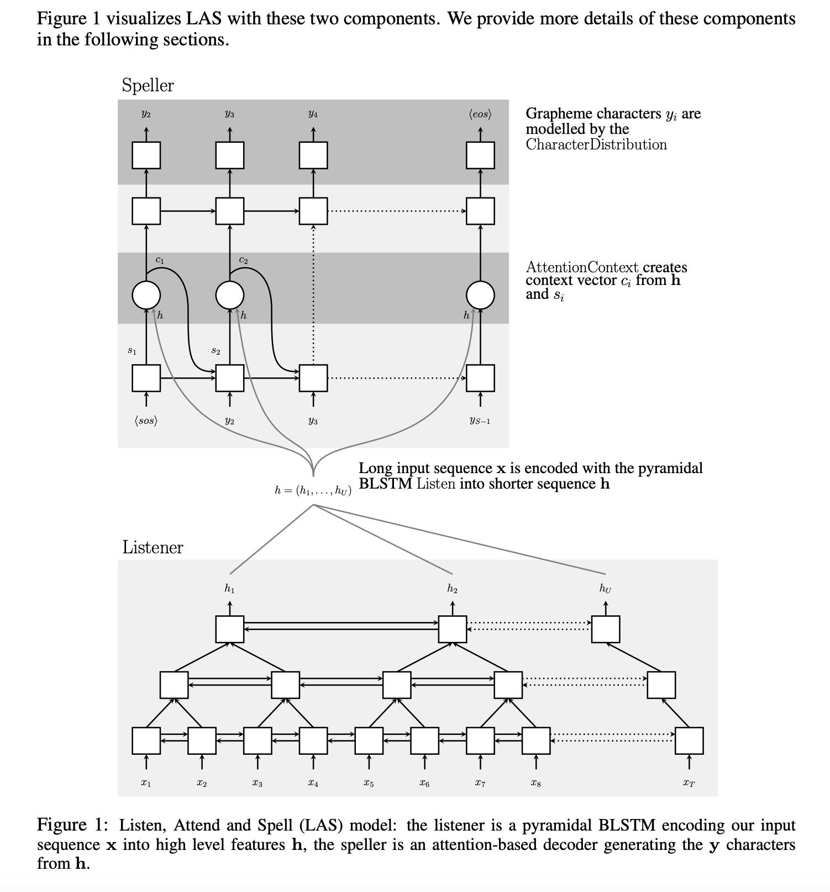
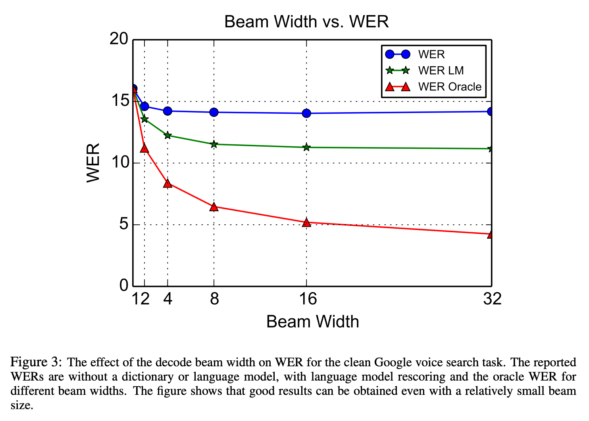
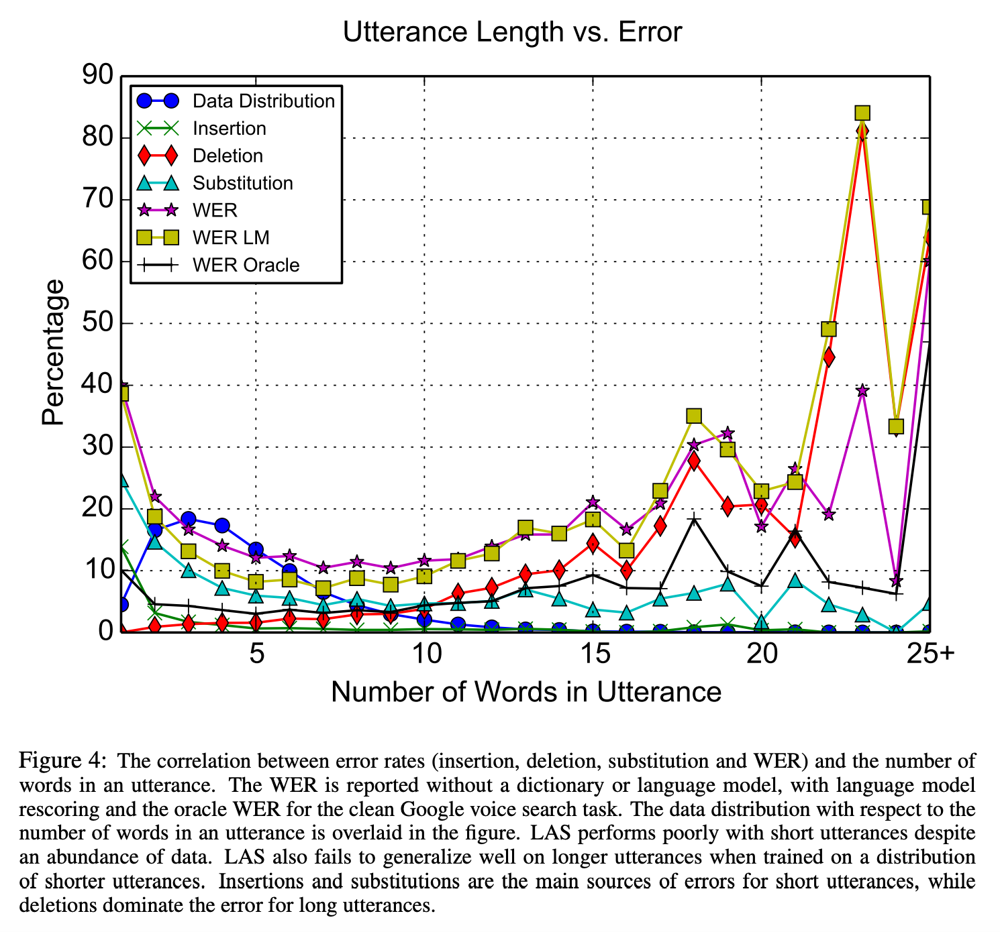

2016년에 제안된 음성인식 모델이다. 핵심은 BiLSTM+Attention 기반 seq2seq를 음성인식에 활용해 end-to-end, generation 방식으로 음성인식 모델을 구현한 점인 것 같다.

- [Listen, Attend and Spell](https://arxiv.org/abs/1508.01211)
# Abstract

---

전통적인 DNN-HMM모델과는 다르게 listener와 speller로 구성된 Encoder-Decoder 방식의 Seq2seq구조로 음성인식 모델을 개발했다. CTC와는 다르게 각각의 글자를 모두 독립적이라는 가정을 사용하지 않는다. 구글 보이스 검색 task에서 LAS모델은 alone으로 WER 14.1%, LM보정을 사용하면 10.3%를 달성했다.

# Introduction

---

기존의 접근법은 크게 Connectionist Temporal Classification(CTC) 방식과 Seq2Seq 방식의 접근법이 있었다. CTC는 각각의 요소를 독립적으로 추론한다는 단점이 있었고, Seq2Seq방식은 end-to-end로 학습될 수 없었다.

LAS는 기존의 불편함을 해소하는 모델이다. listener는 피라미드형 RNN으로 구성되어 있으며, 이는 low level의 음성 신호를 high level 피처로 변환한다. speller는 RNN으로 구성되어 있으며 high level 피처에 어텐션을 사용해 발화를 생성한다.

모델이 character 단위로 추론하기 때문에 OOV 문제를 신경쓸 필요 없었다

실험에서 LAS모델 부분 하나하나가 결과를 내는데 필수적인 요소였다.

- 데이터가 3M 정도로 많았는데도 어텐션이 없으면 모델은 학습데이터에 쉽게 overfit 되었다.
- 음성 신호는 프레임이 굉장히 많기 때문에  피라미드 구조 없이는 모델의 수렴이 너무 느렸다. attention이 sequence 길이에 연산이 많이 필요하기 때문이다.
- speller의 오류를 줄이기 위해 샘플링을 적용했다. (teacher forcing rate)

# Model

---
모델 구조는 Seq2Seq와 흡사하다.

$$\mathbf{x}=(x_1,..., x_T)$$

$$y = (<sos>, y_1, ..., y_S, <eos>)$$

$$y_i \in \{a,b,c,\cdots,z,0,\cdots,9, space, comma, period, apostrophe, unk\}$$

다음의 확률이 최대인 $$\mathbf{y}$$를 구한다.

$$P(\mathbf{y|x}) = \Pi_i P(y_i|\mathbf{x},y_{<i})$$

Listener는 입력 신호 $$\mathbf{x}$$를 고차원 표현 $$\mathbf{h}=(h_1, ..., h_U)$$ 로 변화하고 AttendAndSpell 모델은 $$\mathbf{h}$$로부터 각 문장의 확률 분포를 구한다.

$$\mathbf{h}=Listen(\mathbf{x})$$

$$P(\mathbf{y|x})=AttendAndSpell(\mathbf{h,y})$$

## Listen

기존 BiLSTM은 다음과 같이 작동한다.

$$h_j^j = BLSTM(h_{i-1}^j,h_i^{j-1})$$

하지만 Seqencelength를 줄이기 위해 피라미드 BiLSTM은 다음과 같이 작동한다.

$$h_i^j=pBLSTM(h_{i-1}^j,[h_{2i}^{j-1}, h_{2i+1}^{j-1}])$$

이렇게 이전 레이어의 Sequence 두개를 concat해서 사용한다.

저자들은 3layer로 쌓아서 length을 $$2^3=8$$배 줄였다고 한다.
근데 그렇게 하면 상위레이어로 갈수록 차원은 두 배가 되지 않나? 싶은데 그런 이야기는 없었다.

## Attend and Spell

기존의 attention decoder와 동일하다.

$$c$$는 context, $$s$$는 hidden state, $$\mathbf{h}$$는 인코딩된 hidden states 이다.

$$s_i=RNN(s_{i-1},y_{i-1},c_{i-1})$$
$$c_i=AttentionContext(s_i,\mathbf{h})$$
$$P(y_i|\mathbf{x},y_{<i})=ChracterDistribution(s_i,c_i)$$

RNN은 2 layer LSTM을 사용했다고 함

## Learning

학습은 seq2seq와 똑같이 진행되었다. inference 시에 오류가 일어나면 그 이후의 추론이 이상해지는 문제를 줄이고자 teacher forcing rate은 0.9를 사용하였다.

$$\max_{\theta} \Sigma_i \log P(y_i|\mathbf{x},y_{<i}^*;\theta)$$

여기서 $$y_{<i}^*$$는 이전에 생성한 문자열 groundtruth 이다.

- Listener를 Pretrain해봤지만 성능 향상이 일어나지 않았다

## Decoding and Rescoring

Beam 서치를 적용하였으며 짧은 문장의 Length penalt를 반영했음.
text만 학습한 LM 모델로 확률을 보정하는 것도 실험했다.

$$s(\mathbf{y|x}) = \frac{\log P(\mathbf{y|x})} {|\mathbf{y}|_c} + \lambda \log P_{LM} (\mathbf{y})$$

\\( \lambda \\)는 LM확률의 weight,
\\( |\mathbf{y}|_c \\)는 글자 수를 의미한다.

# Experiment

- 기존 Sota와 비교했을 때 떨어지지만 나쁘지 않은 성능을 보여주었다

## Effects of Beam Width

- Beam size는 클수록 좋아졌지만 16 이후로는 큰 차이가 없었다.

## Effects of Untterance Length

- 문장이 짧으면 단어를 놓치는 경우가 많아서 에러율이 높았다.
- 발화가 길어지면 generalize하는데 어려움을 겪는다. (Generation 방식이라 심할 것 같다)

## Interesting Decoding Examples

- 실험 중 LAS가 하나의 음성에서 여러개의 스펠링 방법을 배우는 것을 관찰했다. ("triple a"를 발음 그대로가 아니라 "aaa"로 표현)
- 위 표는 "triple a"가 들어있는 음성을 인식시킨 결과이다. $$y_i$$의 예측과 $$y_{i+1}$$의 예측이 독립적인 CTC를 사용했을 때는 저런 결과를 관찰할 수 없다.

- 또 놀랐던 점은 LAS가 내용 기반의 어텐션을 사용해서 같은 단어가 여러 번 반복될 때 빼먹거나 더 많이 출력할 줄 알았는데 그렇지 않았다는 점이다.
- 이는 같은 단어의 반복을 표현하는 데 있어 위치기반 어텐션이 필수적이지는 않을 수 있다는 점을 시사한다.

# Conclusion

---

- end-to-end 학습이 가능하고 Listener와 Speller로 구성된 LAS 모델을 개발했다.
- 이 구조에서는 음성학적인 개념도 필요 없고, 사전이나 HMM도 필요 없다.
- CTC의 조건부 독립 가정을 피했으며 모델이 단순 음성 인식이 아니라 language model을 학습하는 모습도 보여주었다.
- 또한 Decode의 결과를 텍스트로만 학습한 LM과 함께 사용하여 rerank하는 방법을 보여주었다.
