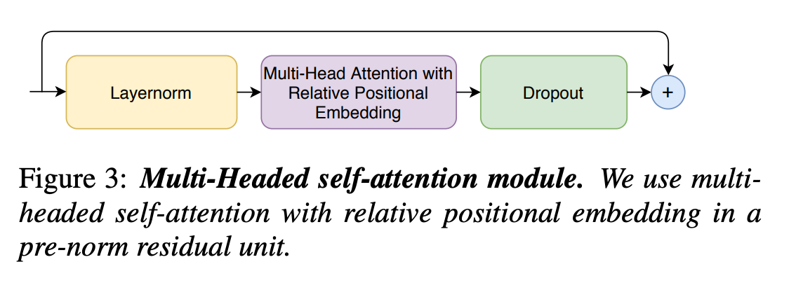
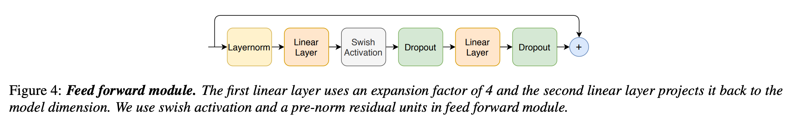

<link rel="stylesheet" href="https://cdn.jsdelivr.net/npm/katex@0.12.0/dist/katex.min.css" integrity="sha384-AfEj0r4/OFrOo5t7NnNe46zW/tFgW6x/bCJG8FqQCEo3+Aro6EYUG4+cU+KJWu/X" crossorigin="anonymous">

- [Conformer: Convolution-augmented Transformer for Speech Recognition](https://arxiv.org/abs/2005.08100)

# Abstract

---

- 최근 CNN기반 모델이 ASR에서 RNN보다 좋은 성능을 보였다.
- Transformer와 CNN을 함께 사용하여 local과 global feature를 효율적으로 반영하는 모델을 설계했다.
- Accuracy SOTA.

# Introduction

---

- Transformer나 CNN기반의 접근이 활용되고 있지만 Transformer는 local feature에 약하고 CNN은 global feature에 약하고 layer많이 필요하다는 단점이 있다.
- 이 논문에서는 유기적으로 CNN과 self-attention을 활용할 지 연구했다.
- 또한 attention head 개수, convolution kernel sizes, activation function 등의 영향도 세심하게 연구했다.

# Conformer Encoder

---

- 모델은 먼저 convolution subsampling layer를 통과하고 많은 conformer block을 통과한다.
- 이 모델의 차별점은 Transformer대신에 Conformer를 사용한 것이다.
- Conformer는 feed-forward, self-attention, convolution, second feed-forward 총 4개 모듈로 구성된다.

## Multi-Headed Self-Attention Module

- [Transformer-XL](https://arxiv.org/abs/1901.02860)의 테크닉을 참고하여 relative sunusoidal positional encoding을 적용하였고 이는 input의 길이가 달라져도 더 일반화가 잘 일어나도록 한다.
- Regularization을 위해 dropout과 함께 Prenorm residual units을 사용하였다.

## Convolution Module

- Pointwise convolution과 gated linear unit를 활용하는 [gating mechanism](https://arxiv.org/abs/1612.08083)을 적용하였다.
- 그 후에 1-D depthwise convolution을 적용하였다.

## Feed Forward Module

- 원래 Transformer에서는 feed-forward 모듈이 MHSA 뒤에 있었으며, 두 개의 선형변환과 한 개의 비선형 변환으로 구성되어있었다.
- 이 구조는 ASR에서도 적합하다.
- 논문에서는 pre-norm residual units로 layer normalization을 적용했으며 Swish activation과 dropout을 사용했다.

## Conformer Block

- Transformer의 feed-forward를 두 개의 half-step feed-forward로 나눠 attention 전과 후에 적용하는  [Macaron-Net](https://arxiv.org/abs/1906.02762)처럼, 논문에서도 feed-forward에서 half-step residual weight를 사용하였다.
- 두 번째 feed-forward는 마지막 layernorm이후에 적용된다.
- Conformer block $$i$$에 대한 입력: $$x_i$$, 출력: $$y_i$$ 라고 할 때 수학적으로 표현하면 아래와 같다.

$$\tilde{x}_i = x_i + \frac{1}{2} \mathrm{FFN}(x_i)$$

$$x_i'= \tilde{x}_i + \mathrm{MHSA}(\tilde{x}_i)$$

$$x_i'' = x_i' + \mathrm{Conv}(x_i')$$

$$y_i = \mathrm{Layernorm}(x_i''+ \frac12 \mathrm{FFN}(x_i''))$$

- $$\mathrm{FFN}$$은 feed foward 모듈, $$\mathrm{MHSA}$$는 Multi-head self attention, $$\mathrm{Conv}$$는 Convolution 모듈이다.
- 저자들은 Macaron-net 방식의 feed-forward layer가 원래의 single feed forward보다 상당한 성능 향상 있음을 발견했다.

# Experiments

---

## Data

- 저자들은 970시간의 LibriSpeech 데이터셋과 LM을 위한 800M 토큰을 추가로 사용했다.
- 25ms 윈도우에 10ms stride로 계산한 80 채널 filterbank 피쳐를 사용했다.
- SpecAugment를 mask parameter ($$F=27$$), ten time masks를 time-mask ratio ($$P_S=0.05$$)로 적용하였다.

## Conformer Transducer

- 여러 조합으로 실험한 끝에 각 파라미터 제약에서 가장 효율적인 10M, 30M, 118M 세 모델을 선정했다.
- 모든 모델 개발에 single LSTM layer decoder를 사용했다.

- 3-layer LSTM 기반의 language model(LM)을 사용하여 결과를 보정했다.

## Results on LibriSpeech

- 저자들이 개발한 모델들은 비교표에서 모두 가장 작은 WER을 보이며 Transformer와 convolution을 함께 사용하는 것이 효과적임을 보였다.

## Ablation Studies

### Conformer Block vs Transformer Block

- Conformer는 Transformer와 Convolution의 사용이나 feed forward의 방식 등 여러 면에서 다르다. 각각의 영향을 알아보기 위해 Conformer의 특징을 하나씩 빼면서 결과를 관찰했다.

- Convolution Block이 가장 큰 영향을 끼쳤다.

### Combinations of Convolution and Transformer Modules

- 저자들은 MHSA을 convolution과 결합할 방법을 여러 가지 방식으로 연구했지만 Conformer Block의 방식이 가장 효과적이었다.

### 기타

- Conformer의 feed foward를 single FFN이나 full-step residual로 바꿨을 때의 결과를 비교했다. 별로 엄청난 차이는 없었다.
- Attention head의 수를 변경해가며 테스트해보았다. attention 헤드를 16까지 높이는 것은 accuracy를 향상시킨다는 것을 발견했다.
- convolution kernal size를 변경하며 실험해보았다. Kernel 사이즈를 32까지 늘렸을 때는 성능이 올랐지만 65로 높이자 성능이 떨어졌다.

# Conclusion

---

- 저자들은 CNN과 Transformer의 요소를 통합하는 Conformer를 도입했으며 Conformer의 각 요소의 중요성을 실험했다.
- 모델은 기존보다 더 적은 파라미터로 더 높은 성능을 기록해 LibriSpeech에서 SOTA을 달성했다.
