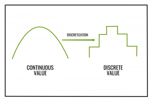
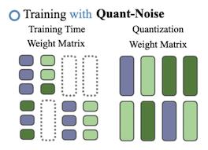
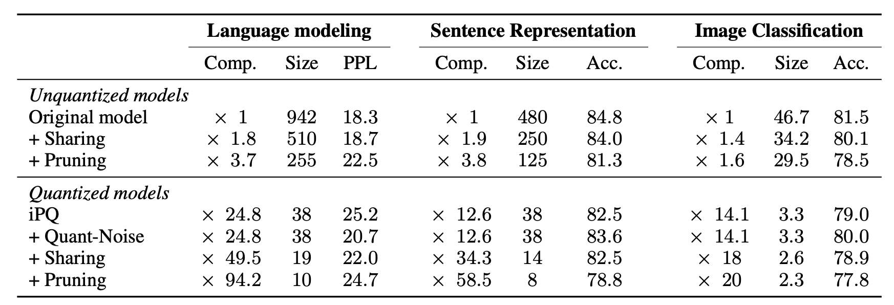
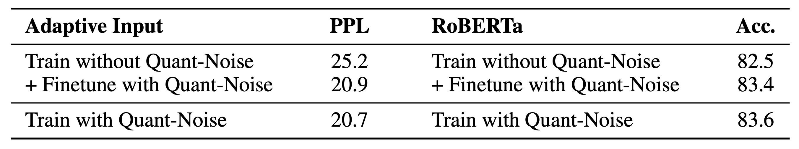
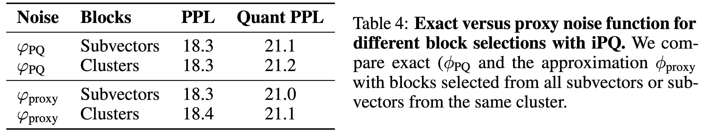

# Introduction

---

최근의 높은 성능을 기록하는 딥러닝 모델들은 모델의 크기가 굉장히 크다. 이에 다양한 경량화 방법론이 등장했다. Pruning과 distillation 같은 압축 방법론들은 모델의 파라미터 숫자를 줄인다. 하지만 그에 비해 Quantization은 파라미터의 bits 개수를 줄인다. Quantization의 경우는 이미 잘 갖춰진 모델의 아키텍쳐를 바꾸지 않기 때문에 필연적으로 weight 자체를 제거하고 줄이는 distillation이나 pruning에 비해 성능 손실이 거의 없이 모델을 경량화 할 수 있다.

기학습된 모델에 Scalar Quantiztion과 같은 방법을 적용하는 것은 좋은 압축률을 보이지만 오류가 누적되면 큰 성능 하락을 일으킬 수 있다. 이 문제를 해결하기 위해 학습 중에도 Quantization을 적용하고자 했지만 그랬을 때 문제는 대부분의 이산화(discretization) 연산은 Gradient가 없다는 점이다. 대부분 미분했을 때 0이 된다.

간단히 생각해보면 원래 값이 어떤 실수x라고 했을 때, 이 숫자를 1bit로 discretization한다고 생각해보자. x가 0보다 크면 1, 아니면 0이다. 그러면 이 함수의 그래프를 그려보면

이런 모양이 된다. 여기서 고등수학을 배운 사람들이라면 이 함수의 x대한 미분값은 그래프의 기울기라는 것을 알 것이다. 기울기는 모든 곳에서 0이다. 본질적으로 이산화 연산은 어쨌든 연속 공간에 있는 값을 특정한 몇 개로 줄이는 연산이기 때문에 gradient가 거의 0이 되는 것이다.

그래서 이를 해결하기 위해서 Quantization Aware Training(QAT)은 Straight Through Estimator(STE)를 이용해서 gradient를 계산한다. 히지만 이 방법은 STE에 의한 에러가 작을 때 사용할 수 있다.

논문의 핵심적인 방법은 Quant-Noise라고 부르는 Noise를 모델 전체가 아닌 모델의 일부 weight에 적용해 학습을 진행하는 것이다. 그렇게 했을 때 STE를 사용하고 모델 전체를 Quantization했을 때와 달리 noise가 추가되지 않은 weight는 정상적으로 계산된 gradient로 학습을 할 수 있기 때문에 훨씬 안정된 성능을 얻을 수 있다.

저자들이 말하는 자신들의 기여는 다음과 같다.

- Quant-Noise테크닉으로 int4, int8, PQ와 같은 Quantization 방법을 사용하여 더 안정된 학습을 할 수 있다.
- Quant-Noise를 PQ와 함께 적용하여 accuracy와 model size의 tradeoff에서 SOTA를 기록했다. (MNLI Acc. 82.5, RoBERTa 14MB압축 모델)
- PQ와 int8 Quantization을 모델 weight와 activation에 Quant-Noise와 함께 적용하여 모델을 극도로 압축했다.

# Background

---

이제 몇 개의 quantization 기법들을 소개하는데, 이해를 돕기 위해 기법과 상관없이 공통된 내용을 미리 설명한다. 고정된 크기의 행렬$$W \in R^{n \times p}$$가 있으며, $$W$$에 quantization을 적용한다. $$W$$는 $$m \times q$$개의 블럭 $$b_{kl}$$로 나눠진다.

$$W=\begin{pmatrix}
b_{11} & ... & b_{11}\\
... & \ddots & ...\\
b_{m1} & ... & b_{mq}\\
\end{pmatrix}$$

codebook은 $$K$$개의 벡터의 집합이다.
$$\mathcal{C} = \{\mathbf{c}[1],\ ...,\ c[K]\}$$ 이때 quantization 기법들은 블럭 $$b_{kl}$$에 해당하는 index를 codebook에 있는 codeword $$\mathbf{c}$$로 변환한다. 그리고 원래 weight 대신 codebook $$\mathcal{C}$$와 indices $$I_{kl}$$를 저장한다.
요약하면, 행렬 $$W$$는 각각의 블럭 $$b_{kl}$$를 $$\hat{b_{kl}} = \mathbf{c}[I_{kl}]$$로 변환함으로써 $$\hat{W}$$로 근사된다.

## Fixed-point Scalar Quantization

Fixed-point scalar quantization(SQ)는 소수를 더 낮은 정확도의 표현으로 바꾸는 방법이다.
이 방법은 모델의 메모리를 절약하면서 추론속도를 빠르게 만들 수 있다.

SQ를 적용할 때는 $$b_{kl}=W_{kl}$$로, weight의 parameter 하나가 scalar parameter하나로 일대일로 변환된다.
$$N$$은 SQ에서 숫자(codeword) 하나를 표현할 bits수이며, 따라서 $$2^N$$개의 codeword가 존재한다. 각각의 weight 블럭 $$W_{kl}$$은 아래의 식을 통해 가장 가까운 codeword $$\mathbf{c}$$로 변환된다.

$$\mathbf{c} = (round(W_{kl}\ /\ s+z)\ -\ z) \times s$$

$$s = \frac{maxW-minW}{2^N-1}\ and\ z=round(minW\ /\ s)$$

## Product Quantization

Product Quantization(PQ)은 SQ와 달리 vector를 vector로 변환한다. PQ는 높은 압축률을 보이면서도 좋은 성능을 보이기 때문에 저자들은 이번 연구에서 PQ에 더 집중했다.

### Traditional PQ.

전통적인 PQ는 weight를 $$m \times p$$개의 subvectors로 나눈 뒤, 각가의 subvector를 centroid로 근사시킨다.
centroid를 구하는 방법은 $$k$$-means 알고리즘 등을 주로 사용한다.
만약 사용하는 Bits 수가 8비트라면, centroid의 개수 $$K=2^8=256$$ 이다.
예를 들어, 만약 사용하는 bits 수가 8비트라면, centroid의 개수 $$K=2^8=256$$이다. 원래 weight와 MSE가 최소가 되는 centroid로 근사된다.

$$||W-\hat{W}||_{2}^2 = \sum_{k,l} ||b_{kl}-\mathbf{c}[I_{kl}]||_2^2$$

또한 PQ는 subvector들 간에 representation(codebook)을 공유한다.

### Iterative PQ.

모델 weight 전부를 PQ를 적용해 압축하면, 상위 레이어들은 하위 레이어의 출력을 입력으로 받기 때문에, 점점 오류가 누적된다. 이는 모델 성능을 크게 떨어뜨리기 때문에 그 해결책으로 Iterative PQ(iPQ)가 등장했다.
iPQ에서는 하위 layer를 먼저 quantization한 뒤에 그 다음 layer를 원래 teacher model의 지도 하에 finetune한다. 각 layer의 codeword는 해당 block의 gradient의 평균으로 finetune된다.

$$c \leftarrow c - \eta\frac{1}{|J_c|} \sum_{(k,l)\in J_c} \frac{\partial\mathcal{L}}{\partial b_{kl}}$$

위 식에서 $$J_{\mathbf{c}}=\{(k,l)\ |\ \mathbf{c}[I_{kl}] = \mathbf{c}\}$$, $$\mathcal{L}$$은 loss,
$$\eta$$는 learning rate이다.
이 방법은 하위 layer에서 input이 왜곡되지 않게 만들어, 전반적으로 quantization의 성능 손실을 막아준다.

### Combining Fixed-Point with Product Quantization

저자들이 말했던 자신들의 첫 번째 공헌점이다.
Fixed-Point Scalar Quantization을 Product Quantization과 함께 적용했다. 방법은 복잡하진 않다.

1. **Product Quantization을 진행**하면 각각의 subvector는 centorid로 근사된다.
2. 그 centroid는 subvector와 같은 형식이기 때문에 소수 형태일 것이다. 이 **centroid와 activation까지 int8로 Scalar Quantization**하는 것이 저자들의 방법이다.

# Method

---

### Training Networks with Quantization Noise

Quant-Noise를 이용해 학습을 시키는 방법은 다음과 같다.

|  |  |

1. 각 블럭 $$b_{kl}$$마다 quantization함수를 계산한다.
2. 각 forward 마다 랜덤하게 블럭 중에 일부를 선택하고 그 블럭에 Quant-Noise를 적용한다.
3. backward 중에, 왜곡된 weight는 STE를 이용해 gradient를 계산하고, 나머지는 정상적으로 계산한다.

수식으로 설명하면, quantized가 적용될 블럭들의 집합 $$J$$, noise 함수 $$\varphi$$가 있을 때, $$\psi$$는 아래와 같이 정의한다.

$$\psi(\mathbf{b}_{kl}|J) = \begin{cases}
\varphi(\mathbf{b}_{kl}) & if\ \mathbf{b}_{kl} \in J \\
b_{kl} & otherwise
\end{cases}$$

forward를 수행할 때, $$y_{noise}$$를 계산하기 위해 $$W$$를 $$W_{noise}$$로 변환한다. $$\mathbf{x}$$는 input vector이다.

$$W_{noise} = (\psi(\mathbf{b}|J))_{kl}\ and\ y_{noise}=W_{noise}\mathbf{x}$$

STE를 이용한 backword과정은 다음과 같다.

$$W\leftarrow W - \eta y_{noise} \mathbf{x}^T$$

여기서 만약 $$J$$가 모든 블럭에 해당할 때, 이 방법은 QAT의 방법과 같다.

### Adding Noise to Specific Quantization Methods

저자들은 각 quantization methods 마다 noise function을 제안했다.

Fixed-point scalar quantization: $$\varphi(w) = (round(w/s+z)-z)\times s$$

Product quantization:
$$\varphi_{\mathsf{PQ}}(\mathbf{v}) = argmin_{c \in \mathcal{C} } ||\mathbf{b}-\mathbf{c}||_2^2$$

특별히 quantization함수와 다르지 않다. 근데 여기서 PQ나 iPQ의 noise function으로 훨씬 빠르고 간단한 함수를 하나 더 제안했는데 아래와 같다. 이 함수는 선택된 블럭의 subvector를 전부 0으로 만들어 버린다.

$$\varphi_{proxy}(\mathbf{v})=0$$

# Result

---

### Comparison of different quantization shcemes with and without Quant-Noise

- 결과적으로 모든 경우에서 Quant-Noise를 적용하면 성능이 향상됨
- iPQ같은 높은 performance를 내는 method와 함께 적용했을 때 효과가 좋음
- 저자가 contribution 중 하나라고 말한 iPQ와 int8 quantization을 같이 쓴 경우는 성능이 떨어졌는데, 봤을 때 모델의 크기는 차이가 거의 없다. iPQ에서 대부분의 메모리사용은 indexding에서 오는 것이지 centroid를 저장하는 데서 오는 게 아니라서 centroid를 scalar quantization 해봤자 모델 크기에 큰 영향이 없다고 한다.

### Comparison with SOTA

그래프를 봤을 때 확실히 Quant-Noise 방식보다 Ideal에 가까운 모델은 없다. Quant-Noise모델보다 사이즈가 작으면서 그 이상의 성능을 내는 모델이 없다는 것이다.

### Quant-Noise: Finetuning vs training

Train with Quant-Noise는 Quant-Noise를 적용해 학습을 시킨 모델이며, Train without Quant-Noise은 Quant-Noise를 적용하지 않고 그냥 finetune시킨 모델이다.
표를 보면 **이미 학습이 끝난 모델에 추가적인 finetune을 해도 처음부터 Quant-Noise로 학습시킨 것과 비슷한 결과**를 얻을 수 있다.
without Quant-Noise + Finetune의 경우 Language Model은 10 epoch, RoBERTa는 25k를 추가적으로 학습시켰다고 한다.

### Impact of Approximating the Noise Function

$$\varphi_{proxy}$$를 이용했을 때와 $$\varphi_{\mathsf{PQ}}$$ Noise 함수를 이용했을 때의 결과를 비교한 것이다.
놀랍게도 거의 **차이가 없었**다.
저자는 subvector들 간의 상관관계를 증가시키는 것 만으로도 iPQ quantization에서 모델의 성능을 유지하는 데에는 충분하다고 했다.
굳이 복잡한 PQ 함수를 쓸 필요 없이 단순히 subvector를 0으로 날려버리면 비슷한 효과를 얻을 수 있다는 게 신기하기도 하고 유용한 것 같다.

# Conclusion

---

- 전체가 아닌 랜덤 subset을 quantize하는 방법으로 높은 압축률에서도 성능을 잘 유지했다.
- NLP와 vision분야의 다양한 모델에 Quantization을 적용해서 검증했다
- 극도의 압축이 필요하다면 iPQ와 int8을 함께 적용할 수 있다.
- 이미 학습된 모델에 추가적으로 post-processing하여 Quantization할 수 있다.

# Reference

---

- [Training with Quantization Noise for Extreme Model Compression](https://paperswithcode.com/paper/training-with-quantization-noise-for-extreme)
