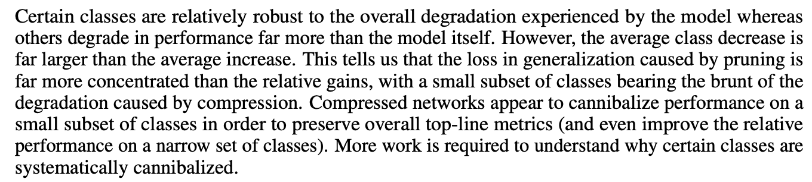
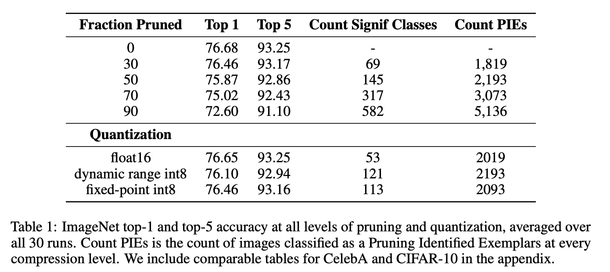
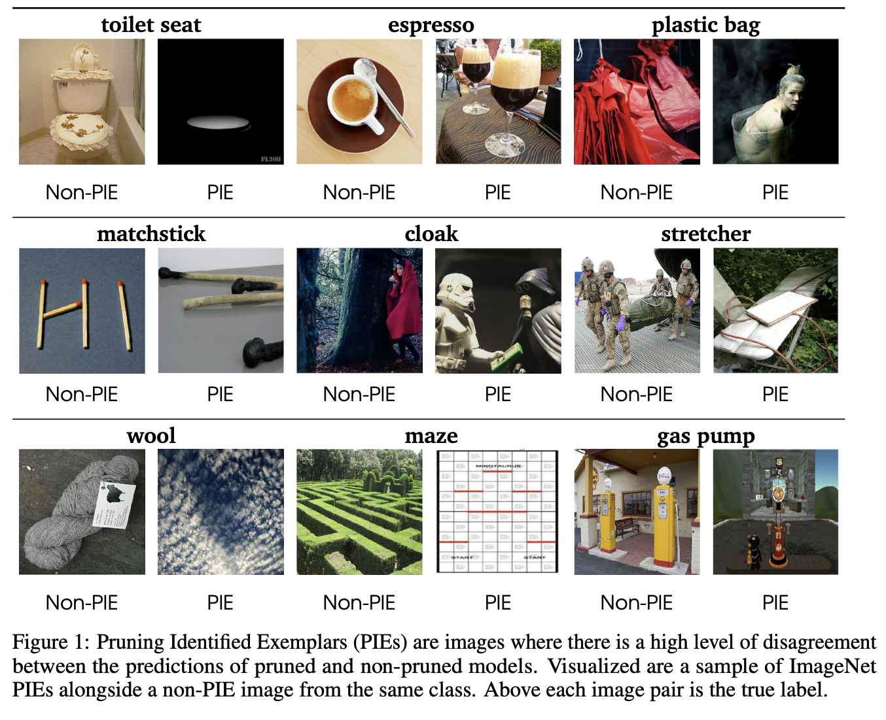
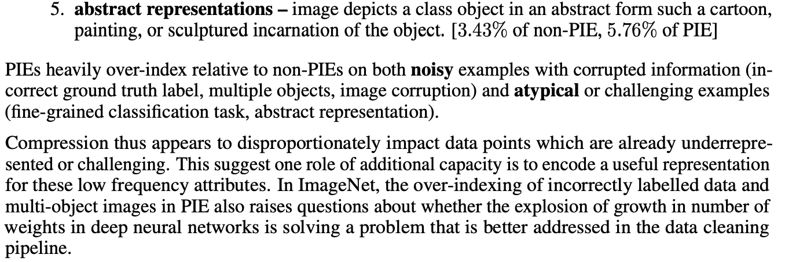

# 개요 (Abstract)

- Pruning과 Quantization의 compression을 적용했을 때 test acc가 거의 손실이 없는 수준으로 보존되지만 사실 measure가 충분히 그 손실을 판단하지 못하는 것이다.
- 실제로는 압축된 모델이 추론성능이 떨어지는 부분이 있고 그걸 밝혀냈다.

1. top-1, top-5 test-set accuracy는 Pruning이 generalization에 미치는 심각한 세부적인 요인들을 숨긴다.
2. Pruning에 큰 영향을 받은 예제들(PIEs)는 사람도 원래 구별하기 더 어려운 것들이다. 모델 압축은 data에서 long-tail에 있는 class (저빈도 클래스)의 예측 능력을 특히 떨어뜨린다.
3. 압축된 모델은 그렇지 않은 모델에 비해 학습 데이터 분포에 좀 더 민감하다. 압축률이 높을 수록 더 그렇다.

# 방법론 (Methods)

- 각각의 압축수준 t마다  30개의 모델을 학습시킴.
- 각 모델별 acc를 계산하고 특정 모델에 대해 특정 class의 accuracy도 계산함.
- t의 압축의 수준을 말함 t가 클수록 고압축, t=0이면 압축X

- PIE의 여부는 특정 이미지마다, 특정 수준의 압축 수준마다(t) 따로 계산함
- 특정 수준(t)의 압축 모델에서 특정 이미지에 대해 가장 많이 추론된 label을 $y^M_{i,t}$라고 하며 이 값이 압축되지 않은 모델의 예측과 다르다면 해당 이미지는 t압축수준에서 PIE가 됨.

# 결과 분석 (Results)

- 그림을 보면 Pruning에 의한 손해가 더 크다. 왜냐하면 클래스 별로 보면 -로 가는 경우가 더 많기 때문에 (저빈도 클래스들)
- 압축된 모델은 작은 class의 성능을 희생해서 전체적인 accuracy를 유지한다.

    

- 놀랍게도 Quantization을 한 경우에는 (단순한 post-training으로 했음에도) 훨씬 성능 하락이 적었다.
- bits representation을 줄이는 것이 weight의 일부를 없애는 것보다 훨씬 robust한 것으로 보인다.

    

- PIE는 non-PIE에 비해 noisy 한 예시 (부정확한 ground truth가 사용된 라벨, 여러 개의 object, 이미지 손상) 혹은 전형적이지 않은 경우(세부 class 추론, 추상적인 표현)에 많았음
- 보통은 이미 어려운 예제들이었으며, 이는 추가적인 capacity는 저빈도 attribute를 배우는 데 사용된다는 점을 시사함.

- pruning은 압축된 모델을 민감하게 만듬.
- adversarial한 7500개의 이미지를 선별한 ImageNet-A와 ImageNet 데이터에 노이즈를 추가한 ImageNet-C로 테스트를 해보면 Pruning이 되지 않은 모델에 비해 성능이 꽤 하락함.

# 결론 및 시사점 (Conclusion)

- 모델 압축은 전체적으로는 성능 하락이 거의 없어 보이지만 Long-tail 저빈도 class에서 손실이 일어난다.
- 우리는 compression의 영향을 분석하는 방법에 중점을 두었으니 더 좋은 압축 방법을 찾아 보세요?

개인적으로는 나름 대로 의미가 있다고 보이지만 결과가 다소 뻔한 것 같다... 압축을 하면 당연히 세세하고 복잡하고 자주 안나오는 걸 잊어버리겠지...??!?

# Reference

- [What Do Compressed Deep Neural Networks Forget?](https://arxiv.org/abs/1911.05248)
