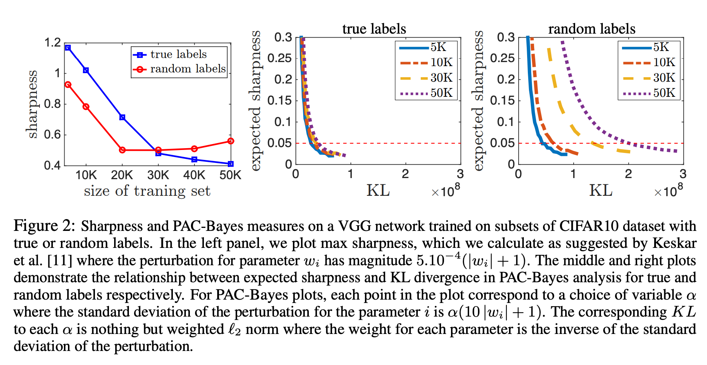
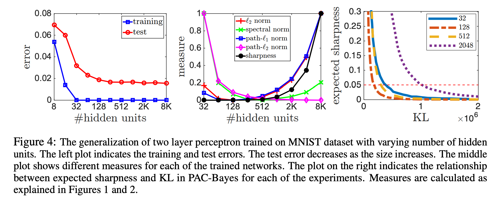

<link rel="stylesheet" href="https://cdn.jsdelivr.net/npm/katex@0.12.0/dist/katex.min.css" integrity="sha384-AfEj0r4/OFrOo5t7NnNe46zW/tFgW6x/bCJG8FqQCEo3+Aro6EYUG4+cU+KJWu/X" crossorigin="anonymous">

- [Exploring Generalization in Deep Learning](https://arxiv.org/abs/1706.08947)

# Abstract

---

- 무엇이 Deep 네트워크에서 일반화(generalization)을 이끄는가?
- 저자들은 당시에 제안된 설명들을 분석하고 각각의 평가 Measure들이 얼마나 일반화를 보장할 수 있는지를 측정함.

# Introduction

---

- over parameterized 세팅에서는 여러개의 global minima가 생길 수 있다. 그런 경우는 여러 global minima들 모두 training error는 최소화 되지만 그 중 다수는 generalize가 잘 되지 않는다.
→ Training Error를 최소화하는 것은 일반화를 보증하지 못함
- optimizer의 변경, BatchSize 등이 일반화에 영향을 미치는 경우가 존재하기 때문에 파라미터의 숫자나 모델의 아키텍쳐만 가지고 도출되는 measure는 일반화를 설명하기에 불충분함.
- 어떤 것들이 Neural Network에서 일반화를 보장할 수 있을까?
- complexity나 capacity control은 뭐랑 관련된 걸까?
    - norm이나 margin-based measure가 주로 capacity control에 사용됨
    - sharpness (파라미터의 변화에 training error가 robust한 정도)나 PAC-Bayes 분석기법이 complexity measure로 제안됨

 

딥러닝에서 일반화를 설명할 수 있는 complexity measure는 무엇이 필요한가?

1. 일반화를 보장하기에 충분해야 함
2. 실제로 해당 measure 아래 학습했을 때, complexity가 낮아야 함
3. 기존 uniform measure(모델 파라미터 수 등)로 설명되지 않는 아래의 현상들을 설명할 수 있어야 함
    - 실제 레이블을 가지고 학습한 일반화가 잘된 모델과 같은 아키텍쳐로 랜덤 레이블을 학습해도 training error를 0까지 떨어뜨릴 수 있음.
    우리는 해당 measure에서 **실제 label로 학습한 모델의 complexity가 랜덤 레이블를 학습한 모델보다 낮기를 기대**함.
    - 모델의 파라미터를 키웠을 때 training error는 차이가 없지만 실제 일반화의 성능은 증가하는 경우가 있음.
    해당 measure 상으로 **모델의 파라미터가 커지면 complexity가 줄어들기를 기대**함
    - optimization 방법(optimizer or initial parameter)만 다르고 똑같은 구조와 데이터셋으로 학습을 시켰을 때, 양쪽 모두 training error는 0이지만 한쪽이 더 일반화가 잘되는 경우가 있음.
    해당 measure가 이런 **실제 일반화 성능과 상관관계를 갖기를 기대**함.

 

- 저자들은 당시에 제안된 complexity measure들(norm, robustness, sharpness 등)이 일반화를 잘 설명하는지 여부를 이론적, 실증적으로 검증함

## Notation

$$f_{\mathbf{w}}(\mathbf{x})$$: function computed by a $$d$$ layer feed-forward with parameter $$\mathbf{w}$$ and ReLU

$$f_{\mathbf{w}}(\mathbf{x})=\mathbf{\textit{W}}_d\phi(\mathbf{\textit{W}}_{d-1}\phi(...\phi(\mathbf{\textit{W}_1}\mathbf{x})))$$* where *$$\phi(z)=\max\{0,z\}$$

$$\textit{D}_i^{\mathbf{x,w}}$$: $$i$$ 레이어에서 activation함수에 대응되는 대각 {1,0}  행렬. 단순화를 위해 위에쓴 $$\mathbf{x}$$를 지우고 $$\textit{D}_i$$로 씀.

$$f_{\mathbf{w}}(\mathbf{x}) = W_dD_{d-1}W_{d-1}\cdots D_1W_1\mathbf{x} = W_d(\Pi_{i=1}^{d-1}D_iW_i)\mathbf{x}$$.

 

$$h_i$$: $$i$$ 레이어에서 노드의 개수, $$h_0=n$$

모든 레이어 $$i$$에 대해, $$W_i \in R^{h_i\times h_{i-1}}$$

$$\ell(\mathbf{w,x})$$:  input이 $$x$$일 때, 함수 $$f_\mathbf{w}$$의 예측에 의한 Loss

$$L(\mathbf{w})$$: 예상되는 loss

$$\widehat{L}(\mathbf{w})$$: 트레이닝 셋에 대해 학습했을 때 경험적 loss

$$[k]: \{1,2,\cdots,k\}$$
(임의의 정수 $$k$$에 대해)

$$\|\cdot\|_F$$: Frobenius norm

$$\|\cdot\|_2$$: spectral norm

$$\|\cdot\|_1$$: element-wise
$$\ell_1$$-norm

$$\|\cdot\|_\infty$$: element-wise
$$\ell_\infty$$-norm

# Generalization and Capacity Control in Deep Learning

---

- 저자들은 일반화를 보장하기 위해 요구되는 example의 개수 측면에서 *capacity*를 고려함

    → 그 숫자는 거의 "랜덤 레이블로 학습했을 때 충분히 작은 training error까지 도달할 수 있는 example의 최대 개수"에 대응됨

 

어떤 feedforward나 convolution으로 표현되는 모든 함수의 집합인 모델 클래스 $$\mathcal{H}$$가 주어졌을 때, 어떤 complexity measure를 다음의 맵핑 $$\mathcal{M}$$으로 볼 수 있다.

$$\mathcal{M}:\{\mathcal{H,S}\} \rightarrow \mathbb{R} ^+$$,  $$\mathcal{S}$$ 는 학습셋

이때 제한된 클래스 $$\mathcal{H}_{\mathcal{M},\alpha}=\{h:h\in \mathcal{H},\mathcal{M}\leq\alpha\}$$를 생각할 수 있다. ($$\alpha\geq0)$$

그러면 $$\mathcal{H}_{\mathcal{M,M}(h)}$$의 capacity 관점에서 학습된 가설 모델 $$h$$ 는 일반화가 되었다고 보증할 수 있다.

$$\mathcal{M}(h)$$의 값이 더 작은 $$h$$가 더 잘 일반화 되었을 것이라고 기대한다.

## Network Size

- 어떤 모델이든 유한한 정확도의 파라미터를 가지고 있다. 모델의 capacity는 파라미터의 수에 비례한다.  Bartlett과 Harvey는 feedforward 네트워크의 VC 차원을 아래와 같이 타이트하게 범위를 구했다.

$$ \textmd{VC-dim} = \tilde{O}(d*\dim(\mathbf{w}))$$

→ 파라미터의 숫자가 샘플의 숫자보다 많은 over-parameterized 세팅에서는 파라미터 수에만 의존하는 measure는 너무 약하고 모델의 일반화를 설명할 수 없음

- 요즘 실제 활용되는 모델들은 샘플보다 많은 파라미터를 가진 경우가 많으며, 일반화되지 않고 랜덤 레이블조차 완벽하게 학습함.

## Norms and Margins

- capacity는 파라미터의 숫자와 상관없이 $$\ell_2$$ norm regularized 등으로 통제될 수 있다.

예를 들어 capacity는 각 레이어의 hidden unit의 $$\ell_1$$norm에 기반해 경계가 그어질 수 있다.
그건 $$\Pi_{i=1}^d\|W_i\|_{1,\infty}^2$$ 에 비례한다.
여기서 $$\|W_i\|_{1,\infty}$$는 레이어 i의 hidden unit의
$$\ell_1$$norm중에서 최대값을 뜻한다.

$$\ell_{p,q}$$: 각 hidden unit의 $$\ell_p$$norm 값들의 $$\ell_q$$norm 이다.

예를 들어 $$\ell_{2,2}$$는 $$\ell_F$$(=$$\ell_2)$$norm과 같다.

$$\ell_p$$ path norm:
$$\Pi_{i=1}^d\|W_i\|_{p,\infty}$$

$$\ell_p$$ path norm은 node-wise rescaling에도 값이 변하지 않는다는 장점이 있다.

node-wise rescaling: $$W_i$$에 $$\alpha$$를 곱하고 $$W_{j}$$에 $$\frac1\alpha$$를 곱해줘 scailing을 재분배하는 것

 

만약 zero/one loss를 사용한다면(틀린개수 세기) loss는 전체 weight값을 반으로 줄이거나 두 배로 늘려도 달라지지 않음. (맞고 틀리고는 똑같을 테니) 따라서 임의의 아주 작은 norm을 얻을 수 있게 됨. ce-loss처럼 scale sensitive한 loss함수를 사용하면 이 문제를 해결할 수 있음.

하지만, ce-loss를 사용하면 loss를 계속 줄이기 위해 결과값이 infinity로 커지는 문제가 발생함. 그러면 weight의 norm도 infinity로 커짐. 결국 이때 norm 값은 언제 멈추었냐의 정도의 의미가 된다.

→ **결국 다른 optimization method나 hyper parameter로 학습한 모델을 weight의 norm으로 비교하는 것은 의미가 없음**

 

대신 다른 network간 Norm의 비교를 유의미하게 만드는 방법은 network output의 scailing을 포함하는 것.

margin: $$f_{\mathbf{w}}(\mathbf{x})[y_{true}]- \max_{y \ne y_{true}} f_{\mathbf{w}}(\mathbf{x})[y]$$

($$x$$: single data point)

정답 레이블의 값과 정답이 아닌 레이블의 값 중 가장 큰 값의 차이를 margin으로 사용한다.
여러 입력데이터가 있을 때 가장 작은 값을 사용하는 건 예외적인 입력에 민감하기 때문에 margin 값은 하위 $$\epsilon$$ 비율에 해당하는 데이터의 margin을 사용한다. 이때의 margin을 $$\gamma_{margin}$$이라고 한다. $$\epsilon$$은 0.001 에서 0.1사이가 적절.

 

margin을 이용해 capacity에 비례하도록 보정한 결과는 다음과 같다.

$$\ell_2$$ norm →
$$\frac1 {\gamma_{margin}^2}\Pi_{i=1}^d 4\|W_i\|_F^2$$

$$\ell_1$$-path norm →
$$\frac1{\gamma_{margin}^2} (\Sigma_{j \in \Pi_{k=0}^d [h_k]} |\Pi_{i=1}^d 2W_i[j_i,j_{i-1}]|)^2$$

$$\ell_2$$-path norm →
$$\frac1{\gamma_{margin}^2} \Sigma_{j \in \Pi_{k=0}^d [h_k]}\Pi_{i=1}^d 4h_iW_i^2[j_i,j_{i-1}]$$

spectral norm →
$$\frac1{\gamma_{margin}^2} \Pi_{i=1}^d h_i\|W_i\|_2^2$$

이 식들은 parameter 수와 독립적으로 norm의 측면에서 capacity의 경계를 설정할 수 있다.

저자들은 norm을 실제 레이블과 랜덤레이블로 학습했을 때를 비교했다. 저자들이 기대한 것은 두 가지이다.

1. 실제 레이블로 학습했을 때, 랜덤레이블로 학습한 모델보다 complexity가 낮을 것
2. 랜덤 레이블을 학습했을 때, capacity가 training 샘플의 수에 비례해 증가하는 것, 그 증가폭이 실제 레이블일 때 보다 더 클 것. (랜덤 레이블을 학습시키려면 모든 추가적인 샘플은 새 capacity를 필요로하기 때문)

결과는 실제로 그렇게 나왔다.

## Lipschitz Continuity and Robustness

- 립시츠 상수로 capacity의 경계를 설정할 수 있을까?
- 일반화를 설명할 때 립시츠 상수 자체만으로 충분한가?

 

capacity control를 립시츠 연속 측면에서 다룸.

$$\mathcal{X}$$: input space, $$\mathcal{M}$$: metric(거리 함수) 일때

$$f : \mathcal{X} \rightarrow \mathbb{R}$$ on metric space $$(\mathcal{X}, \mathcal{M})$$

$$|f(x)-f(y)| \leq C_{\mathcal{M}}\mathcal{M}(x,y)$$ 를 만족하는
$$C_{\mathcal{M}}$$이 존재할 때 $$f$$는 립시츠 함수이다.

- $$f$$는 모델에 대응되고 $$\mathcal{M}$$은 input space $$\mathcal{X}$$에서의 distance function에 대응된다

 

[Luxburg and Bousquet](https://dl.acm.org/doi/10.5555/1005332.1005357)는 metric space $$(\chi, \mathcal{M})$$에서 립시츠 상수와 유한한 diam로 경계를 정할 수 있는 함수들의 capacity를 연구했다.

$$diam_{\mathcal{M}}(\mathcal{X}) = \sup_{x,y \in X} \mathcal{M}(x,y)$$

그들은 $$(\frac{C_{\mathcal{M}}}{\gamma_{margin}})^n diam_{\mathcal{M}}(\mathcal{X})$$ 에 비례하는 capacity를 제시했지만 **이 capacity bound는 input size에 지수적 의존성을 갖는다는 약점**이 있다. (n이 뭔지가 안나와있는데 정황 상 input dimension이 n으로 보임)

 

관련된 또 다른 접근 중에는 [robustness](https://arxiv.org/abs/1005.2243)가 있다.

$$\epsilon>0$$인 $$\epsilon$$이 주어졌을 때, $$\mathcal{X}$$를 아래의 조건을 만족하는 $$K$$개의 disjoint 집합으로 partioning할 수 있다면, 학습된 모델 $$f_{\mathbf{w}}$$는 $$K$$만큼 robust하다.

트레이닝 셋 $$\mathbf{s}$$에 있는 모든 $$(\mathbf{x}, y)$$에 대해 각각의 disjoint set $$C_i$$은 다음을 만족한다.

$$\mathbf{x,z} \in C_i \Rightarrow |\ell(\mathbf{w,x})-\ell(\mathbf{w,z})| \le \epsilon$$

이때 $$K$$ robust한 모델의 capacity는 $$K$$이다.

 

$$K$$는 $$C_{\|\cdot\|}$$로 설명할 수 있는데, 이 때 립시츠 $$C_{\|\cdot\|}$$나 $$C_{\ell_\infty}, C_{\ell_2}$$ 립시츠 상수를 사용하면 결과적으로 input dimension과 네트워크 depth에 지수적인 의존성을 갖게된다.

→ **결국 립시츠 상수만으로는 capacity conrol을 합리적으로 설명할 수 없다.**

## Sharpness

sharpness라는 파라미터 space에 대한 적대적 변동에 robust한지를 측정하는 개념이 일반화의 측정도구로 당시에 제시되었다.

$$\zeta_\alpha(\mathbf{w}) = \frac{\max_{|\nu_i| \le \alpha(|\mathbf{w}_i|+1)}\widehat{L}(f_\mathbf{w+\nu})-\widehat{L}(f_\mathbf{w})}{1 + \widehat{L}(f_\mathbf{w})} \simeq \max_{|\nu_i|\le \alpha(|\mathbf{w}_i|+1)} \widehat{L}(f_\mathbf{w+\nu})-\widehat{L}(f_\mathbf{w})$$

여기서 $$\widehat{L}(f_\mathbf{w})$$는 보통 neural net에서 매우 작기 때문에 중요하지 않은 것으로 보아 sharpness를 제시한 저자들은 단순하게 분모를 무시했다.

**하지만 sharpness는 모델의 일반화를 측정할 수 없다.**

- 첫째로 랜덤 라벨로 학습한 모델과 실제 라벨로 학습한 모델을 보면 가장 왼쪽 그림인 sharpness는 모델의 크기가 클 때는 맞게 표현되었지만 모델의 크기가 작을 때는 오히려 random label의 sharpness가 더 떨어졌다.
- 게다가 sharpness는 $$\mathbf{w}$$의 스케일에 의존성이 있기 때문에 파라미터의 스케일을 조정해 인위적으로 크거나 작게 만들 수 있다.

→ **sharpness는 모델의 capacity를 컨트롤하기에 충분하지 않다.**

 

대신에 저자들은 expected sharpness를 **PAC Bayesian** 프레임워크의 맥락으로 보는 관점을 옹호했다. 
**sharpness와 norm을 함께 사용함으로써 capacity control를 제공하며, 많은 관측된 현상을 설명할 수 있다.**

PAC Bayesian 분석은 $$\mathcal{Q}$$라는 학습 데이터에 의존적인 분포(때때로 posterior 불리는)에서 랜덤하게 뽑힌 predictor (hypothesis)의 기대되는 에러의 범위를 보장한다.

$$f_\mathbf{w}$$: 학습 데이터로 학습된 어떤 예측 함수

$$\mathbf{w}$$: 학습 데이터로 학습한 predictor

$$\nu$$: 확률 변수

predictor에 대한 분포 $$\mathcal{Q}$$를 $$\mathbf{w}+\mathbf{\nu}$$로 나타낼 수 있다.

 

학습데이터와는 독립적인 가설에 대한 prior 분포 $$P$$가 주어졌을 때, $$f_{\mathbf{w}+\nu}$$는 다음과 같다. ([Simplified PAC-Bayesian Margin Bounds](http://citeseerx.ist.psu.edu/viewdoc/summary?doi=10.1.1.129.6048))

$$\mathbb{E}_\nu[L(f_\mathbf{w+\nu})] \le \mathbb{E}_\nu[\widehat{L}(f_\mathbf{w+\nu})] + \sqrt{\mathbb{E}_\nu[\widehat{L}(f_\mathbf{w+\nu})]\mathcal{K}}+\mathcal{K}$$, where $$\mathcal{K}=\frac{2(KL(\mathbf{w}+\nu\|P) + \ln\frac{2m}{\sigma})}{m-1}$$

neuralnet에서는 training Loss $$\mathbb{E}_\nu[\widehat{L}(f_\mathbf{w}+\nu)]$$가 $$\mathcal{K}$$보다 작을 때가 많으므로, 뒤쪽 항이 중요하다.

 

위 식을 조정하면 weaker bound로 다음 식을 얻을 수 있다.

$$\mathbb{E}_\nu[L(f_{\mathbf{w}+\nu})] \le \mathbb{E}_\nu[\widehat{L}(f_\mathbf{w+\nu})] + 4 \sqrt{\frac{(KL(\mathbf{w}+\nu\|P)+\ln\frac{2m}{\sigma}}{m}}$$

이 식은 아래와 같이 다시 표현할 수 있다.

$$\mathbb{E}_\nu[L(f_\mathbf{w+\nu})] \le \widehat{L}(f_\mathbf{w}) + \underbrace{\mathbb{E}_\nu[\widehat{L}(f_\mathbf{w+\nu})] - \widehat{L}(f_\mathbf{w})}_{\textmd{expected sharpness}} + 4 \sqrt{\frac1m \bigg(KL(\mathbf{w+\nu}\|P)+\ln \frac{2m}{\sigma}\bigg)}$$

보시다시피 PAC-Bayes bound는 두 개의 의존성이 있다.

- expected sharpness
- prior P에 대한 KL divergence

 

이 bound는 어떠한 분포 $$P$$, $$\nu$$ 그리고 어떤 $$\mathbf{w}$$를 골라을 때도 성립하기 때문에 간단하게 $$P$$를 평균 0, $$\sigma^2$$의 분산인 정규분포로 정의하고 $$\nu$$또한 평균 0에 분산이 $$\sigma^2$$인 spherical 가우시안으로 선택하면 다음 식이 된다.

$$\mathbb{E}_\nu[L(f_\mathbf{w+\nu})] \le \widehat{L}(f_\mathbf{w}) + \underbrace{\mathbb{E}_\nu[\widehat{L}(f_\mathbf{w+\nu})] - \widehat{L}(f_\mathbf{w})}_{\textmd{expected sharpness}} + 4 \sqrt{\frac1m \bigg(\underbrace{\frac{\|\mathbf{w}\|_2^2}{2\sigma^2}}_{\textmd{KL}} +\ln \frac{2m}{\sigma}\bigg)}$$

- 위의 일반화는 capacity control을 expected sharpness와 norm을 함께 활용하여 명확한 방법으로 설명한다.
- 앞에서 sharpness자체는 스케일을 고려하지 않는다고 했는데 위의 bound에서는 norm과 sharpness가 $$\sigma$$를 통해 직접적으로 상호작용한다. (norm을 키우기 위해 $$\sigma$$를 줄이면 sharpness가 같이 작아지고, 반대도 마찬가지) 그러므로 합리적인 bound를 얻기 위해서는 $$\sigma$$를 적절히 선택해야 한다.
- 저자들은 실험을 통해 위의 meaure가 일반화의 오류를 더 잘 표현한다는 것을 관찰했다. (위의 Figure 2에서도 그렇게 나타남)

# Empirical Investigation

---

저자들은 앞서 말한 measure들이 정말로 효과적인지를 검증하는 실험을 진행했다.

## Difference Global Minima

여러 방법으로 objective function에 대한 global minima에 도달한 모델들을 어떻게 비교할까?

- 저자들은 CIFAR 10에서 진짜 label  10000개에 랜덤 label을 개수를 달리해 추가적으로 학습시키면서 각각이 다른 global minima에 도달하도록 했다.
- 앞에서 예상한 대로 norm 기반의 접근은 좋은 지표를 보였으며, sharpness는 잘 동작하지 않았다. PAC-Bayes measure 또한 잘 예측했다.

## Increasing Network Size

MNIST 데이터셋을 이용해 모델의 크기에 따라 measure들이 영향을 받는 모습을 실험했다.

- 저자들은 sensible compexity measure라면 test error의 양상처럼 모델 크기가 커짐에 따라 예측 값이 작아지기를 기대했다.

- norm 기반의 접근은 hidden unit이 128까지는 유효한 예측을 했지만 norm은 앞서 말한 대로 hidden unit의 개수에 의존성이 있기 때문에 그 이후는 제대로 예측하지 못했다.
- expected sharpness의 경우에도 128까지는 제대로 예측했지만 그 보다 더 큰 네트워크의 일반화를 제대로 설명하지 못했다.
- 이 점은 neuralnet에서 발견되는 모든 일반화 현상을 설명하기에는 아직 부족하다는 점을 시사한다.

# Conclusion

---

- 딥러닝에서는 실제로 잘 동작하는 많은 일반화 현상이 아직 잘 설명되지 않고 있다.
- 이 논문에서는 일반화 현상을 설명하는 여러 complexity measure의 후보군을 살펴보고 비교했다.
- 아직도 마땅한 선택지는 없지만 expected sharpness와 norm의 조합은 neural network의 일반화 현상을 훨씬 더 잘 설명하는 것으로 보인다.
