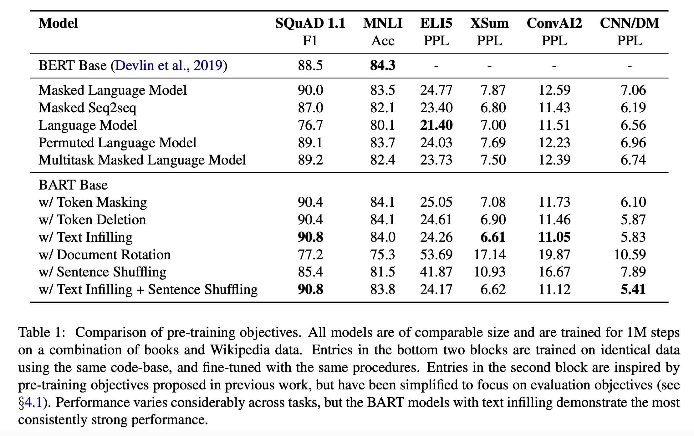
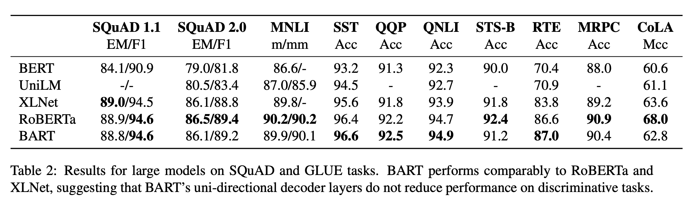
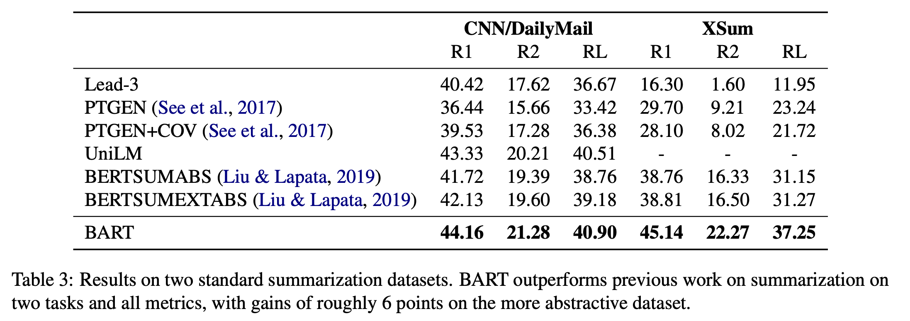
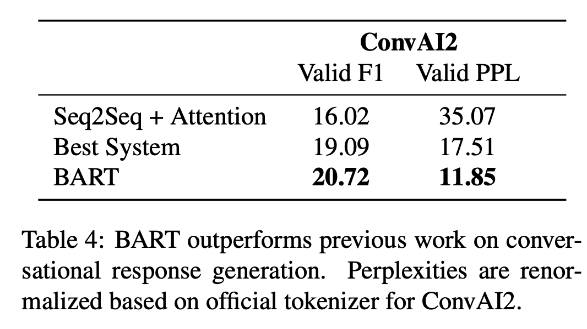

<link rel="stylesheet" href="https://cdn.jsdelivr.net/npm/katex@0.12.0/dist/katex.min.css" integrity="sha384-AfEj0r4/OFrOo5t7NnNe46zW/tFgW6x/bCJG8FqQCEo3+Aro6EYUG4+cU+KJWu/X" crossorigin="anonymous">

- [BART: Denoising Sequence-to-Sequence Pre-training for Natural Language Generation, Translation, and Comprehension](https://arxiv.org/abs/1910.13461)

# Abstract

---

- sequence-to-sequence 모델을 pretrain하기 위한 denoising autoencoder BART를 제안했다.
- BART는 무작의 noise함수로 텍스트를 이상하게 만들고 원본 텍스트를 재구성하도록 학습된다.
- BART는 standard 트랜스포머 기반 NMT 구조를 사용한다.
- 여러 noise 중에서 가장 좋은 것은 원 문장의 순서를 랜덤 셔플하는 것과 in-filling scheme을 함께 사용하는 것이다.
- BART는 Generation은 물론 comprehension task에서도 좋은 결과를 보였다.

# Introduction

---

- 저자들은 Bidirectional과 Auto-regressive Transformer를 함께 활용하는 BART를 제안했다.
- BART의 pretraining은 두 단계로 구성된다.
    1. 텍스트에 noise를 준다.
    2. sequence-to-sequence 모델로 원 문장을 복원하도록 학습시킨다.
- BART가 다른 모델보다 좋은 점은 원본 문장의 길이를 변경시킬 수 있는 등 노이즈의 범위를 마음대로 조절할 수 있다는 것이다.
- 가장 좋은 성능은 문장의 순서를 랜덤하게 섞는 것과 원 원 문장의 임의의 길이 text span을 하나의 MASK토큰으로 치환하는 것을 함께 적용하는 것이다.
- BART는 또한 기계번역을 위한 새로운 방법을 제시했다. BART를 target-size language model로 학습시키면 효과적이다.

# Model

---

## Architecture

- 아키텍쳐는 ReLU대신 GeLU activation을 사용한 점을 제외하고는 GPT를 따른다.
- base 모델은 encoder와 decoder 각각 6layer를 사용하였으며 large 모델은 각각 12layer를 사용하였다.
- 결과적으로 BART는 동일 크기의 BERT 모델모다 10% 정도 더 많은 파라미터를 가지고 있다.

## Pre-training BART

BART는 다른 모델과는 다르게 어떠한 종류의 noise도 적용할 수 있다. 저자들은 다양한 noise를 실험했다.

**Token Masking:** BERT의 방법을 따라 랜덤한 토큰을 [MASK]로 치환하는 것이다.

**Token Deletion:** 랜덤토큰이 제거된다. 모델은 어느 위치에 토큰이 사라졌는지도 추론해야 한다.

**Text Infilling:** 많은 text span을 포아송 분포($\lambda=3$)으로 추출한다. 각각의 span은 하나의 [MASK] 토큰으로 치환된다. 0-length span은 [MASK] 토큰 삽입에 해당한다.

**Sentence Permutation:** 문서를 문장단위로 잘라 순서를 랜덤하게 섞는다.

**Document Rotation:** uniform 랜덤하게 토큰을 선택한다. 그리고 문서는 해당 토큰부터 시작하도록 회전된다. 이 task는 모델이 문서의 시작점을 찾을 수 있게 한다.

# Fine-tuning BART

---

## Sequence Classification Tasks

- Sequence 분류 문제의 경우는 똑같은 입력이 encoder와 decoder로 전달된다. 그리고 마지막 decoder의 hidden state로 multi-class linear classifier를 통과시킨다. 이는 BERT의 CLS와 관련된 것이다.

## Token Classification Tasks

- Squad의 응답 endpoint를 찾는 등 Token 분류 문제의 경우는 전체 document를 encoder와 decoder에 넣는다. 그리고 decoder의 top hidden state를 해당 토큰을 분류하기 위한 단어의 표현으로 사용한다.

## Sequence Generation Tasks

- BART는 autoregressive decoder가 있기 때문에 직접 sequence generation에 finetune 될 수 있다.

## Machine Translation

- 기존의 연구에서 pretrained encoder를 번역에 사용하는 것은 성능이 향상되지만 Pretrained decoder를 사용해서 얻는 향상에는 한계가 있다는 연구가있었다.
- 저자들은 번역에서 BART를 decoder로 사용했다. 번역을 학습할 때 decoder 부분은 유지하고 encoder와 embedding새로 random하게 initialize했다. 이러면 다른 vocab을 사용할 수 있게된다.
- 학습은 2 단계로 진행되는데 첫 번째는 BART의 기존 parameter를 freeze 시키고 학습하는 것이고 두 번째는 모든 parameter를 학습시키는 것이다.

# Comparing Pre-training Objectives

---

- BART를 다른 pretraining 모델들과 비교했다.

## Comparision Objectives

### Language Model

GPU와 비슷하게 left-to-right Transformer LM을 학습함. 이는 cross attention을 제외한 BART decoder와 동일하다.

### Permuted Language Model

XLNet에 기반해 저자들은 토큰의 1/6을 샘플링해 그것들을 랜덤한 순서대로 Autoregressive하게 생성하는 것이다.

### Masked Language Model

BERT를 따라 저자들은 토큰의 15%를 [MASK]토큰으로 치환하였다. 저자들은 원래의 토큰을 독립적으로 예측하도록 훈련시켰다.

### Multitask Masked Language Model

UniLM처럼 저자들은 추가적인 self-attention mask로 Masked Language Model을 학습하였다. self attention mask는 다음과 같은 비율로 랜덤 선택된다.

left-to-right: 1/6

right-to-left: 1/6

unmasked: 1/3

first 50% of tokens unmasked and a left-to-right mask for the remain: 1/3

### Masked Seq-to-Seq

MASS로부터 영감을 받아, 저자들은 50%를 포함하는 스팬을 mask하여 sequence to sequence 모델이 masked token을 예측하도록 학습시켰다.

- 저자들은 source를 encoder에 넣고 target을 decoder넣는 방법(1)과 source를 target 입력의 Prefix로 decoder에 넣는 방법(2)을 모두 실험했으며 (1)이 BART에서 잘 동작하고 (2)은 다른 모델에서 잘 동작하는 결과를 보였다.

## Tasks

SQuAD, MNLI, ELI5, XSum, ConvAI2, CNN/DM Task를 활용하였다.

## Results

- pretraining 방법의 효과성은 task마다 상당히 달랐다.
- 다만 Document Rotation과 Sentence Shuffling의 성능을 보면 Token masking은 필수적인 것으로 보인다.
- left-to-right autoregressive masking은 생성 능력을 향상시킨다.
- SQuad에서는 left-to-right 모델이 약하며 Bidirectional encoder구조가 필수적이다. BART는 절반의 bidirectional layer로도 비슷한 성능을 얻었다.
- BART는(특히 text-infilling) 대부분의 Task에서 일관되게 좋은 성능을 보였다.

- SQuAD와 GLUE task에서도 RoBERTa와 비슷한 수준의 좋은 성능을 보였다.

- 요약이나 대화형 생성 Task에서도 좋은 결과를 보였다.

# Conclusion

---

저자들은 손상된 문서를 원래대로 만드는 방법을 학습하는 pretraining 접근법을 활용해 BART라는 모델을 도입했다. 이는 분류 task에서는 RoBERTa와 비슷한 좋은 성능을 보였으며 generation task에서는 여러 task에서 sota를 달성했다.
