# Seq2Seq 모델 및 학습/평가/서빙 코드 구현

seq2seq를 학습시킬 수 있는 Tensorflow2 keras기반의 모델 및 학습 코드를 구현하였습니다. 이 모델을 짜면서 Tensorflow를 많이 익혔던 것 같습니다.

상세한 코드는 [이곳](https://github.com/cosmoquester/seq2seq)에서 확인하실 수 있습니다. 레포지토리에는 모델 학습/추론/Saved model로의 변환 스크립트 등이 함께 들어있습니다.

이 코드를 이용해 [모두의 말뭉치](https://corpus.korean.go.kr/)로 Auto Encoder를 학습시켜 코드를 검증하였습니다.

학습은 모두 TPU 3-8로 진행하였으며 [Tensorflow Research Cloud](https://www.tensorflow.org/tfrc)로부터 TPU 리소스를 지원받았습니다.

모델은 RNN, RNN+Attention, Transformer를 이용한 세 종류의 seq2seq 모델이 구현되어있습니다. 각 모델의 학습 결과를 간단히 공유해보겠습니다. 가장 좋은 모델을 찾는 게 목표이기 보다는 정상적으로 구현이 되었는지를 체크하는 용도가 더 커서 학습 실험자체는 다양하지는 않습니다. 그냥 재미로? 보시면 됩니다.

구어체가 좀 더 쉽기 때문에 문어체와 섞으면 학습이 Transformer만큼 잘 되지 않아서 RNN계열의 모델은 구어체 데이터만을 이용해 학습을 진행했습니다. 또한 학습 방식은 100% Teacher forcing입니다.

# Configs

```yaml
cell_type: LSTM
vocab_size: 8000
hidden_dim: 256
num_encoder_layers: 4
num_decoder_layers: 4
dropout: 0.15
```

RNN및 RNN+Attention의 기본 모델 파라미터는 위와 같습니다.

```yaml
vocab_size: 8000
dim_embedding: 512
num_heads: 8
num_encoder_layers: 4
num_decoder_layers: 4
dim_feedfoward: 2048
dropout: 0.1
activation: relu
positional_max_sequence: 1024

# Base
dim_embedding: 768
num_heads: 12
num_encoder_layers: 6
num_decoder_layers: 6
dim_feedfoward: 3072
```

Transformer 모델의 기본 모델 파라미터는 위와 같습니다.

위 설정의 모델 파라미터 수는 다음과 같습니다.

- RNN: 7,782,208
- RNN+Attention: 7,914,049
- Transformer: 37,625,664
- Transformer (Base): 111,533,888

```yaml
epochs: 100
steps_per_epoch: 5000
learning_rate: 0.0002
min_learning_rate: 1e-05
warmup_rate: 0.06
batch_size: 1024
dev_batch_size: 512
num_total_dataset: 1000000
num_dev_dataset: 30000
shuffle_buffer_size: 10
max_sequence_length: 128
mixed_precision: False
max_over_sequence_policy: filter
```

기본 학습 세팅은 위와 RNN과 Transformer 모델 모두 위와 같습니다.

# RNN, RNN+Attention 결과 비교

먼저 RNN계열 모델들의 구어체 데이터로 학습한 결과를 비교하겠습니다.

전체적으로 train과 validation의 경향성이 거의 같기 때문에 편의 상 epoch validation만 사용하겠습니다.


epoch loss를 봤을 때 한 눈에 봐도 다른 모델들과 경향성이 다르게 loss가 빠르게 떨어지는 게 Transformer입니다. (역시 파라미터 수가 5배...)

그 다음 loss가 비슷한 수준까지 낮게 떨어진 게 LSTM+Attention을 기본 설정의 2배의 BatchSize로 학습한 것입니다. 참고로 BatchSize가 두배가 되었는데 같은 epoch을 돌았으니 실제 학습한 example 자체가 두 배라는 점은 고려해야 합니다. 그렇게 봤을 때는 200epoch까지 학습한 모델들보다 조금 더 좋아 보인다 정도?

또 한 가지 특징은 learning rate을 2e-4보다 두 배 이상 높여서 학습한 경우에는 수렴이 하나도 안됐습니다...

그리고 attention-batchx2의 학습 곡선이 좀 이상한 감이 있군요.


이건 Accuracy입니다. Accuracy의 계산은 단순히 예측한 토큰이 맞으면 정답 아니면 오답이며, PAD토큰을 예측할 일은 없기 때문에 실제 의미가 있는 토큰으로만 계산된 결과입니다. Task가 auto encoding이라 잘 학습된 모델들은 Accuracy가 굉장히 높습니다.

Loss를 봤을 때는 2등과 3,4등의 차이가 별로 안나보였는데 Accuracy에서 보면 10%이상 차이가 나네요. 이 경우에 총 보는 example의 수는 동일한텐데 그냥 작은 배치로 많은 epoch학습하는 것보다 같은 epoch에서 BatchSize을 키우는 게 훨씬 효과적인 것 같네요.


이건 실제 학습에 소요된 시간입니다. 보기 좋게 시간에 영향을 주지 않는 실험군은 뺐습니다.

Transformer의 경우 거의 10시간 만에 Accuracy 90%를 넘겼군요...

그냥 LSTM에서 Attention을 추가했을 때는 시간이 거의 늘어나지 않네요.

# 구어체 추론 결과

각 모델의 Inference 결과를 간단히 살펴보겠습니다. 모든 추론은 학습이 끝난 마지막 모델을 이용했습니다.

원 문장 입니다.

```
네놈이 지금 뭐라 했느냐!
네 일요일에는 엘에이에 있는 교회에 갔다 왔어요
검찰이 이번에는 제대로 조사해줬으면 좋겠군요
우리 이제 화해하자~
제 나이가 올해 서른입니다.
아 나도 너 좋아해 이럴 줄 알았는데
밥 먹자 뭐 먹고 싶어?
안녕? 너는 이름이 뭐니?
아니 근데 돈을 빌렸으면 갚아야될 거 아냐?
아니 잠깐만 잠깐만 내 말 좀 들어봐 내가 일부러 그런 게 아니라니까?? 제발 한 번만 믿어줘 좀!
"자식은 가슴에 묻는다며? 근데, 엄마는 안 그런 거 같아. 그날 다 흘려보낸 것 같아." "가슴에 묻어? 못 묻어. 콘크리트를 콸콸 쏟아붓고, 그 위에 철물을 부어 굳혀도 안 묻혀. 묻어도, 묻어도, 바락바락 기어 나오는 게 자식이야. 미안해서 못 묻고, 불쌍해서 못 묻고, 원통해서 못 묻어."
유럽찌르레기는 수십 개의 아종이 있으며, 유럽과 서아시아의 온대 기후를 자생 서식지로 삼는다. 오스트레일리아, 뉴질랜드, 캐나다, 미국, 멕시코, 페루, 아르헨티나, 포클랜드 제도, 브라질, 칠레, 우루과이, 남아공, 피지 등지에 외래종으로서 전래되었다.
에베베베베베베 이것도 따라할 수 있나보자 따라해보라고 일 더하기 일은 삼이다!!! 멍청이야!!!?!? 느낌표 개수나 물음표 개수라도 틀리겠지?????????????
교토 학파(京都学派)는 서양의 철학과 종교적 사상을 완전히 이해하여 그것을 동아시아 문화 전통에 특화된 종교적, 도덕적 내면을 창조하기 위하여 이용한 교토 대학을 중심으로 활동한 철학 운동에 붙여진 이름이다.[1] 그러나 이는 또한 교토 대학에서 교수하고, 교토 학파를 창립한 사상가들로부터 영향을 받았으며, 일본의 고유성에 대한 독특한 이론을 발달시킨 몇 명의 전후 학자들을 이르기 위하여 사용되기도 한다. 두 번째 뜻에 포함되는 사상가와 작가는 도쿄 대학 인문과학 연구소(京都大学人文科学研究所)라는 이름으로 나타난다. 대략 1913년 니시다 기타로(西田幾多郎)에서 시작하여, 제2차 세계 대전 이후 심각한 논쟁에서 살아남아 유명하고 활동적인 운동으로 발전하였다. 그러나 교토 학파는 프랑크푸르트 학파나 플라톤의 아카데미아와 같이 전통적인 학파의 의미에서 철학 "학파"는 아니다. 대신 교토 대학을 중심으로 모인 학자 그룹은 독자적인 사상을 장려하였다. 제임스 하이직(James Heisig)에 따르면 교토 학파라는 이름은 1932년 니시다의 제자와 다나베 하지메(田辺元)가 처음 사용하였다.[2] 도사카 준(戸坂潤)은 그 자신을 학파의 막시스트 좌파의 한 명이라고 생각하였다. 이후 일본 밖의 미디어와 다른 학술 기관에서 이 용어를 사용하기 시작하였고, 1970년대에 널리 받아들여진 용어가 되었다.
```

원래 구어체 데이터에 있던 문장을 변형한(그대로는 올릴 수 없기 때문에) 것과 제가 생각나는 대로 넣은 것들입니다. (제일 먼저 Transformer 모델로 추론했는데 다 똑같이 나와서 추가해도 소설 대사를 추가해도 위키 백과의 짧은 문장을 넣어도 이상한 소리를 해도 따라해서 외국어 많은 긴 문장 까지추가함...)

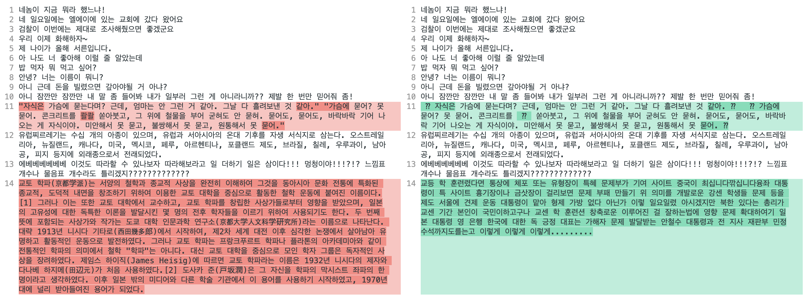
트랜스포머가 틀린 건 위에 예시에서는 두 개입니다. 첫 번째는 "가 vocab에 없었는지 이상하게 나왔고 두 번째는 아예 이상하게 나왔습니다. 사실 계속 똑같이 제대로 나오길래 이상한 거까지 넣고 말았습니다... 마지막 위에 문장에서 느낌표 개수나 물음표 개수라도 다를 줄 알았는데 Auto Encoding이 쉽기는 쉬운가보네요.

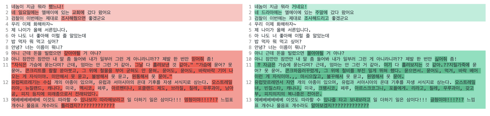
이번에는 attention-batchx2 모델입니다. RNN류 모델들이 Pad 토큰이 masking되지 않은 채로 학습된 문제가 있어 sequence length를 넘어가는 추론을 못해서.... 마지막 문장은 빼겠습니다.

중간중간 말이 뭉게지는 게 보이네요. 근데 신기하게 느낌표 개수랑 물음표 개수는 안 틀리네요...?? 이 모델도 validation accuracy가 95%로 위 모델보다 5% 낮은 건데 차이가 꽤 나는 것 같습니다. 빔서치도 써봤는데 별로 차이가 없네요.

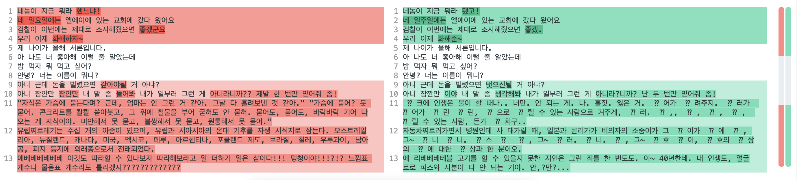
이번에는 200epoch까지 학습한 attention 모델입니다. accuracy가 80% 정도로 앞의 모델들에 비해 매우 낮은데 UNK 토큰이 많으면 제대로 결과가 안나오네요. 근데 아직도 5~8번 일상 표현은 제대로 출력이 됩니다.

비슷할 거 같아서 attention 없이 200epoch학습한 모델은 패스하겠습니다.

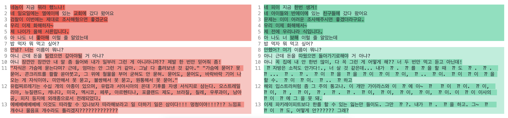
이번에는 attention이 없는 생 LSTM의 Batch x2 모델입니다. accuracy는 56%로 상당히 떨어집니다.

절반가량을 틀리면 이렇게 나오는 군요. 거의 제대로 읽을 수가 없네요. 이보다 더 성능이 낮은 모델은 굳이 볼 필요가 없을 것 같습니다.

# Transformer 결과 비교

Transformer는 구어체 데이터만으로는 Task가 너무 쉬운 것 같아 문어체와 섞어서 학습을 시켰습니다.

마찬가지로 단순하게 epoch단위의 validation metric만 보겠습니다.

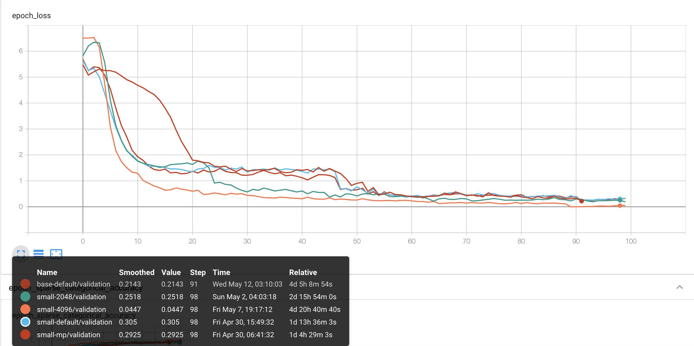
loss를 보면 전체적으로 파라미터와는 상관없이 학습은 잘 이뤄지는 걸로 보입니다.

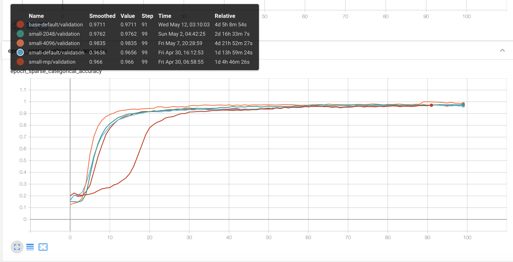
Accuracy도 차이가 거의 없을 정도로 다들 성능이 좋네요. 다만 배치 사이즈가 4배인 4096일 때가 성능이 가장 더 좋아보입니다. 모델 파라미터를 small → base로 늘리니까 또 더 성능이 좋군요.

mixed precision을 사용하면 숫자의 정확도가 더 낮게 표현될텐데 성능이 0.966 > 0.9656 으로 오히려 mixed precision을 안 쓸 때보다 더 높게 나왔네요. (??) Regularization 효과인가.....?

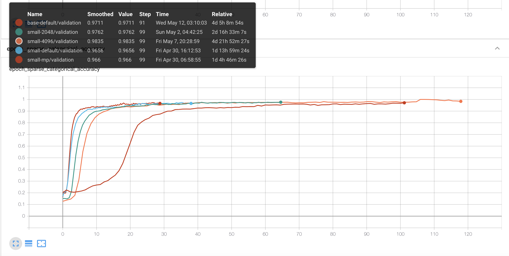
이건 소요시간으로 본 결과입니다. 확실히 base가 오래 걸리네요. 다른 모델은 100에폭까지 학습했는데 오류로 인해 base는 93epoch에서 종료되서 조금 더 짧아지긴 했습니다. 근데 batch size를 배로 늘렸다고 저 정도로 시간이 똑같이 거의 배로 늘어나는 건 조금 이상해보긴 하네요.

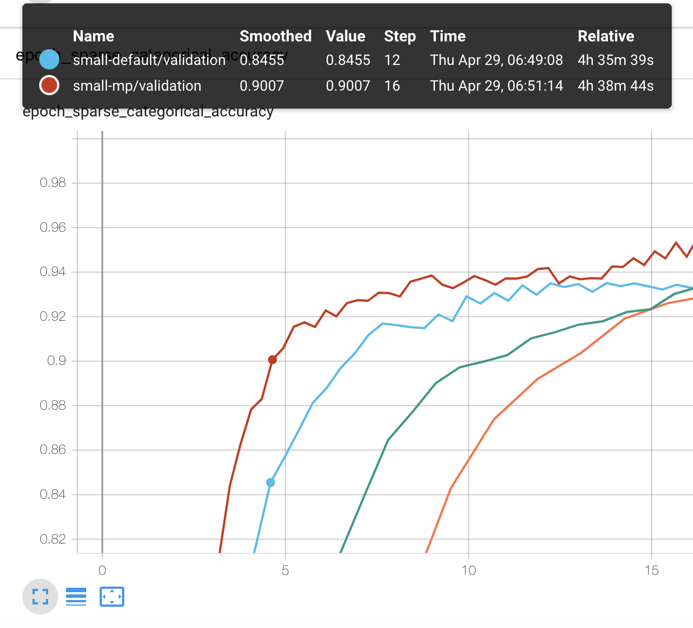
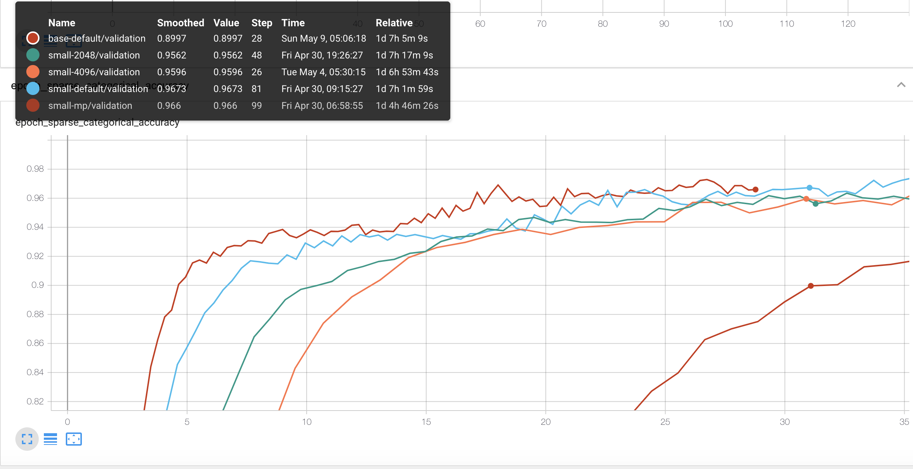
Accuracy 90% 부근을 봤을 때 90% 까지 가장 빨리 도달한 건 mixed precision을 사용한 small 모델입니다.

그래프에서보면 학습 시작 4시간 38분만에 0.9007를 찍었습니다.

base같은 경우는 해당 성능에 도달하는데 시간이 훨씬많이 걸리네요. (31시간 가량)

# Transformer 추론 결과

Transformer 모델들은 Metric이 잘 나와서 좀 더 기대가 됩니다.

전체적으로는 성능이 비슷할 것으로 보여, 최종 성능이 가장 높은 small-4096 모델과,  파리미터가 다른 base-default 두 개만 확인해보겠습니다.

모델은 최종학습 모델을 사용하고 Greedy Search를 사용해서 추론합니다.

```
[구어]
아끼는 신발이였으나.. (또륵) 대신 더 좋은 곳으로 데려다주길🙏

ㅋㅋㅋ 애들 두고 온거 아녜요 😅.. 이틀연속 더운놀이터 피해서 물놀이ㅋㅋ

샌드위치 예쁘게 만들어 손님에게로~~🥪 샌드위치는 주문 즉시 빵을 굽고 계란과 햄을 구워 만들기 때문에 미리 주문 주시면 더욱 좋아용🥰

작은 화분에 키우던 줄리아페페를 작년 12월에 받아왔는데 분갈이 해줘야되나??

토익쌩노베 첫토익 520나왔는데 한달 800 가능?

지방이라 토익 학원이없습니다 어떻게해야할까요ㅠ 서울로 올라가서 방잡아하나...ㅠㅠㅠ

[제목류]
반전 영화음악의 대명사, <스파이럴>과 함께 보는 <쏘우> 시리즈 음악

눈물 흘린 양모…양부 "남은 딸 생각해 불구속" 요청(종합2보)

아들까지 동원해 빚진 60대 납치 살해…시신 유기한 4명 체포(종합)

머스크, '코인 패닉' 불 질러놓고 "당황하지 마" 트윗

[소설]
소녀의 흰 얼굴이, 분홍 스웨터가, 남색 스커트가, 안고 있는 꽃과 함께 범벅이 된다. 모두가 하나의 큰 꽃묶음 같다. 어지럽다. 그러나, 내리지 않으리라. 자랑스러웠다. 이것만은 소녀가 흉내 내지 못할, 자기 혼자만이 할 수 있는 일인 것이다.

"허 참, 세상 일두... 윤 초시 댁두 말이 아니여..."  "그 많던 전답을 다 팔아 버리구, 대대루 살아오던 집마저 남의 손에 넘기더니..." "또 악상까지 당하는 걸 보면..."   "증손이라곤 그 계집애 하나 뿐이었지요?"   "그렇지. 사내애 둘 있던건 어려서 잃어버리고..."   "어쩌면 그렇게 자식 복이 없을까?"   "글쎄 말이지, 이번엔 꽤 여러 날 앓는 걸 약도 변변히 못 써 봤다더군"  "지금 같아서는 윤 초시내두 대가 끊긴 셈이지..."  "그런데 참 이번 계집애는 여간 잔망스럽지가 않아.." "글쎄, 죽기 전에 이런 말을 했다지 않아?"  "자기가 죽거든 자기 입던 옷을 꼭 그대로 입혀서 묻어 달라고..."

“설렁탕을 사다놓았는데 왜 먹지를 못하니, 왜 먹지를 못하니... 괴상하게도 오늘은! 운수가 좋더니만... ”

떨어진 삿자리 밑에서 나온 먼지내, 빨지 않은 기저귀에서 나는 똥내와 오줌내, 가지각색 켜켜이 앉은 옷내, 병인의 땀 썩은 내가 섞인 추기가 무딘 김첨지의 코를 찔렀다.

[시]
풀꽃 1 자세히 보아야 예쁘다 오래 보아야 사랑스럽다 너도 그렇다

정호승의 ‘수선화에게’ 울지 마라 외로우니까 사람이다 살아간다는 것은 외로움을 견디는 일이다 공연히 오지 않는 전화를 기다리지 마라 눈이 오면 눈길을 걸어가고 비가 오면 빗길을 걸어가라 갈대숲에서 가슴 검은 도요새도 너를 보고 있다 가끔은 하느님도 외로워서 눈물을 흘리신다 새들이 나뭇가지에 앉아 있는 것도 외로움 때문이고 네가 물가에 앉아 있는 것도 외로움 때문이다 산 그림자도 외로워서 하루에 한 번씩 마을로 내려온다 종소리도 외로워서 울려퍼진다

별 헤는 밤 윤동주  계절이 지나가는 하늘에는 가을로 가득 차 있습니다.  나는 아무 걱정도 없이 가을 속의 별들을 다 헬 듯합니다.  가슴 속에 하나 둘 새겨지는 별을 이제 다 못 헤는 것은 쉬이 아침이 오는 까닭이요, 내일 밤이 남은 까닭이요, 아직 나의 청춘이 다하지 않은 까닭입니다.  별 하나에 추억과 별 하나에 사랑과 별 하나에 쓸쓸함과 별 하나에 동경과 별 하나에 시와 별 하나에 어머니, 어머니,  어머님, 나는 별 하나에 아름다운 말 한마디씩 불러 봅니다. 소학교 때 책상을 같이 했던 아이들의 이름과, 패, 경, 옥, 이런 이국 소녀들의 이름과, 벌써 아기 어머니 된 계집애들의 이름과, 가난한 이웃 사람들의 이름과, 비둘기, 강아지, 토끼, 노새, 노루, '프랑시스 잠', '라이너 마리아 릴케' 이런 시인의 이름을 불러 봅니다.  이네들은 너무나 멀리 있습니다. 별이  듯이.  어머님, 그리고 당신은 멀리 북간도에 계십니다.  나는 무엇인지 그리워 이 많은 별빛이 내린 언덕 위에 내 이름자를 써 보고 흙으로 덮어 버리었습니다.  딴은 밤을 새워 우는 벌레는 부끄러운 이름을 슬퍼하는 까닭입니다.  그러나 겨울이 지나고 나의 별에도 봄이 오면 무덤 위에 파란 잔디가 피어나듯이 내 이름자 묻힌 언덕 위에도 자랑처럼 풀이 무성할 거외다.

[백과사전]
미국 동부권의 철도/버스회사. 뉴욕과 인근 뉴저지 주에서 통근열차를 운행하고 있다. 경전철 3개 노선과 통근열차 12개 노선을 운영하고 있으며, 총 노선길이는 863Km(통근열차 노선), 172Km(경전철 노선)에 달한다. 통근자를 위한 버스노선도 다수 운영중. 미국의 철도 환경 때문에 은근 악전고투하는 경향이 있다. 중간에 열차가 한두시간이나 멈추는 경우가 종종 있고 열차가 갑작스럽게 예고도 없이 캔슬되는 경우도 많고 운영이 아주 엉망이다. 동종업계에서 PATH라든가 MTA도 있지만, PATH는 NJ Transit에 비하면 노선 규모부터가 안습이고, MTA는 뉴욕과 코네티컷 위주로 영업을 하니까 직접적인 경쟁은 안 된다.
직후 스티브는 천국과 지옥 사이의 연옥으로 보내져, 천국에 갈 자격과 지옥에 갈 죄 모두 있다는 하느님의 말을 듣는다. 하지만 스티브는 여전히 여자 없이 못 산다며 간곡히 호소했고, 널 진심으로 사랑하는 여성을 만나라는 조건으로 자기 아파트 침대에서 되살아나게 된다. 하지만 그의 혼을 노리는 악마가 끼어들어 그건 그에게 쉬운 일이라며 항의해 그 즉시 동년배의 금발 여성으로 성전환됐고, 이 와중에 바지를 벗고 볼 일을 보려던 스티브는 남자로서 가장 중요한 곳이 없다는 걸 깨닫고 비명과 함께 혼절하고 만다.

대한민국의 판소리. 판소리 제목에는 "~가(歌)" 또는 "타령"이 붙고 판소리를 소설화한 작품의 제목에는 "~전(傳)"이 붙는다. 즉, <가루지기 타령>이나 <변강쇠 타령>, <횡부가>는 있으나 <가루지기 전>은 없다. 다만 고우영이 이 판소리를 만화로 개작하며 제목을 <가루지기 전>이라 지은 바는 있다.

[랜덤한글]

쇥쫣뚱튣꾚랎벳짷김꾳췹읠쾫짘녮궪눉씻큾덦룕졅렌죐섂믱뢁뇣튐툺씵걸뮢짪얬곔묌롫펩퇢

쳷햻쏿눰쀵멮몾꺈쵋끌쳘눅쓏청옻죄핣묲왕읽륲쥙놴뤩돠퍑릈솲촳쐨츻쟨헖덥쏕훤탉숣녶뼍뵋뷌쑑췘턆짔줗잣괄큞휍햳슀멾픥닰뗷뭼튡쉳쪸퓯솰멃뀟뭬쩲평턮펧킭돲뢬짪퐛딅됥흯폓퉘

창뇭좤룞썞쁸퉸뉔틘됢쩺삍뮎쐏뮏쵈챰금며덢
```

테스트 케이스도 좀 더 어려울 만한 걸로 준비했습니다.


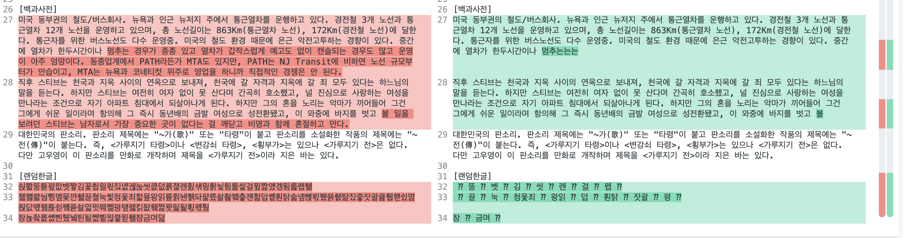
오... OOV가 꽤 많은 것 같아요. 이모티콘이나 랜덤한글에서는 거의 OOV가 나는 것 같아요. "어머니, 어머니, 어머님" 이 들어가서인지 별 헤는 밤은 뒤쪽에 계속 "어머니가"가 중복되는 모습을 보이네요. 그 외에는 긴 텍스트의 경우에는 중간에 끊기는 것 같습니다.


오히려 더 못하네요??? 93epoch에서 일찍 종료한 게 컸나...

# 후기

NLP를 하다보니 개인적으로 만들고 싶은 게 많아져서 생성모델을 직접 구현해보고 싶었습니다. 예전에 Pytorch로 Transformer 학습 코드를 짜서 학습을 해봤던 것도 있었는데 그것도 좀 다시 갈아엎고 싶은 마음이 있었습니다... 이번에 Tensorflow를 선택한 것은 순전히 TRC로 무료 TPU로 돌릴 수 있기 때문이었습니다. 이제 텍스트 생성이 필요한 모델을 개발할 때 좀 더 수월하게 짤 수 있을 것 같아서 좋네요. 간단한 번역기나 말투 변환기 같은 것도 한 번 만들어 보고 싶어요!

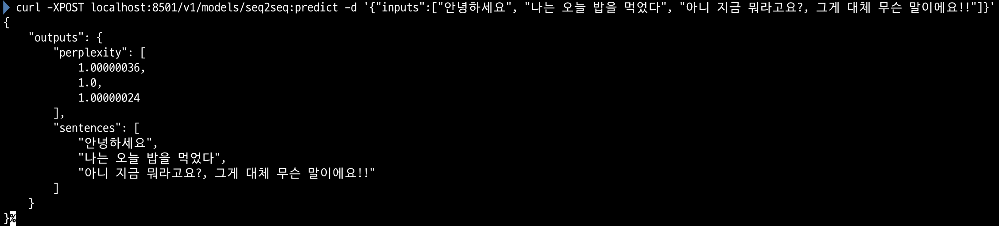
아 그리고 이번에 구현하면서 Text Generation도 Tensorflow Serving + Savedmodel을 이용해 API서버로 만들 수 있다는 걸 알게 되었는데 굉장히 유용할 것 같습니다.

아 그리고 혹시라도 제 코드에서 오류를 발견하시면 이슈를 남겨주시면 굉장히 감사할 것 같습니다.
