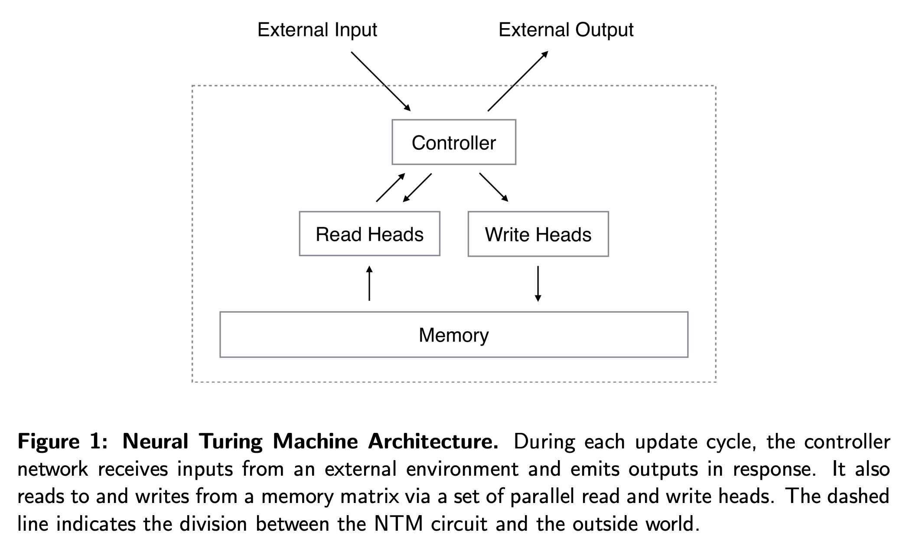

<link rel="stylesheet" href="https://cdn.jsdelivr.net/npm/katex@0.12.0/dist/katex.min.css" integrity="sha384-AfEj0r4/OFrOo5t7NnNe46zW/tFgW6x/bCJG8FqQCEo3+Aro6EYUG4+cU+KJWu/X" crossorigin="anonymous">

- [Neural Turing Machines](https://arxiv.org/abs/1410.5401)

# Abstract

---

- NeuralNet이 외부 메모리를 사용하여 attentional 프로세스를 처리할 수 있도록 확장시켰다.
- 튜링머신이나 폰 노이만 구조와 비슷하지만 end-to-end이며 미분가능하다.
- 실험 결과는 Neural Turing Machine(NTM)이 주어진 입력과 출력 예시로부터 복사, 정렬, 회상 등의 간단한 알고리즘을 풀 수 있다는 것을 보여주었다.

# Introduction

---

- 컴퓨터 프로그램은 세 개의 기본 구성요소를 사용한다.
    - 기초 연산 (수학적 연산)
    - 논리 흐름 제어 (branching)
    - 외부 메모리
- 복잡한 연산을 많이 모델링 했지만 현대의 ML은 논리 흐름 제어와 외부 메모리를 무시하고 있다.
- RNN은 복잡한 시계열 데이터를 학습할 수 있는 능력을 가지고 있으며 또한 튜링 완전한 것으로 알려져 있다.
- 저자는 이를 이용해 알고리즘적인 task를 수행할 수 있도록 확장시켰다.
- 저자는 이 장치를 Neural Turing Machine(NTM)이라고 명명했으며 기존 튜링머신과 달리 미분이 가능하고 학습될 수 있는 컴퓨터이다.
- 인간의 인지과정에서 알고리즘적인 연산과 가장 비슷한 것은 working memory이다. NTM도 working memory와 비슷한 부분들이 있다. 선택적으로 메모리에 읽고 쓰기 위해 attention 프로세스를 사용한다.
- 또한 메모리를 사용하는 방식이 정해져 있는 다른 일반적인 컴퓨터와 다르게 메모리를 어떻게 사용할 지를 학습할 수 있다.

# Foundational Research

---

## Psychology and Neuroscience

- working memory의 개념은 심리학에서 단기 적인 정보 조작으로 해결할 수 있는 task들을 설명하기 위해 오랫동안 발전되어왔다.
- 신경과학에서는 working memory 과정은 전두엽 피질과 기저핵으로 구성된 시스템에 기반한다.
- working memory의 모델에 대한 여러 주장이 있는데 Hazy et al.의 모델이 저자들의 접근법과 비슷하다. Hazy의 모델은 LSTM의 구조와 비슷하기 때문이다.
- 다만 우리는 Hazy의 모델에서와 다르게 저자들과는 다르게 메모리를 다루는 방법에 대한 내용까지 다루었다.

## Cognitive Science and Linguistics

- 인지과학과 언어학은 AI와 거의 동시에 출연하여 많은 영향을 받았다. 당시에 정보나 의미 처리의 비유로 인간의 정신활동을 설명하려 했지만 connectionist 혁명은 그런 비유를 모두 비주류로 만들었다.
- Fodor 와 Pylyshyn은 인지 모델링에서 신경망의 한계를 주장했다.
    - connectionist theory는 *variable-binding*, 또는 특정한 하나의 정보를 특정한 위치에 저장하는 것을 할 수 없다는 것이다.
    - 언어학에서는 variable-binding은 항상 필요하다. "Mary spoke to John"이라는 문장에서 Mary는 주어, John은 목적어, spoke to는 동사라는 것을 알아하는 것처럼.
    - 고정된 입력 크기를 가지고 있는 신경망은 가변 길이 구조의 처리를 수행할 수 없다는 것이다.
    - 이 때문에 힌튼을 포함한 여러 연구자들은 가변 길이를 처리할 수 있는 connectionist 프레임워크를 고안했다.

## Recurrent Neural Networks

- RNN은 상태를 가지고 있는 기계의 종류이다. RNN의 진화는 시스템에 대한 입력과 가지고 있는 상태 모두에 의존적이다.
- RNN의 커다란 혁신 중 하나는 LSTM이다. 이 구조는 gradient의 vanishing과 exploding을 방지하기 위한 목적으로 만들어졌다.
- LSTM은 기존의 단순한 $$\mathbf{x}(t+1) = \mathbf{x}(t) + \mathbf{i}(t)$$와 같은 단순한 구조에서 프로그래밍이 가능한 gate를 추가하여 $$\mathbf{x}(t+1) = \mathbf{x}(t) + g(\text{context})\mathbf{i}(t)$$ 와 같이 만들었다. 이제 임의의 길이의 정보에서 선택적으로 정보를 저장할 수 있게 되었다.
- 이 연구의 또 다른 중요한 부분은 미분가능한 attention 모델, program search 이다.

# Neural Turing Machine

---

- Neural Turing Machine(NTM)은 크게 신경망 controller와 memory bank로 구성되어 있다.
- controller는 다른 신경망처럼 외부와 상호작용하며 이 모델은 메모리와도 선택적 read/write 연산을 수행한다.
- 튜링 머신의 개념에 따라 이 연산을 head라고 이름 붙였다.
- 아키텍쳐의 모든 구성요소는 미분가능해야 하는데 저자들은 메모리에 있는 모든 요소들과 크거나 작은 수준으로 상호작용하는 흐릿한(blurry) read, write 연산을 사용해서 이를 달성했다.
- 흐릿함의 정도(blurriness)는 attentional "focus" 메커니즘에 의해 결정되어 메모리의 일부분과만 상호작용하고 나머지는 무시하도록한다.
- Memory와의 상호작용은 매우 sparse하기 때문에 NTM은 데이터를 저장하는 쪽으로 편향된다.

## Reading

$$\mathbf{M}_t$$: $$t$$시점에서의 $$N \times M$$ Memory 행렬 ($$N$$: Memory location의 수, $$M$$: 각 location의 vector size)

$$\mathbf{w}_t$$: $$t$$시점에서 read head에 의해 산출된 $$N$$ location에 대한 weight 벡터. 

weight는 정규화되어있기 때문에 $$\mathbf{w}_t$$의 $$N$$개의 요소 $$w_t(i)$$는 다음을 따른다.

$$\sum_i w_t(i)=1, \ 0 \le w_t(i) \le 1, \forall i.$$

head에 의해 반환된 길이 $$M$$의 read vector $$\mathbf{r}_t$$은 메모리의 row-vectors $$\mathbf{M}_t(i)$$의 조합으로 정의된다.

$$\mathbf{r}_t \longleftarrow \sum_i w_t(i)\mathbf{M}_t(i)$$

위 식은 memory와 weight 측면에서 모두 미분가능하다.

## Writing

LSTM으로 부터 영감을 받아 저자들은 write를 두 부분으로 나누었다. *erase*와 그 뒤 *add.*

$$t$$시점에서 write head에 의해 산출된 weight $$\mathbf{w}_t$$가 주어졌을 때, 각각의 값이 0에서 1사이인 *erase vector* $$\mathbf{e}_t$$ 와 이전 memory vectors $$\mathbf{M}_{t-1}(i)$$를 이용해 memory가 다음과 같이 수정된다.

$$\tilde{\mathbf{M}_t}(i) \longleftarrow \mathbf{M}_{t-1}(i)[1-w_t(i)\mathbf{e}_t]$$

- 수식을 보면 알 수 있듯이 Memory가 완전히 초기화 되려면 weight값과 erase vector가 모두 1이어야 하고 만약 둘 중 하나가 0이면 Memory는 변화하지 않는다.
- 결합법칙이 성립하기 때문에 여러 개의 write head가 존재해도 어떤 순서로 계산해도 상관없다.

write head는 길이 $$M$$의 *add vector* $$\mathbf{a}_t$$ 도 계산한다. 그리고 erase step이 끝난 뒤에 memory에 더해진다.

$$\mathbf{M}_t(i) \longleftarrow \tilde{\mathbf{M}}_t(i) + w_t(i)\mathbf{a}_t.$$

- write는 erase와 add로 이뤄지며 erase와 add 각각이 미분가능하기 때문에 write 연산도 미분가능하다.
- erase 벡터와 add 벡터 각각이 $$M$$ 길이의 값을 가지고 있기 때문에 각각의 memory location에 세세한 컨트롤이 가능하다.
- *erase vector*와 *add vector*가 어떻게 구해지는 건지 궁금했는데 논문에는 직접 명시되어 있지 않다.

## Addressing Mechanisms

- 위에서 weight를 사용했는데, weight는 "content-based addressing"과 "location-based addressing" 두 개의 addressing 메커니즘을 이용해서 구할 수 있다.
- content-based addressing은 현재 값과 controller가 출력한 값 사이의 유사도에 기반한 위치에 대한 attention을 사용한다.
    - content-based addressing은 controller에서 저장된 값과 비슷한 값을 출력하면 되기 때문에 검색 과정이 간단하다는 장점이 있다.
- 하지만 내용 기반으로는 부족한 경우가 있다. 예를 들어 변수 x와 y를 입력받고 x+y를 출력하는 task에서 controller는 각각 다른 위치에 저장되어있는 x와 y의 값을 얻어와서 곱셈연산을 수행해야 한다.
    - 이 경우에는 location-based addressing으로 content 기반이 아니라 location을 이용해 변수의 위치를 찾을 수 있다.
- content-based addressing은 엄밀히 말하면 내용에 location 정보를 저장할 수도 있기 때문에 더 일반적일 수 있다. 하지만 저자들은 location-based addressing을 primitive 연산으로 제공하는 것이 특정한 경우에는 필수적이라는 것을 실험에서 증명했다.

- 위 도식이 read나 write 시에 weighting vector를 얻는 전체 과정이다.

### Focusing by Content

content-addressing에 대해 각 head는 먼저 길이 $$M$$의 key vector $$\mathbf{k}_t$$를 구하고 각각의 벡터 $$\mathbf{M}_t(i)$$와 유사도 measure $$K[\cdot,\cdot]$$을 이용해 비교한다. content-based 시스템은 유사도와 positive key strength $$\beta_t$$에 기반해 정규화된 weighting $$w_t^c$$를 구한다.

$$w_t^c(i) \longleftarrow \frac{\text{exp}\big(\beta_tK[\mathbf{k}_t, \mathbf{M}_t(i)]\big)}{\sum_j \text{exp}\big(\beta_tK[\mathbf{k}_t, \mathbf{M}_t(j)]\big)}$$

- 저자들은 similarity measure $$K$$로 cosine 유사도를 사용하였다.

### Focusing by Location

- location-based addressing은 weighting의 rotational shift를 구현하면서 이뤄진다.
- rotation에 앞서 각 head는 scalar 값 *interpolation gate* $$g_t$$를 출력하는데 이 값은 이전 time step에서의 head의 결과 값인 $$\mathbf{w}_{t-1}$$과 content 시스템에 의해 얻은 $$\mathbf{w}_t^c$$를 섞어 *gated weight* $$\mathbf{w}_t^c$$를 얻기 위해 사용된다.

$$\mathbf{w}_t^g \longleftarrow g_t\mathbf{w}_t^c+(1-g_t)\mathbf{w}_{t-1}$$

- interpolation 이후에는 각 head는 허용된 정수 shifts에 대한 정규화된 분포 *shift weighting* $$\mathbf{s}_t$$ 를 출력한다. 예를 들어 -1에서 1사이의 shifts가 허용되었다면 $$\mathbf{s_t}$$는 -1, 0, 1이라는 3개의 값을 활용한다.
- 각각의 shift의 weight을 구하는 가장 간단한 방식은 controller에 적절한 크기의 softmax layer를 붙이는 것이다.
- 만약 $$N$$ Memory location을 $$0$$부터 $$N-1$$까지 index를 매긴다면 $$\mathbf{w}_t^g$$에 $$\mathbf{s}_t$$에 의해 아래의 순환 convolution 식에 따라 로테이션이 적용된다.

$$\tilde{w}_t(i) \longleftarrow \sum_{j=0}^{N-1} w_t^g(j)s_t(i-j)$$

- 위 식의 convolution 연산은 weighting을 시간이 지남에 따라 분산시킬 수 있다. 예를 들어 -1, 0, 1의 shifts가 0.1, 0.8, 0.1의 값이라면 점점 세 점을 흐리게 만들게 될 것이다.
- 이 문제를 해결하기 위해 각 head는 $$\gamma_t \ge 1$$ 의 스칼라 값을 출력하는데 이 값은 마지막 weighting을 날카롭게 만든다.

$$w_t(i) \longleftarrow \frac{\tilde{w}_t(i)^{\gamma_t}}{\sum_j \tilde{w}_t(j)^{\gamma_t}}$$

- 위와 같은 방식의 interpolation, content와 location 기반 addressing은 다음 세 가지를 가능하게 한다.
- 첫째, weighting은 location 시스템의 수정 없이 content 시스템에 의해 선택될 수 있다.
- 둘째, content 시스템에 의해 생성된 weighting은 이동될 수 있다. 이는 content에 의해 액세스되는 주소 옆에 있는 위치로 점프할 수 있게 한다. 컴퓨텅적으로 표현하면, 헤드는 연속적인 데이터 블록을 찾고, 그 블록 내의 특정 요소에 접근할 수 있게 한다.
- 셋째, 이전 time step의 weighting은 content based 시스템의 입력이 없이도 rotate 될 수 있다. 이를 통해 각 시간 단계에서 동일한 거리를 전진함으로써 weighting이 반복될 수 있다.

## Controller Network

- 컨트롤러로 Recurrent 모듈을 사용하냐 아니냐는 중요하다.
- LSTM 같은 recurrent 컨트롤러는 내부에 Memory가 있어서 외부 메모리를 보완할 수 있다. (컴퓨터에서 레지스터 처럼) 이는 여러 time step에 걸쳐 연산하기를 쉽게 만든다.
- 반면 feedforward 기반 컨트롤러는 네트워크가 외부 메모리만을 사용하기 때문에 좀 더 투명하게 연산이 보인다는 장점이 있다. 하지만 feedforward 기반은 여러 개의 head를 사용할 때 병목이 생긴다.

# Experiments

---

- 저자들은 NTM을 여러 Task를 통해 테스트했다.
- 테스트는 FeedForward 컨트롤러 NTM, LSTM 컨트롤러 NTM, 그리고 일반 LSTM을 비교하며 진행되었다.

## Copy

- 입력을 그대로 출력으로 복사하는 작업이다.
- 실제 전체 입력 시퀸스를 회상해낼 수 있는지를 보는 것이기 때문에 Target을 출력할 때는 입력을 주지 않는다.

- Learning Curve를 보면 NTM이 LSTM보다 훨씬 빠르게 cost가 감소하는 모습을 볼 수 있다.
- 또한 NTM의 cost는 거의 0에 가깝다.

- 학습에서 사용한 Sequence의 길이는 1~20이었는데 모델이 실제로 알고리즘을 제대로 배웠는지를 확인하기 위해 더 긴 Sequence를 넣었을 때의 결과를 표현한 것이다.
- NTM은 학습했던 최대 길이의 6배인 120까지도 거의 큰 오류 없이 수행하지만 LSTM은 학습했던 20을 넘어가자 정상적으로 동작하지 않았다.

- 위 Figure 6을 보며 저자들은 NTM이 "하나를 읽고 head의 위치를 이동하고 다시 읽고..." 와 같은 알고리즘을 학습했다고 믿었다.

## Repeat Copy

- copy를 확장하여 반복할 횟수를 함께 입력받으면 해당 횟수만큼 입력을 반복해서 출력한 다음 end-of-sequence 마커를 출력하는 작업이다.
- 만약 이 작업이 잘 된다면 for loop를 실행할 수 있다는 뜻이된다.

- 수렴은 NTM이 더 빨랐지만 결과적으로는 LSTM도 잘 학습되었다.

- 다만 sequence length를 학습할 때보다 늘렸을 때는 LSTM은 제대로 동작하지 않았다.
- NTM은 잘 수행했지만 얼마나 반복을 했는지는 기억하지 못했으며 end-of-sequence 마커를 제대로 출력하지 못했다.

## Associative Recall

- 이번에는 아까처럼 단순한 것보다는 조금 더 복잡하게 어떤 입력의 다음 아이템을 출력하도록 했다.

- NTM에서 잘 동작합니다.

## Dynamic N-Grams

- 이건 모델이 Memory를 지우고 다시 통계적인 정보를 저장하기 위해 사용할 수 있는지를 확인하고자 하는 Task이다.

- LSTM과 비교했을 때 NTM은 유의미한 향상이 있었으나 Optimal Estimator까지 도달하지는 못했다.

## Priority Sort

- 이 작업은 NTM이 정렬작업을 수행할 수 있는지를 보는 것이다.

- LSTM과 비교했을 때 훨씬 좋은 성능을 보였다.
- 하지만 완벽히 학습하지는 못하는 것으로 보인다.

## Experimental Details

- 실험에 사용한 모델의 파라미터는 위와 같다.
- 개인적인 생각으로는 파라미터의 숫자가 LSTM 모델보다 훨씬 작은데 저런 작업들의 성능은 NTM이 훨씬 좋았던 걸 보면 외부메모리나 많은 정보량을 잘 활용할 수 있는 아키텍쳐는 맞을 것 같다.

# Conclusion

---

- 저자들은 Neural Turing Machine이라는 neural network 아키텍쳐를 생물학적인 working memory와 compute의 설계에서 영감을 얻어 고안했다.
- 기존의 아키텍쳐와는 다르게 미분가능하고 end-to-end로 학습이 가능하다.
- 이 연구의 실험들은 간단한 알고리즘을 학습할 수 있는 능력을 보여주었다.
