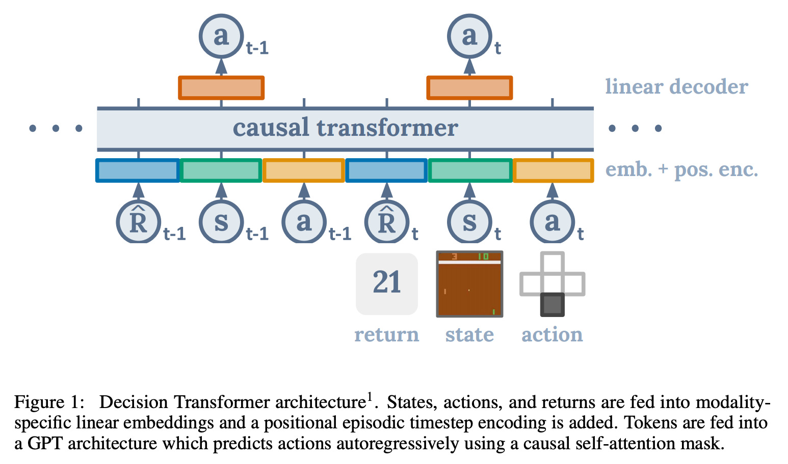

<link rel="stylesheet" href="https://cdn.jsdelivr.net/npm/katex@0.12.0/dist/katex.min.css" integrity="sha384-AfEj0r4/OFrOo5t7NnNe46zW/tFgW6x/bCJG8FqQCEo3+Aro6EYUG4+cU+KJWu/X" crossorigin="anonymous">

- [Decision Transformer: Reinforcement Learning via Sequence Modeling](https://arxiv.org/abs/2106.01345v1)
- [참고자료](https://bellman.tistory.com/m/11)

# Abstract

---

- 저자들은 Decision Transformer를 제안해 강화학습을 sequence modeling 문제로 추상화시켜 단순하고 확장성이 좋은 Transformer 구조의 이점을 살릴 수 있게 하였다.
- 단순함에도 불구하고 Decision Transformer는 Atari, OpenAI Gym, Key-to-Door task의 offline RL에서 SOTA를 넘어서는 성능을 보였다.

# Introduction

---

- 저자들은 Transformer를 전통 RL의 Component로 사용하는 이전 연구들과는 다르게 Generative Trajectory modeling이 전통적인 RL알고리즘을 대체할 수 있는지를 연구했다.
- Transformer를 미리 수집한 experience를 이용해 Sequence Modeling Objective를 사용해 학습하도록 했다.
- 이는 미래의 credit assignment를 예측하기 위한 Bootstrapping의 필요성을 없애 RL에서 deadly triad 중 하나를 피하게 해준다.

💡 [Bootstrapping?](https://velog.io/@kjb0531/%EA%B0%95%ED%99%94%ED%95%99%EC%8A%B5%EC%97%90%EC%84%9C-Bootstrapping%EC%9D%98-%EC%9D%98%EB%AF%B8)
강화학습에서 부트스트래핑이란, 예측값을 이용해 또다른 값을 에측하는것을 말한다.

- 이 방식은 future reward에 대한 차감도 필요하지 않다.
- 트랜스포머는 self-attention을 통해 credit assignment를 직접적으로 수행할 수 있다.
- 저자들은 offline RL에서 가설을 테스트했다.

💡 [Offline RL?](https://talkingaboutme.tistory.com/entry/RL-Offline-Reinforcement-Learning)
실제로 매번 예측을 수행하며 다음 상태를 탐색하는 online과 달리 고정된 데이터셋으로 최적의 Policy를 찾는다.

- 저자들은 Autoregressive하게 Trajectory를 생성하는 GPT 아키텍쳐로 Decision Transformer를 Atari, OpenAI Gym, Key-to-Door 환경에서 offline RL 벤치마크로 검증했다.

    그 결과 dynamic programming 없이 SOTA model-free offline RL 알고리즘을 넘어섰다.

💡 [Dynamic Programming?](https://brunch.co.kr/@chris-song/81)
크고 복잡한 문제는 작은 문제들로 쪼개서 푼다는 컨셉

# Preliminaries

---

## Offline reinforcement learning

저자들은 $$(\mathcal{S}, \mathcal{A}, P, \mathcal{R})$$로 설명할 수 있는 Markov decision process(MDP)에서의 학습으로 모델링했다. 

MDP 튜플은 state $$s \in \mathcal{S}$$, 
action $$a \in \mathcal{A}$$, 
transition dynamics $$P(s'|s,a)$$, 
reward 함수 $$r = \mathcal{R}(s,a)$$로 구성되어있다.

timestep $$t$$에서의 state, action, reward를 $$s_t, a_t, r_t=\mathcal{R}(s_t, a_t)$$로 사용한다.

trajectory는 states, actions, rewards의 sequence로 구성된다. 

$$\tau = (s_0, a_0, r_0, s_1, a_1, r_1, \cdots, s_T, a_T, r_T)$$

time $$t$$에서 trajectory의 보상은 $$R_t = \sum_{t'=t}^T r_{t'}$$ 그 timestep부터 미래의 보상의 합이다.

강화학습의 목표는 MDP에서 예상되는 보상 $$\mathbb{E}[\sum_{t=1}^T r_t]$$ 를 최대화하는 policy를 학습하는 것이다.

offline RL에서는 agent가 환경을 탐색하고 추가적인 피드백을 받을 수 있는 능력을 없애기 때문에 더 어려운 환경이다.

## Transformers

Transformer는 sequential data를 효과적으로 다룰 수 있는 아키텍쳐이다. Transformer는 여러 self-attention레이어와 residual connection으로 구성되어있다. 

이 구조는 Query-Key 벡터 상에서 state와 보상과의 관계를 내재적으로 형성해 credit assign을 가능하게 한다.

# Method

---

## Trajectory representation

trajectory 표현에서 핵심은 트랜스포머가 의미있는 패턴을 배우고 test time의 조건하에서 action을 생성할 수 있게 만드는 것이다. 우리는 모델이 미래의 기대되는 보상(returns-to-go)에 기반해 action을 생성하길 원하기 때문에 이는 단순한 문제가 아니다. 결과적으로 저자들은 모델에게 보상을 직접 주지 않고 모델에게 미래의 보상 $$\widehat{\mathcal{R}}_t = \sum_{t'=t}^T r_{t'}$$을 주었다.

autoregressive한 학습과 생성에 쉬운 아래와 같은 trajectory로 표현된다.

$$\tau = (\widehat{R}_1, s_1, a_1, \widehat{R}_2, s_2, a_2, \cdots, \widehat{R}_T, s_T, a_T)$$

## Architecture

저자들은 last $$K$$ timestep의 정보를 모델 입력으로 사용했다. 각 스텝마다 return-to-go, state, action이 있으므로 $$3K$$ 토큰을 사용한다. token을 Embedding으로 만들기 위해 Embedding layer를 거치고 layer normalization을 적용한다. (시각적 입력의 경우에는 대신 Convolution을 사용한다.) 원래 GPT와 달리 하나의 Positional Encoding은 세 토큰에 적용된다는 차이가 있다. 

## Training

length $$K$$의 sequence를 데이터셋으로부터 샘플링한다. 모델은 입력 토큰 $$s_t$$로부터 $$a_t$$를 예측하도록 학습된다. (이산적인 action이면 cross entropy, 연속적인 action이면 MSE loss) 각 timestep의 loss를 평균내서 사용한다. state나 returns-to-go를 예측하는 것은 성능에 변화가 없었다.

# Evaluation on Offline RL Benchmarks

---

Decision Transformer의 성능을 dedicated offline RL과 imitation 학습 알고리즘과 비교하였다. 특히 Decision Transformer도 model-free 방식이기 때문에 TD-learning 기반의 model-free offline RL 알고리즘과 주로 비교했다. 

💡 [model-free?](https://www.secmem.org/blog/2019/12/15/RL-key-concepts#model-based-model-free)
환경에 대한 예측을 사용하는 방식이 model-based, 사용하지 않는 방식이 model-free

또한 likelihood 기반의 policy learning 공식이 유사하기 때문에 behavior cloning 종류와도 비교했다.

저자들은 이산적인 action을 필요한 Atari와 연속적인 action이 필요한 OpenAI Gym에 모두 평가했다. 전자는 고차원의 observation 공간이 필요하고 long-term credit assignment를 사용하며 후자는 세세한 control을 요한다. 결과는 위와 같다.

## Atari

아타리는 고차원의 시각입력과 지연된 보상으로 인해 어렵다. 네 종류의 모델 CQL, REM, QR-DQN을 네 개의 아타리 Task(Breakout, Qbert, Pong, Seaquest)에 대해 비교했다. 

저자들의 방법은 3개의 게임은 CQL에 비기는 결과를 보여주었고 모든 게임에서 나머지 3개 모델보다 좋은 결과를 얻었다.

## OpenAI Gym

OpenAI Gym의 HalfCheetah, Hopper, Walker, Reacher 게임으로 CQL, BEAR, BRAC, AWR모델들과 비교했다. CQL은 model-free offline RL에서 SOTA이다.

각 task마다 아래처럼 세 종류의 데이터셋으로 나눠실험했다.

1. Medium: "expert" policy의 1/3 정도 점수에 도달한 "medium" policy로 생성된 100만개의 timestep를 사용
2. Medium-Replay: medium policy로 학습된 agent의 replay 버퍼 (저자들의 환경에선 25k-400k timestep)
3. Medium-Expert: medium로 생성된 100만개의 timestep과 expert policy로 생성된 100만개의 timestep를 함께 사용

💡 [Experience reply?](http://sanghyukchun.github.io/90/)
이전의 state, action, return 등을 버퍼에 저장하고 있다가 나중에 batch에 랜덤하게 뽑아 함께 넣어 학습하는 것

Decision Transformer는 다수의 작업에서 가장 높은 점수를 얻었으며 나머지에 대해서도 비등한 점수를 얻었다.

# Discussion

---

### Does Decision Transformer perform behavior cloning on a subset of the data?

Decision Transformer가 특정 보상을 가진 데이터셋에 대해 imitation learning을 하는 것이지 알기 위해 실험했다. Percentile Behavior Cloning (%BC)와 비교하는 방법을 사용했는데 이는 return이 높은 순서대로 정렬했을 때 상위 X%의 trajectory를 사용한 데이터로 Behavior Cloning을 학습하는 것이다. X = 100% 인 경우는 모든 데이터셋을 사용하는 것이다. 

데이터가 충분할 때 %BC는 다른 offline RL 방법을 이기거나 비슷하다. 

하지만 아타리처럼 데이터가 부족한 경우에는 %BC는 약하다. 이는 적은 데이터에서 Decision Transformer는 모든 trajectory를 사용한 %BC보다 성능이 더 높고 일반화 능력이 좋다는 점을 시사한다.

이 결과를 봤을 때 Decision Transformer는 단순히 imitation learning을 수행하는 것보다 더 효과적일 수 있다.

### How well does Decision Transformer model the distribution of returns?

Decision Transformer가 returns-to-go 토큰을 이해하고 있는 능력을 desired target return을 변경하면서 평가했다. 

위 그림은 다양한 target return의 값에 따라 agent가 획득한 누적 return을 보여준 것이다. 모든 task에서 desired target return과 실제 관측된 return은 높은 상관관계를 보였다. 

여기서 실제로 데이터셋에 존재하는 최대의 return보다 높은 return을 얻은 경우도 있는데 Decision Transformer의 추론적 능력을 보여준다.

### What is the benefit of using a longer context length?

context length의 중요성을 실험하기 위해 context length $$K$$로 ablation을 진행했다. 이는 frame stacking을 사용했을 때 보통 직전 상태($$K=1$$) 이 강화학습 알고리즘에 충분하다고 여겨지기 때문에 흥미로운 점이다. 

결과는 상당한 성능차이를 보여주었다. 한 가지 가설은 우리가 policy들의 분포를 표현할 때 어떤 Policy가 action을 생성하는지 알게하고 학습을 돕는다는 것이다.

### Does Decision Transformer perform effective long-term credit assignment?

모델의 long-term credit assignment 능력을 평가하기 위해 Key-to-Door 류의 환경을 사용했다. 이 환경은 다음 3 페이즈로 진행된다.

1. agent는 키가 있는 방에 놓인다.
2. agent는 빈 방에 놓인다.
3. agent는 문이 있는 방에 놓인다. 

agent가 문에 phase 3에서 문에 도착하면 binary reward를 받는다. 단 phase 1에서 key를 집었을 경우에만.

random trajectory로 생성한 데이터셋을 이용해 모델들을 학습시켰다. Decision Transformer와 %BC는 random walk로 만든 데이터임에도 효과적인 policy를 학습할 수 있었다. TD learning은 제대로 학습하지 못했다.

### Does Decision Transformer perform well in sparse reward settings?

TD learning의 알려진 약점은 골고루 충분한 보상이 주어져야 잘 학습할 수 있다는 점이다. 그리고 그것은 비현실적인 가정이다. Decision Transformer는 그 부분에서 더 robust할 수 있다. 이를 평가하기 위해 Hopper task에서 보상을 계속 주지 않다가 마지막 timestep에 몰아서 주도록 바꿔서 실험했다.

TD learning 방식은 성능이 크게 하락했지만 DT는 robust했다. BC는 학습 방법 상 Reward와 무관하다.

### Why does Decision Transformer avoid the need for value pessimism or behavior regularization?

Decision Transformer와 다른 offline RL 알고리즘의 큰 차이점은 DT는 policy regularization이나 convervatism이 필요하지 않다는 점이다. 

저자들의 추측은 TD learning 기반의 알고리즘은 근사 value function을 추정하고 value function을 개선하면서 policy를 개선하는데 학습된 함수를 최적화하는 것은 value function근사의 부정확성을 악화시킨다. DT는 직접적으로 학습된 함수를 목적함수로 사용하지 않기 때문에 이런 문제를 피할 수 있는 거 같다.

## How can Decision Transformer benefit online RL regime?

Decision Transformer는 Online에서도 잘 동작할 것이라고 믿는다.

# Conclusion

---

저자들은 Decision Transformer를 제안하며 language/sequence modeling과 강화학습을 합치는 아이디어를 냈다. 일반 LM에서 조금 달라진 구조의 Decision Transformer를 사용하여 많은 강력한 offline RL 알고리즘을 이기거나 비슷한 성능을 보여주었다. 

우리는 supervised loss를 사용했지만 큰 데이터셋으로 self-supervised pretraining task로 더 개선될 수 있을지도 모른다. 특히 state, return, action에 대한 더 정교한 embedding을 고려해볼 수 있다. Transformer 모델은 state의 변화를 모델링하는데 사용될 수 있기 때문에 잠재적으로 model-based RL를 대체할 가능성이 있다.
