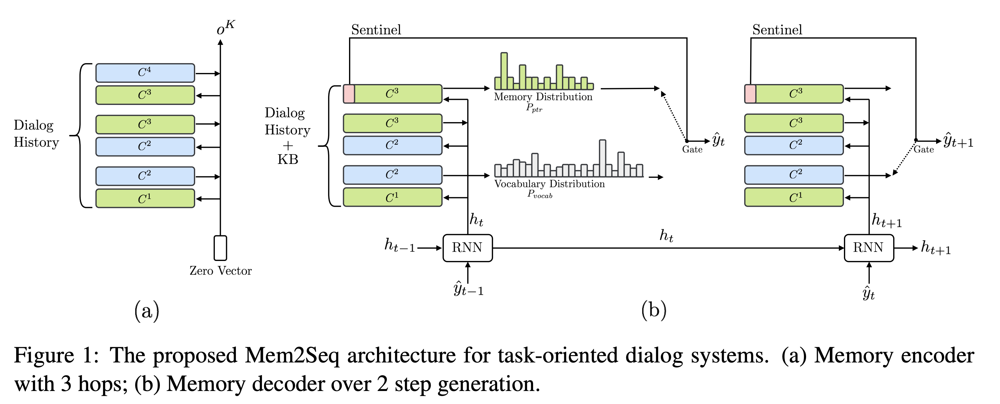

<link rel="stylesheet" href="https://cdn.jsdelivr.net/npm/katex@0.12.0/dist/katex.min.css" integrity="sha384-AfEj0r4/OFrOo5t7NnNe46zW/tFgW6x/bCJG8FqQCEo3+Aro6EYUG4+cU+KJWu/X" crossorigin="anonymous">

- [Mem2Seq: Effectively Incorporating Knowledge Bases into End-to-End Task-Oriented Dialog Systems](https://arxiv.org/abs/1804.08217)

## Abstract

---

- task oriented 대화 시스템에서 Knowledge base(KB)를 통합하는 것은 어려운 문제
- Mem2Seq 이라는 이 문제를 해결할 수 있는 모델을 제안
- Mem2Seq은 Memory에 대한 attention을 pointer network와 결합한 생성모델

## Introduction

---

- 목적지향 챗봇은 유저가 특정한 목표를 수행하는 것을 도움
- 목적 지향 대화 시스템에서 외부 KB에 query할 수 있는 능력은 필수적
- 최근(2018년 기준)에는 RNN을 이용한 encoder-decoder 구조의 생성모델로 답변을 생성하는 접근법이 좋은 성과를 거뒀음.
    - 하지만 여전히 외부 KB 정보를 RNN hidden state에 통합하는 데엔 어려움이 있음
    - 또한 attention을 사용할 때 긴 sequence를 처리하는 건 시간이 많이 소요됨.

- [MemNN](https://arxiv.org/abs/1503.08895)이라는 큰 외부 메모리에 대한 recurrent 어텐션 모델이 등장했으며 외부 메모리에 embedding 을 기록하고 query 벡터를 이용해 메모리를 반복적으로 읽을 수 있음.
- 이 접근 방식은 외부 KB 정보를 기억할 수 있고 긴 대화 맥락을 빠르게 인코딩할 수 있음.
- 하지만 MemNN은 답변을 생성 모델이 아닌 미리 정해진 풀에서 선택하는 한계가 있음.

- 저자는 MemNN의 한계를 개선하기 위해 Memory-to-Sequence (Mem2Seq) 이라는 새 아키텍처를 제시.
- Mem2Seq은 multi-hop 어텐션 메커니즘을 pointer 네트워크 개념과 엮어 대화 기록이나 KB에서 직접 단어를 copy해올 수 있음.
- Mem2Seq은 메모리에 접근하기 위한 query를 다이나믹하게 직접 생성하는 법을 학습함.

## Model Description

---

- Mem2Seq은 MemNN 인코더와 memory decoder 둘로 구성됨.
- MemNN 인코더는 대화 기록에 대한 벡터 표현을 만들어줌.
- memory decoder는 메모리를 읽고 복사해서 응답을 생성함.

$$X = \{x_1, ..., x_n, \$ \}$$ 는 대화 기록을 토큰으로 표현한 sequence임. $$ \$ $$는 sentinel이라는 특수토큰.

$$B = \{b_1, ..., b_l\}$$은 KB의 튜플.

$$U=[B;X]$$ 는 $$X$$와 $$B$$를 concat한 것.

$$Y=\{y_1, ..., y_m\}$$는 기대되는 시스템 응답의 단어들의 모음.

$$PTR = \{ ptr_1, ..., ptr_m\}$$은 포인터 인덱스로 아래와 같이 음.

$$
ptr_i= 
\begin{cases}
    \max(z) & \text{if }  \exist{z}\text{ s.t. }y_i=u_z\\
    n+l+1 & \text{otherwise}
\end{cases}
$$

$$u_z \in U$$은 입력 seuqnce 이고 $$n+l+1$$은 sentienl의 index를 뜻함.

### Memory Encoder

- $$U$$은 단어수준으로 이뤄졌으며 인코더의 입력
- MemNN의 메모리는 trainable 임베딩 행렬로 $$C = \{C^1, ..., C^{K+1}\}$$ 로 표현되며 $$C^k$$는 토큰을 벡터로 맵핑함. 쿼리 벡터 $$q^k$$는 읽는데 사용됨.
- 모델은 $$K$$ hop만큼 루프를 돌아 각 메모리 $$i$$마다 hop $$k$$에서 어텐션 weight를 계산함.

$$p_i^k = \text{Softmax}((q^k)^TC_i^k)$$

$$C_i^k = C^k(x_i)$$ 는 위치 $$i$$에서 메모리의 내용. $$p^k$$은 메모리의 쿼리와의 연관성을 계산하는 메모리 셀렉터로 기능함.
- 모델은 $$C^{k+1}$$에 대해 가중합을 통해 메모리 $$o^k$$을 읽음

$$o^k = \sum_{i} p_i^kC_i^{k+1}$$
- 다음 hop을 위해서 쿼리 벡터는 아래와 같이 업데이트 됨
$$q^{k+1} = q^k + o^k$$
- 인코딩 단계의 결과물은 메모리 벡터 $$o^K$$이며 디코딩 단계의 입력으로 사용됨.

### Memory Decoder

- 대화기록과 KB 정보를 모두 사용함
- GRU 모듈이 매 스텝 $$t$$마다 이전에 생성한 단어와 이전 쿼리를 입력으로 받고 새 쿼리를 생성함.
    
    $$h_t = \text{GRU}(C^1(\hat{y}_{t-1}), h_{t-1})$$
    
- 쿼리 $$h_t$$는 MemNN으로 전달되어 토큰을 생성함. $$h_0$$는 인코더 결과 $$o^K$$
- 매 스텝마다 vocab의 단어에 대한 분포 $$P_{vocab}$$과 메모리에 대한 분포 $$P_{ptr}$$를 구함
- $$P_{vocab}$$은 첫 hop의 어텐션 값과 현재의 쿼리벡터를 concat해서 아래와 같이 생성함. $$W_1$$은 학습 파라미터.
    
    $$P_{vocab}(\hat{y}_t) = \text{Softmax}(W_1[h_t;o^1])$$
    
- $$P_{ptr}$$은 디코더 MemNN 마지막 hop의 어텐션 가중치를 사용해서 만들어짐.
    
    $$P_{ptr} = p_t^K$$
    
- 디코더는 메모리에서 입력 단어를 가리키면서 토큰을 생성함. (pointer network 방식)
- 저자는 첫 hop은 루즈하게 메모리에서 정보를 가져오는 것에 집중하고 마지막 hop은 메모리에서 특정한 단어를 가리키기 위해서 사용하도록 일부러 학습했다고 함

#### Sentinel

- 메모리에 필요한 단어가 없을 경우 $$P_{ptr}$$은 sentinel $$\$$$를 생성하도록 학습됨. sentinel이 선택될 경우, 모델은 $$P_{vocab}$$에서 단어를 생성함. 아니면 $$P_{ptr}$$에서 단어를 생성함.

### Memory Content

- 저자는 단어 단위로 내용 $$X$$를 메모리에 저장했음
- 또한 $$X$$의 각 토큰에 시간과 화자 정보를 추가함. ex) “hello t1 $$u” ⇒ hello라고 timestep 1에 u가 말했다.
- 반면 KB정보 $$B$$를 저장할 때는 (주어, 관계, 목적어) 표현을 사용함. ex) (The Westin, Distance, 5 miles). 그 다음 각각의 단어 임베딩을 더해서 KB의 메모리 표현을 만듬. 생성 시에 $$P_{ptr}$$로 KB가 선택될 때는 위의 예시에서는 “5 miles”에 해당하는 부분을 사용함.
- KB는 특정 대화에 관련된 정보만 메모리로 사용됨.

## Experimental Results

---

- 타 모델들과 비교해 좋은 결과를 얻음

## Analysis and Discussion

---

### Memory Attention

- 위 그림은 토큰을 생성하기 위한 마지막 hop의 attention 점수인데 매우 sharp한 분포를 갖고 있는 것을 볼 수 있음.

### Multiple Hops

- Mem2Seq은 어떻게 여러 hop이 모델의 성능을 개선시키는 지를 보여줌
- 첫번째 hop은 보통 모든 관련된 메모리에 점수를 매기고 정보를 가져오는데 사용됨
- 마지막 hop은 보통 특정한 토큰에 집중하고 attention이 sharp하지 않으면 실수가 발생함

## Conclusion

---

- 목적지향 대화시스템을 위한 end-to-end로 학습할 수 있는 Memory-to-Sequence 모델을 제안
- Mem2Seq은 end-to-end memory 네트워크의 multi-hop 어텐션 메커니즘을 pointer 네트워크와 결합
- 실험적으로 모델의 능력을 검증함
