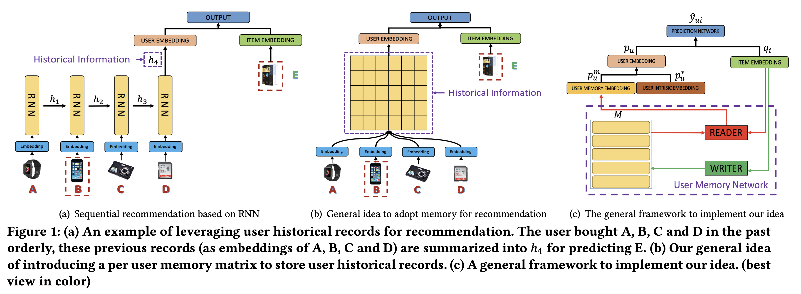

<link rel="stylesheet" href="https://cdn.jsdelivr.net/npm/katex@0.12.0/dist/katex.min.css" integrity="sha384-AfEj0r4/OFrOo5t7NnNe46zW/tFgW6x/bCJG8FqQCEo3+Aro6EYUG4+cU+KJWu/X" crossorigin="anonymous">

- [Sequential Recommendation with User Memory Networks](https://dl.acm.org/doi/10.1145/3159652.3159668)

## Abstract

---

- 실생활에서 유저의 선호는 다이나믹하고 유저의 행동 기록들이 미래 관심사를 예측하는데 모두 똑같이 중요하진 않음
- 논문에서 저자들은 유저의 historical reocrd를 더욱 직접적이고 가변적이고 효과적인 방식으로 표현, 저장, 조작하는 것을 목표로 했음
- memory-augmented neural network(MANN)을 collaborative-filtering 과 통합하여 설계
- 개인화 추천의 속성에 맞춰 메모리 read/write operation을 설계
- 저자들의 방법론으로 4개의 real-world 데이터셋에 검증했을 때 높은 성능을 보여줌

## Introduction

---

- 유저의 현재 관심사는 그들의 과거 행동에 영향을 받음
- 추천 문제를 해결하기 위해 유저의 순차적인 과거 기록을 통해 추천하는 sequential recommendation 방법이 등장함
- Markov체인이나 RNN을 이용해서 유저의 정보를 Embedding으로 만들어 추천하는 방법 등이 있지만 이 방법론들은 유저의 모든 과거 기록을 고정된 크기의 embedding으로 나타냄
- 과거의 여러 기록이 다름을 구별하는 능력의 부족은 두 가지 문제를 낳음
    - **과거 기록 중 강하게 연관된 상품들과의 연관성을 약화**시킴
    - 이런 신호를 간과하여 **사람이 추천을 이해하고 설명하기 어려움**
- 이 문제를 해결하기 위해 저자들은 **외부 기억으로 유저 기록을 모델링하는 법**을 제안
    - 각각의 기록을 명시적으로 표현, 저장, 조작할 수 있는 능력으로 외부 기억 네트워크(ENN)은 많은 순차적 예측 task에서 좋은 성능을 보임
- EMN으로부터 저자들은 **R**ecommender system with external **U**ser **M**emory networks (RUM) 을 제안
    
    
    
    - (b)와 (c)가 기본적인 아이디어를 보여줌
    - 유저마다 외부 유저 메모리 행렬이 있어서 그들의 과거 기록 정보를 유지함
- 저자들은 item-level, feature-level 두 가지 방식으로 RUM을 개발하고 실험함

### Contribution

- memory-augmented neural networks(MANNs)를 처음으로 추천시스템에 적용
- item, feature level 두 종류의 잠재적인 메모리 네트워크를 탐색함. 나아가 두 방식의 성능을 비교함.
- 다양한 실생활 데이터에 대해 SOTA와 비교하여 우월성을 검증함
- 어텐션 메커니즘을 통해 왜 상품이 추천되는지 방법과 이유를 설명할 수 있는 실험적 분석을 제공

## Related Work

---

- 저자들은 본질적으로 sequantial recommendation과 memory-augmented neural network를 통합한 것이며 이 두 연구에 대해 설명함

### Sequential Recommendation

- 유저 순차적인 과거 기록으로 미래 행동과 추천을 예측하는 많은 모델이 제시됨
- factorized personalized Markov chains(FPMC)는 인접한 행동 간에 있는 전이 정보를 추천을 위한 상품 잠재 벡터로 사상함
- FPMC나 HRM 같은 방법론들은 주로 모든 인접한 기록에서 지엽적인 순차적 패턴을 모델링함
- 여러 스텝의 순차적 행동을 모델링하기 위해 전체적인 순차적 패턴을 파악하고 RNN에 기반해 동적으로 유저의 관심사를 학습하는 DREAM 모델 등이 제안되었지만 기존 모델들은 보통 유저의 이전 기록를 hidden state 하나로 인코딩함
- 하지만 저자들은 유저 메모리 네트워크를 활용해 각 유저의 이전 기록을 저장하고 조작해 유저 기록의 표현력을 높임

### Memory-Augmented Neural Network

- external memory network (EMN)은 순차적 데이터를 효과적으로 처리하는 능력을 보여줌
- EMN은 기록을 저장하기 위해 기억행렬을 사용하고, 적절하게 이 행렬을 읽고 갱신함
- 매우 최근에 연구자들은 EMN을 question answering, naturl langueage transduction, knowledge tracking 등 영역에 성공적으로 적용함
- EMN은 크게 기억행렬과 컨트롤러 두 요소로 구성됨. 많은 방법론이 어텐션 메커니즘을 사용해 기억을 읽어들임.
    - 입력 $$q$$에 대해 먼저 기억행렬에 있는 기억슬롯 $$m_i$$ 과의 유사도 $$S(q, m_i)$$를 계산함. 그리고 어텐션 가중치 $$w_i = \text{Softmax}(S(q, m_i))$$를 얻음. 이 가중치로 어떤 기억을 읽어들일지 결정됨.
    - 쓰기 과정에서는 내용과 위치에 기반해 기억행렬이 갱신됨.
- 논문에서 저자들은 EMN 아이디어를 추천 시스템에 적용해 유저 행동 기록을 효과적으로 반영할 수 있는 것을 목표로 함.

## RUM: Recommendation with user memory networks

---

- 먼저 RUM의 일반 구조를 설명하고 item-level, feature-level 두 가지 방식에 대해 추가적으로 설명함

### General Framework

- $$N$$명의 유저와 $$M$$개의 상품을 가정했을 때, $$p_u$$와 $$q_i$$는 유저 $$u$$와 상품 $$i$$의 임베딩을 뜻함
- $$u$$와 $$i$$의 유사도는 $$\hat{y}_{ui}=p_u^Tq_i$$ 로 예측됨
- 결국 유사도는 $$p_u$$과 $$q_i$$의 내적값으로 계산함

#### Memory enhanced user embedding

- 유저의 임베딩은 두 부분으로부터 생성함. 하나는 유저의 이전까지의 기록을 인코딩한 유저의 기억에 대한 것이고 다른 하나는 이전 기록에 영향을 받지 않고 유저의 내재적인 선호를 나타내는 자유벡터.
- 유저의 기록은 더 표현성이 좋은 개인화된 기억행렬 $$M^u$$로 인코딩되어 저장되고 갱신됨
- 유저 $$u$$에 대해, 메모리 임베딩 $$p_u^m$$은 현재 아이템 임베딩 $$q_i$$에 따라 $$M^u$$를 읽어 얻어짐

$$
p_u^m = READ(M^u, q_i)
$$

- 그 다음 $$p_u^m$$을 내재적인 임베딩 $$p_u^*$$과 합쳐 최종 유저 임베딩을 얻음

$$
p_u = MERGE(p_u^*, p_u^m)
$$

- $$MERGE$$는 두 벡터를 하나로 합쳐주는 함수이며 저자들은 단순하게 weighted vector addition을 적용
    - $$\alpha$$는 weighting 파라미터
    - $$MERGE$$함수로 element-wise 곱이나 concat도 실험했지만 좋은 결과를 얻지 못했음
    - 저자들은 기억을 추천에 활용할 때 영향력을 알아보기 위해 $$\alpha$$값을 실험함

$$
MERGE(x,y) = x + \alpha y = p_u^* + \alpha p_u^m
$$

#### Prediction function

- 예측할 때, 최종 유저 임베딩 $$p_u$$와 상품 임베딩 $$q_i$$를 함수에 넣는다.

$$
\hat{y}_{ui} = PREDICT(p_u, q_i)
$$

- $$PREDICT$$는 임의의 예측함수 혹은 예측 신경망을 뜻하며 저자들은 학습 효율을 위해 sigmoid 내적을 사용함. $$\hat{y}_{ui} = \sigma(p_u^T \cdot q_i)$$ 다른 도메인에서는 다른 방식이 사용될 수 있음.
- 모델 최적화를 위한 loss 함수로는 binary cross-entropy 를 사용함.

$$
\begin{aligned}
l_{RUM} &= \log \prod_{(u,i)} (\hat{y}_{ui})^{y_{ui}}(1-\hat{y}_{ui})^{1-y_{ui}} - \lambda \Vert \Theta \Vert_F^2
\\
&= \sum_u \sum_{i\in I_u^+} \log \hat{y}_{ui} + \sum_u \sum_{i\in I/I_u^+} \log (1- \hat{y}_{ui}) - \lambda \Vert \Theta \Vert _F^2
\end{aligned}
$$

- $$\Theta$$는 모델 파라미터이며, $$y_{ui}$$는 $$u$$가 구매를 했다면 1, 아니면 0을 뜻하는 ground truth임
- $$I$$는 모든 상품의 집합, $$I_u^+$$는 구매순으로 배열된 $$u$$가 구매한 상품들의 집합
    - $$I_u^+ = \{ v_1^u, v_2^u, \cdots, v_{\mid I_u^+ \mid }^u \},$$ 여기서 $$v_j^u$$는 $$u$$가 구매한 $$j$$번째 상품
- negative 물품은 $$I_u^- = I / I_u^+$$ 에서 랜덤으로 추출함

- loss 함수의 앞 부분 2개로 likelihood를 최대화하고 뒷 부분으로 모델을 regularize함

#### Memory updating

- 매 구매가 일어난 뒤에 유저 기억행렬 $$M^u$$는 자체의 동적인 속성을 유지하기 위해 갱신된다.

$$
M^u \leftarrow WRITE(M^u, q_i)
$$

- 이제 item-level과 feature-level에서 각각 $$READ$$와 $$WRITE$$가 어떻게 일어나는지 설명함

### Item-level RUM

- 먼저 저자들은 각각의 상품을 하나의 기억 단위로 봄
- 유저 $$u$$에 대해 해당 유저가 최근에 구매한 상품들로 기억행렬 $$M^u$$를 구성함
- $$I_u^+ = \{ v_1^u, v_2^u, \cdots, v_{\mid I_u^+ \mid }^u \}$$ 일 때, $$v_i^u$$는 $$u$$가 구매한 $$i$$번째 상품.
- $$p_u \in R^D, q_{v_i^u} \in R^D$$는 각각 유저 $$u$$와 상품 $$v_i^u$$의 임베딩
- 기억 행렬에는 $$K$$개의 열(기억 슬롯)이 있다고 가정
- $$M^u \in R^{D \times N} = \{ m_1^u, m_2^u, \cdots, m_K^u \},\ m_k^u \in R^D$$은 $$M^u$$의 $$k$$번째 열 벡터

#### Reading Operation

- 더 영향력 있는 상품이 최종 기억 임베딩에서 더 가중되어야 함
- user-item 페어 $$(u, v_i^u)$$에 대해 예측할 때, 처음에 FPMC와 비슷한 방식을 택함

$$
w_{ik} = (q_{v_i^u})^T \cdot m_k^u,\ z_{ik} = \frac{\exp(\beta w_{ik})}{\sum_j \exp (\beta w_{ij})},\ \forall k= 1,2,\cdots, K
$$

- $$\beta$$는 강도 파라미터이며 $$z_{ik}$$를 $$u$$의 기억 임베딩을 얻기 위한 어텐션 가중치로 사용함

$$
p_u^m = \sum_{k=1}^K z_{ik} \cdot m_k^u
$$

- 이전 모델들과 달리 저자들은 모델 상품 임베딩을 reading 중에 강제로 합치지 않고 각각을 $$M^u$$에 저장해두고 어텐션을 사용해 읽어들임으로써 더 세세하게 유저기록을 활용할 수 있음

#### Writing operation

- 유저의 최근 행동이 현재를 예측하는데 더 중요하기 때문에 저자들은 단순하게 first-in-first-out 메커니즘을 사용해 기억행렬 $$M^u$$를 유지함.
- 기억행렬 $$M^u$$는 항상 가장 최근에 구매한 $$K$$개의 상품 임베딩을 갖고 있음
- 하지만 만약 기억슬롯이 꽉 차지 않았다면 원래 걸 지우지 않고 추가만 함

### Feature-level RUM

- latent factor model(LFM)에서 영감을 얻은 방식으로 LFM에서는 feature level에서는 구매 결정을 할 때 상품의 feature의 집합을 사용
- 이런 feature 상에서 유저의 선호는 동적으로 구매이력에 따라 반영되어야 함
- 먼저 저자들은 global latent feature table(GLFT)을 만들어 feature 임베딩을 저장함. 이 테이블은 유저나 상품과는 별도로 모델의 일부처럼 공유함.
- GLFT 에 있는 feature에 대한 선호를 이용해 유저 기억행렬 $$M^u$$를 만들고, 여기에 어텐션을 사용해 기억 임베딩을 얻음
- 마지막으로 아이템 임베딩을 이용해 유저 기억행렬 $$M^u$$를 갱신함

- $$p_u \in R^D,\ q_i \in R^D$$는 유저 $$u$$와 상품 $$i$$의 임베딩
- 시스템에 $$K$$개의 feature가 있을 때 GLFT $$F = \{ f_1, f_2, \cdots, f_K \},\ f_k \in R^D$$
- 유저기억 행렬 $$M^u = \{ m_1^u, m_2^u, \cdots, m_K^u,  \}$$이 있을 때 $$m_k^u \in R^D$$는 유저 $$u$$의 feature $$k$$에 대한 선호를 나타내는 임베딩이다.

#### Reading operation

- 먼저 상품 $$i$$와 각 feature의 연관성을 구함

$$
w_{ik} = q_i^T \cdot f_k,\ z_{ik} = \frac{\exp(\beta w_{ik})}{\sum_j \exp(\beta w_{jk})},\ \forall k = 1,2,\cdots, K
$$

- $$\beta$$는 여전히 강도 파라미터이며 위와 같은 얻은 $$z_{ik}$$와 유저의 기억행렬을 이용해 유저 기억 임베딩을 계산하

$$
p_u^m = \sum_{k=1}^K z_{ik} \cdot m_k^u
$$

#### Writing operation

- neural turing machine(NTM)에서 영감을 받아 유저 기억행렬 $$M^u$$에 쓸 때, 삭제를 먼저한 뒤에 정보를 추가함
- $$q_i$$로부터 $$D$$ 차원의 erase 벡터 $$erase_i \in R^D$$를 다음과 같이 계산

$$
erase_i = \sigma (E^Tq_i + b_e)
$$

- $$\sigma(\cdot)$$은 element-wise sigmoid 함수이며 $$E$$와 $$b$$는 학습되는 삭제 파라미터.
- 어텐션 가중치와 $$erase$$벡터가 주어졌을 때, feature 선호 기억은 다음과 같이 갱신됨

$$
m_k^u \leftarrow m_k^u \odot (1-z_{ik} \cdot erase_i)
$$

- $$\odot$$은 element-wise product
- 기억벡터는 오직 해당 위치의 weight와 erase 값이 모두 1일 때만 0으로 초기화 되고 weight나 erase 값 중 하나라도 0이면 기억벡터는 변하지 않음
- 삭제 후에는 $$add_i \in R^D$$가 feature preference memory를 갱신하는데 사용됨

$$
add_i = \tanh(A^Tq_i + b_a),\ m_k^u \leftarrow m_k^u + z_{ik} \cdot add_i
$$

- 여기서 $$A$$와 $$b_a$$는 학습되는 파라미터
- 이러한 erase-add 갱신 전략은 망각을 가능하게 하고 유저의 feature 선호 임베딩을 강화하여 모델이 어떤 신호가 약해져야하고 강해져야하는지를 학습할 수 있음

## Discussions and Further Analysis

---

### Item- v.s. Feature-level RUM

- item-level RUM은 각각의 상품을 단위로 사용해 상품의 Embedding을 직접 메모리로 저장하고 상품간의 전이 패턴을 찾도록 설계됨
- feature-level에서는 여러 feature에 대한 유저의 preference의 임베딩을 저장하고 상품은 이 임베딩을 변화시키기위해 간접적으로 활용됨
- 실제로 이 모델들을 활용할때 “설명-효과성”의 tradeoff가 있음
    - item-level RUM은 과거의 어떤 아이템이 현재 결정에 더 중요한지를 명시적으로 설명할 수 있음
    - feature-level RUM은 block box로 모델링되어 설명이 어렵지만 더 좋은 성능을 보임

## Experiments

---

### Overall Performance of Our Models

- 먼저 item-level과 feature-level에서 ($$\alpha=0.2)$$ 성능을 측정함
- item이나 feature 레벨 RUM 모두 대부분의 경우에서 베이스라인보다 높은 성능을 얻음

### Influence of the Weighting Parameter $$\alpha$$

- weighting 파라미터 $$\alpha$$의 영향을 분석
- 메모리를 사용하지 않는($$\alpha = 0$$)인 경우, 성능이 좋지 못했으며 메모리 네트워크가 통합되었을 때($$\alpha \simeq 0.2$$
) 성능이 극적으로 향상됨
- 하지만 메모리 임베딩의 weight를 더 높여가면 성능이 하락함
- 이 결과는 유저가 최근에 구매한 상품의 영향력을 더 고려는 것이 더 좋은 추천을 할 수 있음을 의미
- 하지만 너무 최근 정보에 집중하는 경우 유저의 내재적 선호가 고려되지 않을 수 있음

## Conclusion

---

- external memory network를 collaborative filtering과 통합해 sequential recommendation에 적용하는 방법을 제안
- item-level과 feature-level로 RUM 프레임워크를 제공하고 실험을 통해 효과를 증명함
- 명시적 유저 기억 모델링에 기반한 추천이라는 목표를 향한 첫 걸음
- 유저의 리뷰나 상품 이미지 등을 활용하면 더욱 설명가능한 추천시스템을 만들 수 있을 것
- RUM은 유연한 framework이기 때문에 다른 분야에 적용해볼 수 있을 것

## Review

---

- 어쨌든 기본 시스템은 Memory Embedding 풀을 구성하고, 마지막에 구매한 상품을 query로 사용해 메모리에서 attentional하게 정보를 읽어들여 user embedding을 만들고, 가장 까까운 item embedding을 찾아 해당 상품을 추천한다. 그 다음 새 구매정보를 메모리에 추가하는데 item-level에서는 단순히 item embedding을 추가하고, feature level에서는 neural turing machine 컨셉을 따라 attention 가중치를 이용해 원래 기억을 지우고 새 값을 더하며 메모리를 유지함

논문을 읽으면서 아직 모르겠는 궁금점들이 있다.

- feature-level 에서 feature의 Embedding은 어떤 모델로 어떻게 얻지?
- 유저의 내재적 임베딩, item임베딩은 어떻게?
- 어디까지가 end-to-end로 학습되는지도 잘 모르겠다.
- feature-level 에서는 매 상품의 구매마다 memory read/write를 반복해야 한다. 그러면 매 학습 step마다 memory를 초기화하나? 그렇지 않다면 그냥 배치단위로 계속 그 다음 sequence를 입력받는 식인가?
- 최근 논문 중에는 EMN을 활용하는 논문이 없나? 잘된다면 QA같은 task에서 효과가 매우 좋았을 거 같은데? 한계점 같은 걸 분석한 논문이 있을까?
