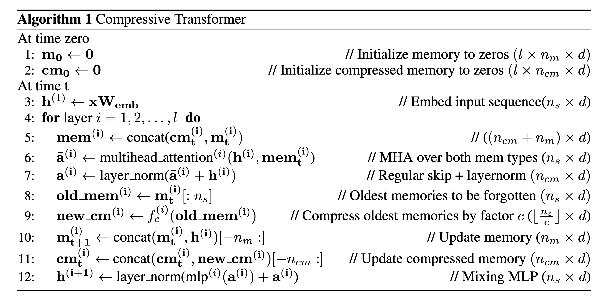

<link rel="stylesheet" href="https://cdn.jsdelivr.net/npm/katex@0.12.0/dist/katex.min.css" integrity="sha384-AfEj0r4/OFrOo5t7NnNe46zW/tFgW6x/bCJG8FqQCEo3+Aro6EYUG4+cU+KJWu/X" crossorigin="anonymous">

- [Compressive Transformers for Long-Range Sequence Modelling](https://arxiv.org/abs/1911.05507v1)

## Abstract

---

- 긴 과거 sequence 에 대한 메모리를 압축하는 Compressive Transformer를 보여줌
- Compressive Transformer로 WikiText-103, Enwik8 등 벤치마크에서 SOTA 성능을 얻음
- Speech나 RL에서도 사용될 수 있음을 검증
- 새 LM 벤치마크 데이터셋 PG-19를 제작

## Introduction

---

- 책을 읽을 때 사람은 수천 단어를 읽어도 심지어는 읽는 텀이 길어도 과거의 서사를 압축된 표현으로 갖고 있을 수 있음
- 모든 정보를 저장하는 것이 아니라 사람은 입력되는 자극을 공격적으로 선택하고 필터링하고 통합함
- 과거에 대해 표현할 수 있는 RNN, LSTM, Transformer 등의 모델이 등장
- Transformer는 과거를 depth x memory size x dimension으로 표현하기 때문에 LSTM의 hidden state에 비해 크기정도(order of magnitude)가 더 큼
- Transformer는 엄청난 성능을 보여주었지만 모든 timestep에 attention하기 때문에 큰 메모리의 계산과 저장 비용이 높음
- sparse 메커니즘처럼 계산 비용을 줄이는 모델도 있지만 저장 비용은 그대로임
- 저자는 Transformer의 확장으로서 Compressive Transformer를 제안
    - 과거 기억을 더 작은 압축된 형태로 표현
    - 기억과 압축기억에 대해서 같은 방식으로 어텐션 메커니즘을 적용
    - 글자 수준의 LM에서 SOTA 달성
    - 언어 말고도 음성이나 RL 분야에도 적용가능함을 확인
- 책의 LM 벤치마크인 PG-19 데이터셋을 제작

## Related Work

---

- Transformer 어텐션의 범위를 확장하거나 비용을 줄이려는 시도가 많았음
- TransformerXL에서는 과거의 activation을 기억에 저장하고 새로운 relative positional embedding 방법을 제안했으며 저자들도 이 두 아이디어를 모두 활용함
- Sparse Transformer는 합리적은 메모리와 계산 비용으로 모델을 만들 수 있지만 작은 attention window로 성능의 한계가 있었으며 여러 attention head가 더 짧고 긴 길이의 어텐션을 학습하는 기법 등은 압축기억을 활용하는 비슷한 면이 있지만 구현 상 TPU 같은 가속화하드웨어를 사용하기 어려운데 비해 저자들의 접근 법은 가능함

## Model

---

- 긴 과거기록을 보존하기 위해 각 레이어마다 과거 activation을 메모리로 갖고 있는 TransformerXL 을 기반으로 함
- TransformerXL에서는 메모리 크기를 넘어서는 오래된 기억은 버려지는 반면 Compressive Transformer는 이런 오래된 기억도 버리지 않고 압축하여 별도의 압축기억으로 저장함

### Description

- $$n_m:$$ 레이어 마다의 회상 기억
- $$n_{cm}:$$ 레이어 마다의 압축 기억
- $$S = x_1, x_2, \cdots, x_{\vert s \vert}$$ 는 입력 토큰들
- $$n_s:$$ 모델이 동시에 처리하는 개수, window size

모델은 time $$t$$에 $$\mathbf{x} = x_t, \cdots, x_{t+n_s}$$ 를 입력받음. $$\mathbf{x}$$하나를 seqence로 칭함.

모델이 다음 sequence로 이동하면 $$n_s$$ 길이의 hidden activation은 고정 크기의 FIFO 메모리로 입력됨

그리고 가장 오래된 $$n_s$$ 개의 메모리는 삭제되는데 TransformerXL과는 달리 이 데이터를 버리지 않고 압축함.

$$f_c: \mathbf{R}^{n_s \times d} \rightarrow \mathbf{R}^{ \lfloor \frac{n_s}{c} \rfloor \times d }$$ 는 $$n_s$$개의 가장 오래된 기억을 $$\lfloor \frac{n_s}{c} \rfloor$$ 개의 압축기억으로 맵핑해 이차적인 FIFO 압축기억 공간에 저장.

$$d$$는 activation의 hidden size를 뜻하며 $$c$$는 압축률을 뜻함.

### Compression Functions and Losses

- 압축 함수 $$f_c$$로 다음과 같은 함수를 고려함
    1. max/mean pooling, kernel과 stride는 모두 $$c$$
    2. 1D convolution, kernel과 stride는 모두 $$c$$
    3. dilated convolutions
    4. most-used, 기억들은 각 어텐션 평균값으로 정렬되고 가장 많이 사용되는 것들이 보존됨
- pooling은 빠르고 단순한 베이스라인
- convolution 방법들은 학습 파라미터를 갖고 있음

- compression 네트워크는 loss로부터 gradient를 받아 학습할 수 있지만 매우 오래된 기억의 경우backpropagating-through-time (BPTT)을 통해서 긴 timestep에 걸쳐 학습해야 함.
- 저자들은 지엽적인 압축 목표를 주기 위한 loss로 두 가지 방법을 고려함
    1. Auto-encoding loss
        - auto-encoding loss는 압축된 기억으로부터 원래 기억을 복원할 수 있도록 함
        - $$\mathcal{L}^{ae} = \Vert \text{old\_mem}^{(i)} - g(\text{new\_cm}^{(i)}) \Vert_2$$
        - $$g: \mathbb{R}^{ \frac{n_s}{c} \times d} \rightarrow \mathbb{R}^{n_s \times d}$$ 가 학습됨
    - 이건 모든 정보를 메모리에 유지하려는 lossless 압축 목표
    1. attention-reconstuction loss
    
    
    
    - 위와 같이 메모리와 압축 메모리에 대한 content-base 어텐션 값을 복원하는 objective
        - 이 방식은 모델에서 더이상 attended 되지 않는 정보들이 버려질 수 있는 lossy한 목표임
- attention-reconstruction 방식이 좋다는 것을 발견
- 학습 시 transformer와 compression 네트워크 간의 gradient를 차단하여 각각 모델의 목표로 학습하도록 함

## PG-19 Benchmark

---

- 긴 길이의 메모리를 다루는 모델들이 등장하면서 더 긴 context를 학습하고 평가할 데이터셋이 필요함
- Project Gutenberg에서 추출한 책을 사용한 language modeling 벤치마크 PG-19 제작

 

## Experiments

---

- Adam 사용
- LR cosine decay로 스케줄링 (1e-6 → 3e-4 Warm up → 1e-6)
- gradient update frequency 조정 (gradient accumulation 말하는 듯 x4)
- gradient clipping (≤ 0.1) 이 최적화에 중요했다고 함

### PG-19 & Enwiki8

- PG-19, Enwiki8 language modeling에서 좋은 성능을 기록

### Compressibility of layers

- 상위 layer로 갔을 때 representations이 더 압축하기 어려울 거라고 생각해볼 수 있음
- layer별로 compression loss를 모니터링 해봄
- 1st layer가 매우 압축성이 좋았지만 상위 레이어로 가면서의 경향은 불불명함

### Attention

- 압축 기억을 활용하는지를 체크하기 위해 네트워크가 평균적으로 어디에 attend하는지 조사함
- 현재 sequence에 대부분의 attention이 걸리며 sequence에서는 causual masking으로 인해 앞부분의 attention이 높음.
- 가장 오래된 memory에서 compressed memory로 갈 때 attention weight가 커지는 것을 발견
- 이는 오래된 기억일수록 덜 활용되는 경향에 반하는 것이며 이건 **모델이 중요한 정보를 보존하는 법을 학습하고 있다는 증거**

#### Optimisation Schedule

- 긴 context를 다루는데 parameter를 실시간으로 업데이트하다보니 train/test 간에 분포의 차이가 발생함
- 문서가 바뀌는 부분에서만 파라미터를 업데이트할 수도 있지만 이건 너무 오래걸림
- 저자들은 학습 도중 파라미터 업데이트의 빈도를 4스텝에 1번으로 조절하고 이것이 꽤 잦은 파라미터 업데이트로 빠른 초기학습과, 항상 업데이트하지는 않아 더 좋은 일반화 능력을 갖게됨을 발견

### Speech & Reinforcement Learning

- 다른 modality에서의 성능을 확인하기 위해 waform에 Compressive Transformer를 적용
    - TransformerXL과 WaveNet보다 좋은 성능을 기록
- 비디오 입력은 다음 frame에 대해 높은 상호 정보량을 가지고 있어 압축이 효과적임
    - 비디오에 직접 테스트하지는 못했지만 비디오 입력을 받는 RL agent에 적용해봄
    - compression rate을 1로 줬을 때 제대로 학습이 되지 않았지만 4로 가장 좋은 성능에서는 사람만큼 잘 풀었음
    - 비디오 입력에 대해서도 효과가 있을 것이라고 기대

## Conclusion

---

- 본 논문은 Transformer 기반 모델의 임시적인 수용범위를 압축의 개념을 활용해 확장함
- long-range seqence modeling에서 기존의 아키텍쳐보다 우수한 성능을 확인
- 새로운 LM 벤치마크 PG-19 제작 및 공개
- 압축 기억을 활용했을 때 텍스트 뿐만 아니라 음성, 비전, RL 등에서 활용가능함을 보여줌
- 이 연구의 한계점으로는 부가적으로 발생하는 복잡성이 있음.
    - long-range가 아니라면 Compressive Transformer을 썼을 때 이점이 없을 것
    - 그럼에도 dynamic 이나 sparse 어텐션 류들보다는 단순하고 연산의 하드웨어 호환성이 좋음
- 저자들은 세세한 최근 기억과 개략적인 압축된 과거 기억을 혼합하여 사용하는 더욱 강력한 모델이 있을 것이라 생각

## Review

---

- Algorithm 1에서 보면 attention의 key, value로 현재 sequence가 없고 압축기억과 기억만 사용하는 것처럼 표기가 되어있는데 이러면 현재 sequence에서는 attention을 못 받는데 안되지 않나?
    - 공식 코드는 아니지만 https://github.com/lucidrains/compressive-transformer-pytorch의 구현에서는 sequence까지 concat해서 key, value로 사용하는데 실제로도 이게 맞을 듯
- 부록에서보면 학습 시에 상태를 초기화하지 않았다고 하는데 왜 그랬지? Batch 단위로 했을 때 어떤 건 끝나서 초기화해줘야하고 어떤 건 안끝났고 이거 처리가 귀찮아서 그런가...?
    
    > As the Compressive Transformer is trained without state resetting, it is actually slightly out of sample when provided with the (relatively) short contexts. This is because its memory and compressed memory may be still empty (whereas they are always full during training). However we see a trend of the samples usually improving towards the end.
    > 
- 압축함수가 $$n_s \rightarrow \frac{n_s}{c}$$ 로 줄여주는 함수라 모델의 한 번 입력 sequence 길이(window size)를 고정해야하는 건 불편할 수 있을 듯
- 압축방식으로 auto-encoding 방식과 attention-reconstuction 방식 두 가지를 고려했을 때 후자가 좋다는데 두가지와 local reconstruction loss를 사용하지 않고 학습했을 때의 성능 비교가 있었으면 좋았을텐데 왜 안 넣었지? 이게 없어도 수렴이 되기는 하는 건지 궁금
- 사실 여기서는 압축을 빼고 생각하면 기억이라고 표현하지만 토큰의 임베딩 정보를 단순하게 FIFO 큐에 보관해서 어텐션 때 key, value로 참고하는 것...인데 그리고 압축은 그 key, value의 쌍을 좀 더 적은 메모리로 근사하는 것이고. 사실 상 초기레이어에서는 말 그대로 단어를 백업하는 게 될 듯하다.
- 또 결국은 memory든 compress memory는 다 FIFO 큐라 일정 시간이 지나면 아무리 중요한 정보라도 날라갈 수밖에 없는 것도 한계가 있을 듯. external memory의 형태지만 실질적으로는 context 길이의 확장 느낌? 큐 대신 ntm이나 memory net처럼 기존 기억과의 병합하는 방식으로는 못 안될까?
