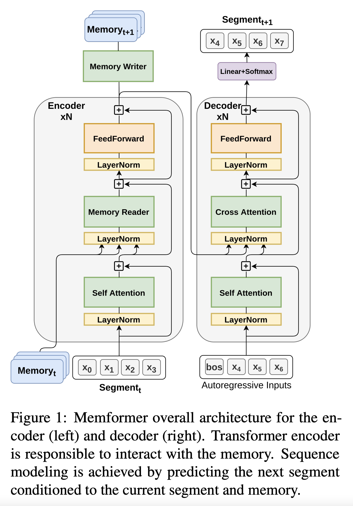

<link rel="stylesheet" href="https://cdn.jsdelivr.net/npm/katex@0.12.0/dist/katex.min.css" integrity="sha384-AfEj0r4/OFrOo5t7NnNe46zW/tFgW6x/bCJG8FqQCEo3+Aro6EYUG4+cU+KJWu/X" crossorigin="anonymous">

- [Memformer: A Memory-Augmented Transformer for Sequence Modeling](https://openreview.net/forum?id=ic1jE-kkXcO)

## Abstract

---

- Transformer는 모든 token-level 표현을 메모리로 저장하기 때문에 효율성 문제가 있음
- 저자들은 외부 동적 메모리를 사용하여 과거 정보를 인코딩하고 기록하는 Memformer라는 더 효율적인 모델을 제안
- Memformer는 입력에 대해 선형의 시간복잡도와 상수의 공간복잡도를 가짐
- BPTT의 메모리 사용량을 줄이는 MRBP라는 최적화 방법을 제시
- 실험을 통해 추론시 베이스라인들에 비교했을 때 8.1배 적은 메모리 사용량으로 3.2배 더 빠른 속도를 보여줌
- 어텐션에 대한 분석으로 timestep이 지나가도 중요 정보를 인코딩하고 유지할 수 있다는 것을 보여줌

## Introduction

---

- 인간은 감각정보를 인지하고 압축된 형태로 인코딩해 뉴런에 저장함
- 그리고 저장된 정보를 가져와 효과적으로 다양한 작업에 적용
- 기억 시스템을 신경망에 적용하려는 시도가 계속 있었음
    - RNN, LSTM, GRU, NTM(Neural Turing Machine), DNC(Differential Neural Computer)
- 기존의 recurrence를 버리고 Transformer 가 등장, 대신 $$\mathcal{O}(N^2)$$ 연산이 필요한 self-attention을 사용
- Transformer의 계산비용을 줄이기 위한 모델이 등장
    - Reformer, Sparse Transformer, Longformer, Linformer
    - 덕분에 셀프 어텐션의 복잡도를 줄이고 더 긴 sequence를 처리할 수 있지만 여전히 선형적인 공간 복잡도를 가짐
- TransformerXL은 기억과 recurrence를 재도입, 하지만 단순하게 raw hidden state를 가지고 있는 방식으로는 정보를 압축할 수 없음
- Compressive Transformer는 이 점을 개선해 메모리를 더 적은 벡터로 압축하여 개선시킴
    - 하지만 TransformerXL, Compressive Transformer 모두 구조적으로 일정 timestep이 지난 정보는 결국 버려지게 되어있음

- Memformer는 고정 크기의 외부 동적 기억을 최근 Transformer와 통합
- Memformer는 외부 동적 기억과 상호작용하여 기억을 읽고 씀
- 망각 기능을 이용해 새 정보를 기억하기 더 쉽게 만듬
- Memformer는 이론적으로 아무리 큰 recurrent한 모델을 학습하기 위해 필요한 BPTT는 메모리 사용량이 크기 때문에 memory replay back-propagation (MRBP) 기법을 제안하여 메모리 사용량을 상당부분 개선
- Memformer를 auto-regressive 이미지 생성이나 language modeling에 적용해 Transformer나 TransformerXL과 동등한 성능을 보이면서도 계산 속도와 메모리 사용량 측면에서 훨씬 효율적임을 실험을 통해 검증
- 분석을 통해 Memformer가 extended period에도 정보를 유지할 수 있음을 보여줌

## Related Work

---

### Recurrence and Memory

- recurrence와 memory를 transformer에 적용하는 시도는 주로 relative positional encoding과 segment-level recurrence 메커니즘을 적용한 TransformerXL과 여기에 더해 이전 hidden state를 압축해서 사용하는 Compressive Transformer 두 가지 정도가 있음
- 하지만 과거 hidden state를 직접 활용하는 것은 과거 context를 볼 수 있는 최대 길이에 제한이 있음

### Dynamic Memorization

- dynamic memorization은 이론적으로 최대 context 길이의 제한이 없음
- Neural Turing Machine, Differential Neural Computer 등의 방법론이 있으며 external memory를 하활용하여 긴 길이의 memory를 활용
- 하지만 복잡한 기억 메커니즘은 학습 도중 느리고 불안정하게 만드는 측면이 있음
- 본 논문에서는 더 효율적인 dynamic memoization 메커니즘을 제안

## Methods

---

### Segment-level Sequence Modeling

- $$N$$ 토큰으로 이뤄진 sequence $$x_1, x_2, \ldots, x_N$$이 주어졌을 때, 보통 LM은 sequence의 각각 토큰의 확률을 곱한 결합 확률를 학습한다.
    
    $$P(x) = \prod_t P(x_t \vert x_{<t})$$
    
- 큰 외부 메모리가 있을 때 메모리를 모든 토큰에 대해 상호작용할 수 없어서 sequence를 $$L$$길이를 갖는  $$T$$ 개의 segment로 나눈다.
    
    $$s_t = \{x_{t,1}, x_{t,2}, \ldots, x_{t,L}\}$$
    
- Bi-directional 인코더가 단어의 표현을 추출하는데 더 좋기 때문에 Transformer encoder-decoder 구조를 적용함.
    - (Comment) 결과적으로 그냥 Transformer기반 생성 모델에서 Encoder만 Memory정보를 추가활용하는 느낌
- encoder는 이전 timestep의 기억인 $$M_{t-1}$$을 활용해 segment $$s_t$$를 인코딩하여 encoder output을 기억 $$M_t$$에 저장함
- encoder의 최종 출력은 디코더의 크로스 어텐션 레이어로 들어가서 다음 timestep segment $$s_{t+1}$$의 토큰을 예측하는데 사용됨

$$
\begin{align*}
M_t && = \text{Encoder}(s_t, M_{t-1})
\\
P(s_t \vert s_{<t}) && = \prod_{n=1:L} P_{Decoder}(x_{t,n} \vert x_{t,<n}, M_{t-1})
\\
P(x) && = \prod_{t=1:T} P_{Model}(s_t \vert s_{<t})
\end{align*}
$$

- 각 timestep 마다 segment가 입력으로 주어졌을 때, 모델은 다음 text segment를 생성하고 생성한 segment는 다시 모델의 입력으로 들어감
- 메모리는 과거 정보를 전부 저장하고 있기 때문에 auto-regressive하게 모든 토큰을 생성할 수 있음

- (Comment) 이건 근데 $$x_7$$이 decoder에서 생성된 걸로 나오는데 다다음 segment에 encoder 입력으로 $$x_7$$이 들어가야하지 않나?
    - 이게 true랑 prediction 값을 구분해서 표기하지 않아서 그런 듯? 그냥 생성모델이라고 생각하면 학습 시점에서는 실제값도 있고 저렇게 나온 예측값도 있어서 teacher forcing으로 그걸 학습할 것이고 추론시점에서는 LM이라고 생각하면 첫 segment에서 생성된 값을 다시 두번째 segment의 encoder input으로 넣어서 뽑고 그걸 또 다시... 하면 될 것 같긴한데
    - 여기서 궁금점은 그러면 추론시인데 input context가 segment하나를 넘어가면 어쩌지?
        - 안될 거 같은데...?

### External Dynamic Memory Slots

- External dynamic memory (EDM)은 과거 입력을 high-level 표현으로 저장하는 자료구조
- 동적 메모리는 모델이 메모리와 상호작용하며 recurrent 방식으로 데이터를 읽고 인코딩함을 의미
- 본 논문의 설계에서는 정해진 $$k$$개의 벡터를 external dynamic memory로 할당
- 매 timestep $$t$$에서 $$M_t = [m_t^0, m_t^1, \ldots, m_t^k]$$ 를 가짐
- batch 안의 각 example마다 별도의 메모리 표현을 가지고 있음
- 때문에 입력의 sequence가 아무리 길어져도 rnn처럼 추론 중 메모리 사용량은 일정함
- 각각의 메모리는 독립적이고 하나를 memory slot이라고 칭함

### Memory Reading

- input segment sequence가 들어올 때마다 모델을 메모리를 cross attention 방식을 사용해 메모리를 읽어옴

$$
\begin{align}
Q_x, K_M, V_M && = xW_Q, M_tW_K, M_tW_V
\\
A_x && = \text{MHAttn}(Q_x, K_M)
\\
H_x && = \text{Softmax}(A_{x,M})V_M
\end{align}
$$

- Memory slot 벡터들은 key, value로 사상되며 입력 sequence $$x$$는 query로 사상됨
- 입력 sequence의 query는 모든 memory slot key, value에 attend하여 최종 hidden state를 얻음
    - (Comment) 쉽게 말하면 원래 transformer decoder랑 같은 구조인데 cross attention을 encoder output이 아니라 memory에 대해 하는 느낌

### Memory Writing

- slot attention으로 메모리를 업데이트하거나 불필요한 정보를 망각시키는 작업
- memory reading과 달리 writing은 encoder의 마지막 레이어에서만 일어남
    - 이는 high-level의 contextual 정보만을 기록하도록 함

#### Update via Memory Slot Attention

- 각각의 slot마다 독립적으로 query, key로 사상됨
- segment 토큰은 key, value로 사상됨
- slot 어텐션이란 각각의 메모리 슬롯이 자기자신과 token 표현에 대해서만 attend할 수 있음
    - 각 memory 슬롯은 자신의 정보를 다른 슬롯에 쓸 수 없어 서로 간섭할 수 없음

$$
\begin{align}
Q_{m^i}, K_{m^i} && = m^iW_Q, m^iW_K
\\
K_x,V_x && = xW_K, xW_V
\\
A^\prime_{m^i} && = \text{MHAttn}(Q_{m^i}, [K_{m^i};K_x])
\\
A_{m^i} && = \frac{\exp(A_i^\prime / \tau)}{\sum_j \exp(A_j^\prime / \tau)}
\end{align}
$$

- 최종 어텐션에는 temperature $$\tau (\tau<1)$$를 사용해 어텐션 분포를 더 sharp하게 만듬

$$
\begin{align}
m_{t+1}^i\ ^\prime = \text{Softmax}(A_{x,M})[m_t^i;V_x]
\end{align}
$$

- 이런 어텐션 메커니즘은 각각의 슬롯이 오래된 정보를 유지할 지를 선택할 지 새 정보를 업데이트할지를 결정하는 걸 도움

#### Forgetting Mechanism

- 망각은 사소하고 임시적인 정보를 걸러주기 때문에 학습에 매우 중요함
- Biased Memory Normalization (BMN) 이라는 방식으로 망각을 구현
- 최초의 memory 상태는 forgetting vector랑 똑같이 만들어줌
- 매 step마다 메모리 슬롯을 정규화해서 weight가 무한히 커져가거나 긴 timestep에 graident 안정성을 잃지 않도록 함

$$
\begin{align*}
m_{t+1}^i && \leftarrow m_{t+1}^i + v_\text{bias}^i
\\
m_{t+1}^i && \leftarrow \frac{m_{t+1}^i}{\Vert m_{t+1}^i \Vert}
\\
m_0^i && \leftarrow \frac{v_\text{bias}^i}{\Vert v_\text{bias}^i \Vert}
\end{align*}
$$

- 이전 정보를 지우기 위해서 학습되는 벡터 $$v_\text{bias}$$를 더해줌

- normalization을 하기 때문에 모든 메모리 슬롯은 구 위로 사상됨
- $$v_\text{bias}$$가 망각의 속도와 방향을 컨트롤, $$v_\text{bias}$$를 더할 때마다 (새 정보가 추가되지 않으면) 결국 최종 상태 $$T$$에 도달하게 됨
- 망각의 속도는 $$v_\text{bias}$$의 크기와 $$m_{t+1}^\prime$$과 $$v_\text{bias}$$간의 cosine 거리에 의해 통제됨
    - 예를들어 거의 반대편에 있는 $$m_b$$가 $$m_a$$보다 잊히기 어려움

#### Memory Replay Back-Propagation

- Memform의 고정된 크기의 메모리 설계 때문에 추론 시간에도 추가적인 memory cost는 없음
- 하지막 학습 때는 BPTT가 memory writer network의 학습 때문에 long-term range의 모든 출력값을 다 보존하고 있어야 함.
    - 이는 Memformer에게는 비현실적인 memory 사용량을 초래
- gradient checkpoint 방식은 memory 사용량을 줄일 수 있지만 이 경우는 불필요한 계산량이 많음
- Memory Reply Back-Propagation(MRBP)는 gradient checkpointing의 효율적인 버전
- $$x_t, x_{t+1}, \ldots x_T$$와 $$M_t, M_{t+1}, \ldots, M_T$$가 주어졌을 때, 이 알고리즘은 forward pass 중에서 계산 그래프의 crtical path만을 탐색하고 backward 중에는 그 partial graph에 대해서만 재계산함

- MRBP는 매우 적은 속도 저하로 많은 메모리를 아낄 수 있음

## Experiments

---

### Computation and Memory Cost

- Vanilla Transformer는 $$O(N^2)$$ 필요 ($$N$$은 sequence length)
- Transformer-XL과 Compressive Transformer는 과거 정보를 저장하기 위해 기억을 활용하여 input sequence length가 상수기 때문에 $$O(N)$$ 필요
    - (Comment) 왜 $$N$$이지? 생각해봤는데 한 sequence length가 $$L$$이라고 치면 timestep은 $$\frac{N}{L}$$ 만큼이고 각 step 마다 $$L^2$$연산 필요, 곱하면 $$\frac{N}{L} \times L^2 = NL$$ 인데 $$L$$이 상수라고 치면 $$O(N)$$이 되는 듯
- trade-off 로 TransformerXL과 Memformer 모두 memory size가 과거 정보를 저장할 수 있는 능력에 영향을 주는 중요한 요소임
- TransformerXL은 $$L$$개의 레이어가 있고 $$K$$의 memory size일 때 $$O(KL)$$의 저장 비용이 발생하지만 Memformer는 레이어와 상관없이 $$O(K)$$의 메모리만 사용

- 왼쪽 그림을 보면 Vanilla Transformer가 계산량의 증가가 가장 크다는 걸 볼 수 있음
- GPU 메모리 사용량을 보면 memory size가 증가함에 따라 TransformerXL은 Memformer에 비해 메모리 사용량이 빠르게 증가하는 모습을 볼 수 있음

### Autoregressive Image Generation

- 최근 연구는 Image를 long sequence로 보고 생성하는 접근을 보여줌
- MNIST 784 pixel 값 하나하나를 토큰으로 보고 생성

- TransformerXL은 8 layer
- 128 hidden size, 4 attention heads, 32 head size, 256 feedforward size
- Memformer는 4 layer encoder, 8 layer decoder, 64 memory size가 default
- 테이블을 봤을 때 최고 성능에서는 10%의 FLOPs로 TransformerXL 784 메모리 보다도 더 좋은 성능
- layer 수가 더 많은 점 때문에 Ablation을 해보면 4 encoder + 4 decoder로 했을 때 성능은 떨어져서 TransformerXL이랑 비슷하지만 전반적으로 훨씬 낮은 비용으로 더 좋은 성능을 보임을 알 수 있음
- temperature, forgetting, multi-head 등등의 요소도 성능에 기여함을 알 수 있었음

### Language Modeling

- long-range LM 벤치마크인 WikiText-103으로 실험을 수행함
    - 평균적으로 3.6K개의 토큰들어있는 28K의 문서가 있음
- 리소스 문제로 PG-19로는 테스트를 못해봄
- TransformerXL은 16 layers
- 모두 512 hidden size, 2048 feedforward size, 64 head size

- 전반적으로 TransformerXL에서 Memory Size가 커지면 성능이 향상
    - 하지만 그에따라 FLOPs도 커짐
- Memformer는 더 적은 FLOPs도 더 좋은 성능 달성
- layer 수를 맞춰서 4+12로 실험했을 때 성능은 TransformerXL이랑 거의 비슷했지만(TransformerXL보다 약간 낮아짐) FLOPs가 훨씬 적었음

#### Memory Writer Analysis

- Memory Writer가 어떻게 memory slot을 업데이트하는 지 해석해봄
- 메모리 슬롯을 3 종류로 분류
- 문서를 처리하는 중간에는 60% ~ 80%의 메모리 슬롯이 $$m^{300}$$ 과 비슷
- 어텐션이 자기 자신에 focus되어 현재 timestep에서 업데이트를 하지 않는다는 뜻
    - 이는 메모리 슬롯이 먼 과거 정보를 가지고 있을 수 있음을 시사함
- $$m^{250}$$같은 종류는 부분적으로 자기 자신에 attend하고 나머지는 token 들에 나눠져있음
    - 이런 경우는 첫 번째 type에서 transform되며 다른 토큰들로 부터 정보를 모아 저장함
- $$m^{355}$$같은 경우는 완전히 input token에만 attend, 매우 초기 time step에는 거의 모든 메모리가 이런 상태지만 나중에는 5~10% 정도만 이런 메모리임
    - 또한 $$m^{355}$$의 forgetting vector의 크기가 다른 슬롯들에 비해 크다는 점을 발견 ($$3.2 > 1.15)$$

## Conclusion

---

- Memformer라는 external dynamic memory를 활용하여 효율적으로 long sequence를 처리할 수 있는 auto-regressive 모델을 제안
- Memformer에 더해 MRBP라는 optimization scheme을 고안해 large memory를 갖고 있는 recurrent 모델의 학습을 용이하게 함
- 실험 결과는 Memformer가 매우 좋은 효율로 비교할만한 성능을 달성했다는 것과 먼 과거 정보를 유지할 수 있음을 보여줌
- Memformer는 recurrence나 auto-regressive modeling이 필요한 dialog나 interactive 시스템에서 잘 활용될 수 있을 것

## Review

---

- 기본적인 아이디어는 transformer에 external dynamic memory를 결합한 것
- 그 방법으로는 encoder-decoder의 transformer를 사용하는데 다른 기법들처럼 input을 여러 segment로 나누고 각 segment마다 encoding (with memory read)과 memory write, 그리고 decoding을 수행함.
    - 궁금한 점으로는 현재 기법으로는 segment 단위로 decoding을 하게 되는데 좀 이상하지 않나? 왜 그렇게 했을까? 이러면 앞부분만 보고 생성하고 또 다음 segment보고 생성하고... 이걸 반복하는 건데 한번에 다 읽고 decoding을 하는 보통개념과는 다른 느낌
    - 그리고 뭔가 input segment를 넘어가는 sequence input을 사용할 수 없는 것도 뭔가... 이상한?
- 그래도 성능이 그럭저럭? 나왔고 연산량은 확실히 적어보이기는 하고 구조적으로 과거의 정보를 동적 메모리에 저장할 수 있는 구조라는 점은 좋은 듯
