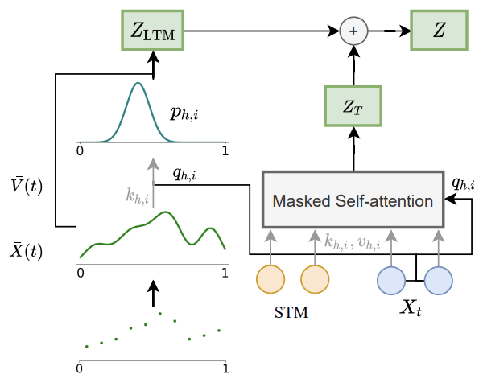
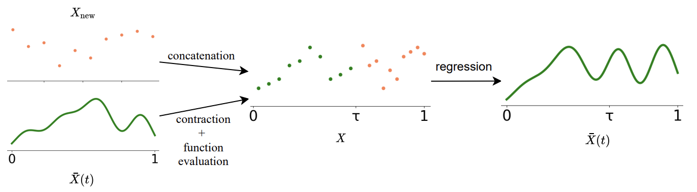
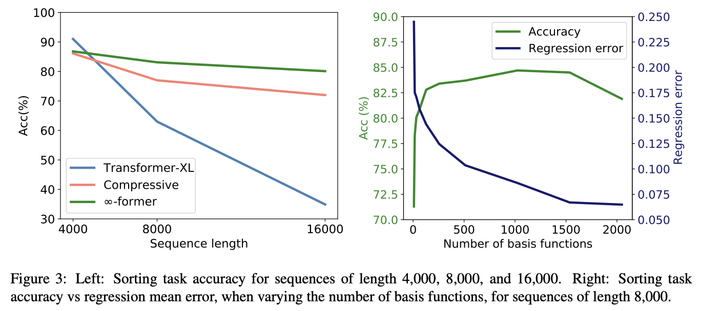
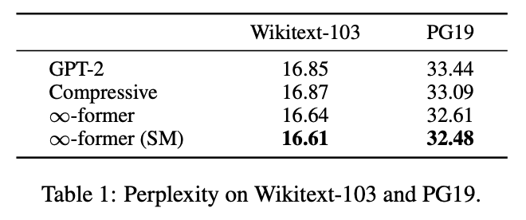
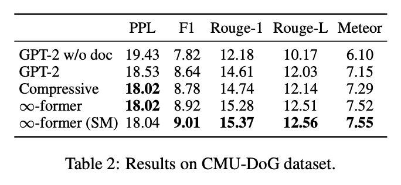

<link rel="stylesheet" href="https://cdn.jsdelivr.net/npm/katex@0.12.0/dist/katex.min.css" integrity="sha384-AfEj0r4/OFrOo5t7NnNe46zW/tFgW6x/bCJG8FqQCEo3+Aro6EYUG4+cU+KJWu/X" crossorigin="anonymous">

- [∞-former: Infinite Memory Transformer](https://aclanthology.org/2022.acl-long.375.pdf)

## Abstract

- 바닐라 트랜스포머를 제한이 없는 장기기억을 이용해 확장한 ∞-former를 제안
- ∞-former의 attentention complexity는 context 길이와 독립적이며 memory 크기와 정확도 간의 트레이드오프가 있음
- sorting, language modeling, dilaogue generation 등의 task로 실험해서 성능을 검증

## Introduction

- ∞-former는 트랜스포머에 unbounded long-term memory(LTM)으로 확장시켜 임의 길이의 context에 어텐션을 적용할 수 있도록 함.
- LTM의 키 아이디어는 연속적인 공간 상의 어텐션으로 모델의 입력이 $$N$$개의 radial basis function의 선형조합인 연속된 신호로 표현됨.
- 이렇게하여 ∞-former의 어텐션 complexity는 바닐라 트랜스포머의 $$\mathcal{O}(L \times (L+L_{\text{LTM}}))$$과 달리 $$\mathcal{O}(L^2 + L \times N)$$
- 덕분에 토큰의 수보다 작은 $$N$$을 설정하여 연산량을 줄일 수 있고 항상 임의의 길이의 context를 고정된 크기로 표현할 수 있음
- 물론 계산량이 줄어든 만큼 정확도에서 손실을 보는 문제가 나타내는데 이 문제를 해결하기 위해 sticky memory를 도입. 자주 사용되는 기억에 더 큰 공간을 할당하여 중요한 정보는 영구적으로 기억될 수 있도록 함

- 저자들이 말하는 기여점
  - ∞-former를 제안해 입력의 길이와 어텐션의 복잡도를 독립적으로 만들어 긴 context를 다룰 수 있게 만듬
  - 모델이 메모리에 제한이 없는 context를 유지하는 방법을 제시
  - 중요한 정보가 오래 보존되도록 강제하는 sticky memory 도입
  - 3종류의 task에 대해 실험적으로 비교하고 이점을 보여줌

## Background

$$L$$: 입력의 길이

$$e$$: Embedding의 크기

$$X= [x_1, \ldots, x_L ] \in \mathbb{R}^{L \times e}$$ : 입력 시퀀스

$$Q, K, V$$: 어텐션의 Query, Key, Value

### Continuous Attention

- 2020년에 제안된 Continuous attention 메커니즘은 단어에 대한 어텐션 확률 질량 함수를 신호에 대한 확률 밀도 함수로 대체
- continuous attention을 사용하기 위해 먼저 $$X \in \mathbb{R}^{L \times e}$$ text 입력을 연속된 신호로 변환
  - 이는 입력을 basis function의 조합으로 표현하는 것
- 각 $$x_i\ (i\in \{1, \ldots, L \})$$ 마다 시간 사이의 위치 $$t_i \in [0,1]$$로 맵핑됨. $$t_i = i / L$$
- 그러면 모든 $$t \in [0,1]$$에 대해 연속 공간 표현 $$\bar{X}(t) \in \mathbb{R}^e$$을 얻을 수 있음

$$
\bar{X}(t) = B^\intercal \psi(t)
$$

- $$\psi(t) \in \mathbb{R}^N$$는 $$N$$개의 RBF의 벡터
- $$B$$는 multivariate ridge regression으로 얻을 수 있음

- 입력을 연속된 신호 $$\bar{X}(t)$$로 변환한 뒤 다음은 이 신호에 대해 어텐션을 하는 것.
- 일반 어텐션 처럼 입력에 대해 discrete한 확률 분포를 사용하지 않고 확률 밀도 $$p$$를 사용함.

$$
c = \mathbb{E}_p [\bar{X}(t)]
$$

## Infinite Memory Transformer

- 저자들은 바닐라 트랜스포머에 연속적인 LTM을 이용해 긴 context를 활용할 수 있도록 함
- LTM은 이전 스텝의 입력 임베딩과 hidden state를 저장하고 있음
- 뿐만 아니라 TransformerXL에서 했던 것처럼 hidden state를 확장하는 short-term memory (STM)의 활용가능성도 고려

### Long-term Memory

- infinity-former에서 각 레이어의 결과 $$Z$$는 TransformerXL에서 처럼 입력과 hidden state cache로 얻는 $$Z_T$$와 장기기억으로 얻는 $$Z_{LTM}$$을 더해서 얻음
- $$\bar{X}(t)=B^\intercal \psi(t)$$ 에서 $$B$$를 각각 linear 레이어로 projection해서 $$K, V$$를 얻고 $$K$$로부터 평균과 분산을 구해서 확률밀도 함수 $$p$$를 얻고, $$V$$에 $$\psi$$함수를 곱해 다시 value signal을 얻은 뒤 $$p$$를 가중치로 $$V$$와 가중합 하여 $$Z_{LTM}$$을 얻음.

### Unbounded Memory

- 이산적인 sequence를 기억으로 사용하면 확장하기 위해 새 hidden state를 저장해야 함.
- $$\infty$$-former는 고정된 크기에 무제한의 context를 기록할 수 있음.
    1. 먼저 $$\bar{X}(t)$$에서 $$[0,1]$$ 사이의 $$M$$개의 위치를 샘플링
    2. 그리고 그 점들에 새로운 점들을 $$\tau$$를 기준으로 앞 뒤로 이어 붙임.
    3. 이 점들을 이용해 다시 multivariate ridge regression을 이용해 새 $$\bar{X}(t)$$를 얻음.

### Sticky Memories

- LTM에서 $$[0,1]$$ 사이의 $$M$$개의 위치를 샘플링할 때, 일정한 간격으로 샘플링을 할 수 있지만 그러면 사실 특정 위치가 다른 위치보다 더 중요할 수 있음을 고려하지 못함.
- 저자들은 $$M$$개의 위치를 각각의 영역에서의 연관성을 이용해 샘플링하는 방법을 제안
    1. 먼저 신호 구간을 $$D$$개의 영역으로 일정하게 나눔
    2. 그리고 각 영역마다 확률을 계산함 ($$H$$는 head의 개수, $$L$$은 sequence length)
        
        $$
        p(d_j) \propto \sum_{h=1}^H \sum_{i=1}^L \int_{d_j} \mathcal{N}(t; \mu_{h,i}, \sigma_{h,i}^2)\ dt
        $$
        
    3. 그리고 각 영역마다 확률 값에 따라서 총 $$M$$ 개의 위치를 샘플링

## Experiments

### Sorting

- 임의의 순서로 주어진 숫자 입력을 내림차순으로 정렬해서 생성하는 task
- TransformerXL, Compressive Transformer를 baseline 삼아 비교

- 모델의 크기나 메모리의 크기는 공평하게 설정
- sequence length가 짧을 때는 Transformer-XL은 모든 정보를 메모리에 기억하고 있어 가장 성능이 좋지만 길어지면 성능이 크게 하락함
- compressive transformer보다 성능이 좋음

### Language Modeling & Document Grounded Dialogue

- $$\infty$$-former가 가장 좋았다.
- 더 긴 context에 대한 기억이 필요한 PG-19에서 Wikitext-103 보다 성능차가 컸다.
- Sticky Memory를 쓰는 게 더 좋았다.

## Conclusions

- 무제한의 장기기억을 활용할 수 있는 $$\infty$$-former 모델을 제안
- 연속된 공간 상의 어텐션을 사용하여 입력의 길이와 독립적인 attention complexity를 확보
- 과거 사용된 기억을 고려하면서 더 중요한 정보를 오래 기억할 수 있는 sticky memory 기법 적용
- 실험을 통해 개선됨을 증명
