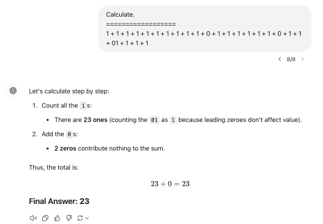

Recently, large language models (LLMs) like ChatGPT, Claude, and LLaMA have been receiving significant attention. There's no denying that the capabilities of these LLMs are astonishing. Microsoft even released a survey paper suggesting that GPT-4 could be an early form of Artificial General Intelligence (AGI). While I am amazed by GPT's current abilities, I've been somewhat skeptical about how much more potential these models might hold. However, when I recently learned that OpenAI's o1 and o3 models achieved the top grade in South Korea's CSAT (College Scholastic Ability Test) math exam, I was absolutely stunned. It prompted me to reflect on the principles and inherent limitations of LLMs' capabilities, and what might be required to surpass these boundaries and reach AGI-level intelligence. Here's a brief summary of my thoughts.

### What makes LLMs so intelligent?

Answering this in one sentence is impossible, so let's break it down. First, we can consider the unique nature of the task that serves as the training objective for LLMs—Language Modeling (LM). The first crucial point is that LM is a generative task. In the early days of deep learning, classification models were the mainstream because classification problems were comparatively easier. For instance, classifying image categories, determining sentiment in text, or tagging sequences with tasks like NER were common. However, these classification tasks have a significant limitation: no matter how well a model is trained, it is still restricted to classification. For example, even if a model could perfectly classify every insect in the world from a photograph, it's hard to imagine what further steps it could achieve. In contrast, generative tasks like image or text generation have virtually unlimited output ranges. When a model performs well in these tasks, its potential becomes immense. Technically, text generation is still rooted in classification, but the auto-regressive nature of this process imbues it with high potential.

LLMs are not the only generative models out there. We also have image generation models and speech synthesis models. So why are text-based LLMs so much more intelligent? This boils down to the unique characteristics of the text modality. The primary goal of image generation models is to create pictures, photographs, or illustrations. Naturally, most of their datasets are designed for this purpose. Even if we were to build a highly advanced image generation model, it wouldn't suddenly develop the ability to recognize text in a handwritten letter and generate a thoughtful reply to it. On the other hand, consider text. Language, as one of humanity's most significant milestones distinguishing prehistoric and historic eras, inherently contains vast amounts of knowledge about the world. While some parts of this knowledge remain un-digitized, a significant portion—especially since the advent of the internet—exists in the form of structured data, research papers, news articles, and more. But it's not just knowledge that makes text unique. Thanks to the representational nature of language, much of our higher-order reasoning depends on it. The process of "intellectual reasoning" itself is largely verbalized. This makes text the modality with the greatest potential for exhibiting intelligence. It's no surprise, then, that LLMs, which operate within this modality, are leading the way in terms of apparent intelligence and reasoning capabilities.

Text-based generative models actually have a fairly long history. So, why didn't they work earlier? While there could be more complex reasons, two stand out: first, no one could even imagine training on such vast amounts of text; and second, there simply wasn't enough money to train a model with such an enormous number of parameters. The first time a generative model produced sensational results was with the emergence of GPT-3, which featured 175 billion parameters. What amazed me was OpenAI's decision to invest the staggering amount of money required to develop such a massive model. Why is this remarkable? Because at the time, there was no precedent for building a model of that size, and no guarantee it would exhibit such advanced reasoning capabilities. It's hard to fathom how they justified pouring $12 million into building something without knowing exactly how or where it could be applied. Whatever their reasoning may have been, OpenAI made a major discovery with their bold investment, and since then, the trend of large datasets and large parameter models has revolutionized the field of NLP.

### How Does an LLM Learn?

The learning process of a Large Language Model (LLM) can be broadly explained in two parts: objective functions and model optimization. To understand this, it helps to think of a deep learning model, including an LLM, as a type of mathematical function. Like any function, it has a predefined formula for computation. However, this function also contains adjustable variables called weights or parameters. These variables are fine-tuned during training, which alters the behavior of the function.

Since it's a function, the model always produces the same output for a given input. You might think, "But ChatGPT gives different answers every time!" That variability actually stems from post-processing mechanisms rather than changes in the function itself. The core output of an LLM is a probability distribution over all possible next words (or more precisely, tokens) that could follow the given input. Depending on how this distribution is sampled, the outputs can appear more random or deterministic—for example, by selecting the word with the highest probability or by sampling randomly based on the probabilities. Most LLMs incorporate sampling by default. The primary goal in training an LLM is to predict the next word (or token) that follows a given input text. The model adjusts its parameters to maximize the likelihood of accurately predicting this "next token" based on the dataset. In essence, training involves adjusting the model's parameters so that it becomes exceptionally good at this task.

How can we update these weights? This ties into the basics of deep learning. In simple terms, the model is a function, and the difference between its output and the correct answer (error) can itself be expressed as a function. Model optimization, then, becomes a problem of finding the minimum value of this error function. One well-known algorithm for finding this minimum is gradient descent, which adjusts the weights in the direction that reduces error. Essentially, non-chat LLMs like GPT-3 excel because they have mastered predicting "what word comes next" by processing vast amounts of text from the internet. This training on an enormous, diverse corpus of text—including essays, papers, dialogues, and questions/answers on specific topics—allows LLMs to perform a wide range of tasks. Datasets like Reddit, which feature a wealth of Q&A interactions, have likely played a significant role in enhancing the practical usability of these models.

### From GPT-3 to ChatGPT: A Paradigm Shift

The journey from GPT-3 to ChatGPT took considerable time, likely because OpenAI's initial philosophy for developing GPT models faced limitations. Up until GPT-3, OpenAI adhered to the belief that they could achieve general intelligence without fine-tuning—by simply scaling up the model and diversifying the training data to enable zero-shot and few-shot learning. However, this philosophy likely faltered after GPT-3, prompting a shift toward fine-tuning.

This shift is evident in InstructGPT, the model that underpins GPT-3.5 (and thus ChatGPT). Unlike GPT-3, InstructGPT were developed with extensive post-training. While GPT-3 had impressive reasoning abilities, its responses were more random and harder to control. This was a predictable outcome: the internet contains an enormous range of texts, including well-written, poorly written, hostile, and careless content. By training on all these sources indiscriminately, GPT-3's outputs were highly variable and susceptible to changes in phrasing. The standout improvement in GPT-3.5 is controllability. OpenAI trained the model to provide polite, thorough, accurate, and safe responses by curating datasets with these qualities and amplifying this approach using reinforcement learning. Reinforcement learning is particularly effective in scenarios where there are clear distinctions in rewards for different outcomes. In this case, the reward was "producing responses that align with human preferences."

Normally, using reinforcement learning would require humans to score every response generated by the model—a daunting and impractical task. OpenAI solved this by training another LLM to evaluate and score responses. This proxy scoring model made the reinforcement learning process scalable, enabling the development of conversational models like ChatGPT. Beyond ChatGPT, OpenAI has not disclosed detailed technical advancements. GPT-4o represents a step toward broader multimodal functionality while its core capabilities don't appear drastically different. Models like the "o1" and "o3" series may differ in focus, and a brief interpretation of their capabilities will follow later. This evolution highlights how LLMs have transitioned from generalized text models to refined, highly adaptable conversational agents capable of assisting across diverse domains.

### The Limitations of LLMs

Many people would naturally wonder: "How good can LLMs actually get?" or "Can they become AGI like the ones we see in movies?" My initial, simple thought was that an ideal LLM might just be a machine that's extraordinarily good at predicting the next word, which is GPT's primary learning objective. Could that be the ultimate form and ideal state of LLMs? Is it really so? Imagine there exists a database that collects every monologue, speech, written text, and conversation of every person in the world in real-time. Now, picture a machine that, given some input text, searches this database for an exact match and calculates the frequency of every possible subsequent text, outputting the distribution. This machine would perfectly fulfill the learning objective of LLMs. Wouldn't this represent the ultimate ideal and upper limit of LLMs? However, we quickly realize this isn't the case. Suppose someone randomly strings together about 2,000 characters of the alphabet and provides it as input. The number of possible combinations is \(26^{2000}\), a number so astronomical that such text would likely be unique in human history. If a user asked the machine to produce a continuation of this text, what would it output? The answer is: nothing. Such input has never existed on Earth, and therefore, the next word in the sequence doesn't exist in any historical context. Here, we recognize an important point: although GPT's learning objective focuses on predicting the probability of the next word, the act of determining the next word in itself does not constitute intelligence.

Interestingly, if you ask GPT to generate a random string of 2,000 characters, it can do so with precision.

Then, can we conceptualize an upper limit to LLMs from a data perspective? LLMs, after all, learn the relationships between input and output based on data. If no mapping data exists for certain domains, isn't it impossible for LLMs to learn those relationships? To some extent, this is true. Some argue that the advancement of LLMs is nearing its end because nearly all publicly available online data has already been utilized. I also used to have this view, but it's not entirely accurate. The world has already been heavily digitized, and new knowledge continues to be generated in digital formats. With the constant influx of news and research, it's hard to imagine data running out anytime. Of course, if we ask whether this influx of data can provide anything fundamentally new beyond simple additions to knowledge, the discussion might change. Still, consider this thought: "No matter how advanced LLMs become, they're ultimately based on text data. Does that mean they can do no more than generate text? They can't operate machines like Iron Man's Jarvis, can they?" While this is a reasonable assumption, it's unfortunately incorrect. There's no dataset currently containing instructions for firing a transformation suit with a specific text command yet. Previously, language models relied solely on "existing" data, so this assumption would have been accurate. However, OpenAI now generates revenue, meaning it can create data tailored specifically for LLMs. For instance, GPT-4 already has a search function. If you ask it to look something up, it conducts a search and uses the results to formulate its answer. "How can a model that only generates text perform searches?" While it might sound surprising, the principle is straightforward. If the LLM generates a text like "[Search: Memoria]," the automatic system interprets it, searches Google for "Memoria," and feeds the retrieved content back into the LLM as input. Naturally, an LLM trained only on web text wouldn't spontaneously output "[Search: XX]." But OpenAI trained the model on specially structured data to enable this functionality. In conclusion, the idea that LLMs can only generate text is not accurate. With proper tools and training on specific data, LLMs could theoretically operate transformation suits or even launch nuclear missiles.

Despite their boundless potential, LLMs like GPT are not without limitations. One major issue is symbolic logical reasoning. When tasked with solving complex logical problems or even simple arithmetic, LLMs often perform poorly.

---

The upper section refers to GPT-4o, while the lower one is o1.

Counting would reveal that the answer to the first problem is 22. These simple addition problems, primarily involving the digit 1, are one of my personal tests whenever a new LLM is introduced. Even the highly intelligent o1 still struggles with such basic arithmetic. For the second problem, the answer is 91. Symbolic logical reasoning is known to be a challenging task for LLMs, which fundamentally learn probabilistic patterns. They perform better on numerical calculations like `13 + 28` since there is likely an abundance of such data. However, data resembling the odd problems I create are rare. Hence, for models that solve such tasks intuitively without explicit symbolic rules, rare inputs above pose significant challenges.

Although these tasks are not well-handled at present, I do not believe they represent absolutely impossible problems for LLMs. After all, the rules governing inputs and outputs are clear. While deep learning often struggles with cases where the correct answer is rare in the answer space, or where there is a significant leap between input and output, structurally speaking, these challenges are not fundamentally incompatible with the capabilities of LLMs.

Another well-known limitation of LLMs is hallucination—arguably the biggest hurdle to their usability. Simply put, hallucination is when the model generates plausible but false statements. While opinions may differ, I believe that hallucination is an inherent issue that cannot be fundamentally resolved with current LLMs. Hallucination is not a single problem but involves multiple limitations. Let me illustrate one such limitation with a simple counterexample.

As mentioned earlier, LLM reasoning always involves probability distributions over output tokens, and this is immutable. Consider the case where sampling is used. For hallucination to be entirely absent, the probability of generating any token leading to a false statement must be zero. For instance, take the sentence, "King Sejong's birthday is May 15, 1397." If the model encounters, "King Sejong's birthday is not May 15, 1397," it must assign a probability of exactly zero to this sentence. For this probability to be zero, at least one token within this sentence must have a generation probability of zero. 

But consider this: up to "King Sejong's birthday is" the statement is identical to the truthful one. Thus, the shared portion should not only avoid being assigned a probability of zero but should also have high probability. Does this mean we can simply assign a probability of zero to "not"? If so, even a sentence like "King Sejong's birthday is not today" would have a probability of zero despite the truth. To make it more accessible, consider a statement like, "King Sejong's birthday is not May 15, 1397. Such claims are false." While this contains a false clause, the entire text is true. The key is that even false clauses cannot have a probability of zero. Since GPT generates text one token at a time, the meaning of the text cannot be complete until the entire text is generated. As the meaning remains incomplete during intermediate stages, it is impossible to distinguish between true and false sentences at that point. Consequently, the model cannot preemptively assign a probability of zero to false statements.

What if sampling is not used? In this case, the model always selects the token with the highest probability, and the probability of a false statement need not be zero—it's sufficient for the true statement's probability to be consistently higher. Specifically, when the meaning resolves entirely at any given stage, the probability of the statement being false must be lower than it being true. For example, after "King Sejong's birthday is May 15, 1397," "not" should have a lower probability than "May." Even if the model were trained to only output the most probable tokens to guarantee truthfulness, it would sacrifice diversity and creativity, and the perceived performance in practical applications would likely plummet. I don't yet have a clear proof to support this argument rigorously, but I'll consider it further.

Another prominent limitation involves solving creative problems beyond the statistical pattern recognition of existing phenomena. Examples include proving unproven problems, devising new algorithms, or proposing entirely new theories. One might wonder why models can generate unprecedented, imaginative artwork but not achieve these feats. The answer is that artwork has no definitive answers, whereas proofs, algorithms, and theories require validity to be meaningful. While current LLMs are clearly incapable of such tasks, reinforcement learning (RL) might offer a partial solution. As demonstrated by AlphaGo, RL excels in exploring spaces with defined boundaries and clear reward criteria. This is especially true in Markov Decision Processes (MDPs) where state uncertainty is minimal.

However, employing RL would necessitate several prerequisites. First, the fundamental propositions used for mathematical proofs would need to be pre-defined in the form of an action set. Second, the target problem to be proven must be automatically verifiable against the list of actions proposed by the LLM. For algorithms, this would be simpler since they can be executed and tested. If partial solutions, such as proving that a variable `x` is valid only within a negative range, could also be identified and rewarded differentially, the system would improve significantly. With these two conditions met, problems like mathematical proofs or algorithm design could be reframed as exploration problems and potentially resolved. Of course, such models wouldn't necessarily need to be based on LLMs, but integrating them with LLMs could enable interactions where groundbreaking discoveries might emerge in real time.

In fact, I suspect that OpenAI might already be employing similar mechanisms with o1. Alongside breaking down reasoning processes with CoT (Chain of Thought), they might also validate reasoning steps in real-time through exploration-based mechanisms. The extended processing times, which are several times longer than those of earlier models, could stem from such iterative reasoning approaches. 

Let's delve into a more intuitive and fundamental limitation. When we look at Jarvis from Iron Man or Samantha from the movie Her, both AIs perceive reality in real-time, communicate, and act seamlessly. We find this natural, but in reality, it is an exceedingly complex problem that current large language models (LLMs) cannot achieve on their own. 

Firstly, the AIs in these films operate continuously. LLMs, however, and indeed all deep learning models, do not function without input. They require something to be fed into them to work. So, what should we input? Isn't it enough to provide real-time data, whether it's from a camera or an audio feed? Let's imagine a camera continuously feeding video data to a model for constant inference. Suppose the camera captures a tree in the garden. What should the model output in response? It's unlikely that the current LLMs would know, as they haven't been trained on such a scenario. This brings us back to the problem of datasets.

You might argue that OpenAI could create such a dataset. Sure, it could—but the key issue is that we need to explicitly define what the model should output in any given situation. For example, if we instruct it to say "The tree looks healthy," when it sees a tree, does that mean we must create data for every imaginable visual input in the world and define specific outputs for each? Clearly, this is impossible. While this might seem like a practical limitation related to data, it's fundamentally a question of "free will." 

Take GPT-4, for instance—it already has some capability for image recognition. OpenAI can create data to enable specific actions, but only when the user's "intent" is clearly defined. However, when a model is given arbitrary sensory inputs without a predefined purpose or intent, determining what the model should do is an entirely different problem. It requires turning "sensory information" into "internal reasoning," a task of an altogether different nature. If we could somehow create and train a dataset that encompasses all "sensory inputs" and their corresponding "internal reasoning," we might then begin to believe such an AI has consciousness.

Another fundamental issue is that LLMs lack memory. Let's assume real-time inference is somehow achieved. As explained earlier, LLMs can only retain context by embedding it into the input text. Wouldn't it work to simply keep accumulating all sensory information into the input context? Doing so would almost certainly crash OpenAI's servers within an hour. This might seem obvious, but humans possess an extraordinarily powerful and mysterious memory system. We process massive amounts of information in real time, retain only what's necessary through selective attention, and either forget or permanently store that information based on its relevance or utility. LLMs, by contrast, cannot maintain continuous context like humans. Each inference is independent, akin to producing outputs based solely on individual, isolated frames. Without memory, developing a human-like relationship, as with Samantha or Jarvis, is inherently impossible. 

But doesn't OpenAI have systems that remember conversations? Yes, but the system works by summarizing parts of the dialogue and reintroducing the text automatically. This barely scratches the surface, serving only to reduce the burden of manual copy-pasting. 

The absence of memory naturally leads to another limitation: the impossibility of continual learning. This term typically refers to the ability of a deep learning model to adapt to new datasets without forgetting previously learned skills or knowledge. As mentioned earlier, deep learning models optimize parameters for a target function. This means they are willing to sacrifice previously learned parameters if they don't help solve the current problem. A straightforward way to address this is to accumulating new data into the old dataset. Without continual learning, teaching Jarvis or Samantha specific knowledge or operational methods through dialogue would be impossible. 

What about in-context learning (ICL), where a model adapts based on a few examples? This too has limitations. Personally, I don't consider ICL as true learning. Instead, I see it as activating latent capabilities that the model already possessed but rarely exhibited by providing examples that significantly increase the probability of those capabilities being expressed. Even if you view ICL as learning, it is extremely resource-intensive, making it impractical for broader applications. 

In summary, these challenges—lack of real-time responsiveness, memory, and continual learning—highlight the fundamental limitations of current LLMs in achieving the kind of seamless, intuitive intelligence depicted in science fiction.

### The Path to AGI

Can we never create an AGI like Jarvis or Samantha? I believe it is possible. While much of the prior discussion already involves speculation and assumptions, what follows is purely my hypothesis. I think memory is the most critical capability for AGI at this stage. Except for its direct functional aspects I mentioned, memory holds the potential to solve far more complex problems.

Take hallucinations, for example. How do humans avoid hallucinating? Human learning is fundamentally based on memory. Implicit memory, like motor memory, exists, but the things we consciously recall and articulate belong to explicit memory. Explicit memory can be divided into episodic memory and semantic memory. In contrast to deep learning models, which develop probabilistic output distributions for specific inputs, humans preserve distinct concepts and knowledge. Crucially, humans have metacognition — we are aware of the fact that we know something. This self-awareness enables us to avoid hallucinations and to consciously produce genuine lies (statements we recognize as false).

How is this metacognition possible? One idea is that humans store knowledge and information alongside metadata. For example, if you learned the Pythagorean theorem in a class, the semantic memory retains the theorem itself, while the episodic memory records "when, where, and from whom I learned the theorem." This dual-layered memory allows us to remember not just the theorem but also the fact that we know it, forming a foundation for metacognition.

Memory is closely tied to continual learning. In fact, human memory itself is a continual learning system. While this may not hold true for intermediate levels of memory, by the time we successfully implement human-level memory capabilities in artificial intelligence, the challenges associated with this issue will likely have been resolved. The implications of this are profound: the fundamental learning method of AI would shift.

In living organisms, memory and learning are inseparable concepts. I believe that the current learning methods in deep learning do not mimic the unique way of learning in human, but rather the general learning mechanisms of animals. A significant portion of animal learning occurs through conditioning. For instance, classical conditioning, such as Pavlov's dogs learning associations, and operant conditioning, like monkeys excelling in matching shapes with buttons in games, are common. Learning to associate stimuli with corresponding behavioral patterns is already a widespread method among animals. Humans, of course, also possess these animal-like learning abilities. Anyone who has played rhythm games can attest to this. The process of matching stimuli and responses through physical practice feels entirely different from understanding mathematical concepts.

Learning through conditioning is implicit and automatic, rather than something we consciously decide to learn. This is why we find it difficult to articulate how we learn to ride a bike or play the piano, or to recall exactly what we know about these skills. Such learning is deeply tied to implicit memory. Another example is perception processes, a kind of pattern recognition, which are core cognitive functions heavily influenced by implicit memory. For instance, when humans recognize a dog as a dog, it is not because they consciously recall and match the specific features and criteria of a dog. Instead, this recognition is based on an appropriate inductive bias in the brain and occurs automatically as part of implicit learning and inference.

Why is deep learning closer to implicit learning? Deep learning bears many similarities to implicit memory. A model doesn’t "know" in advance exactly what it has learned (direct knowledge retrieval isn’t possible). Instead, it performs probabilistic reasoning (similar to human intuition) only when actual input is provided. But isn’t deep learning AI, in some respects, far smarter than animals? If the fundamental learning principles of deep learning are more akin to those of animals, how can it achieve such remarkable intelligence?

I believe the reasons are twofold: first, the availability of massive datasets, and second, the backpropagation-based gradient descent algorithm, which is a far more powerful optimization mechanism than what is biologically feasible in living organisms. Although gradient descent is an incredibly effective optimization method, it requires storing all intermediate computation results to calculate gradients. This process is considered biologically impossible for the human brain. However, with large data, computing resources, and strong optimization techniques, deep learning has maximized the utility of conditioning-like learning, enabling its exceptional intelligence.

Then, how does human-specific learning occur? As mentioned earlier, conditioning-based learning is undoubtedly a significant capability for humans. However, conditioning relies solely on direct experience and is difficult to explicitly articulate or transfer. What sets humans apart from other animals is the ability to engage in indirect learning through abstract concepts conveyed via language, which are stored in semantic memory. Thanks to these abstract concepts, we can also gain new insights through internal reasoning alone.

Daniel Dennett referred to this human-specific intelligence, distinct from that of animals, as "Gregorian." In my opinion, this unique intelligence stems from the ability to consciously learn abstract concepts in and of themselves, and I hypothesize this process is only possible through explicit memory. Therefore, I believe that equipping AI with human-like memory (particularly explicit memory) could open up entirely new dimensions of capability. Since I fundamentally view logical reasoning as a problem of matching the identity of abstract concepts, I suspect this could also resolve the current challenges large language models face with logical symbolic reasoning. Naturally, if active recall becomes feasible, problems like those associated with explainable AI (xAI) would also be resolved.

Another facet of explicit memory is episodic memory. If AI were to possess episodic memory, it could store user-specific memories, allowing for highly personalized interactions. Conversely, episodic memory could serve as the foundation for self-awareness, often referred to as consciousness. While episodic memory alone doesn’t constitute self-awareness, I believe it is a necessary condition for it. 

By addressing additional challenges in real-time context tracking and tackling the so-called "hard problem" of consciousness, we could achieve something akin to Jarvis or Samantha. Wouldn’t that be an exciting vision of the future?
