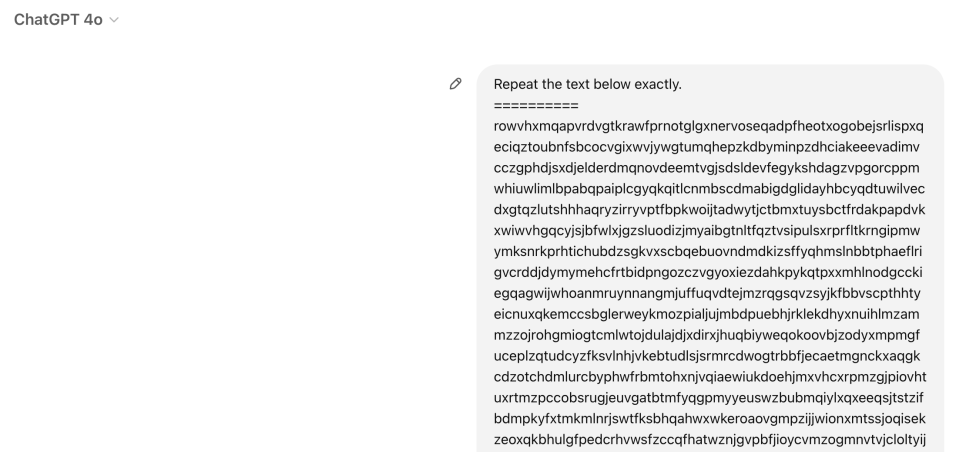
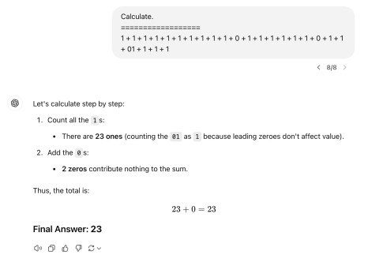
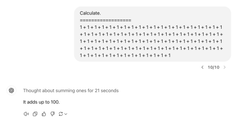

최근 ChatGPT, GPT-4, Claud, LLaMa 등의 LLM은 상당히 많은 관심을 받고 있다. 확실히 이들 LLM의 능력은 경이로운 수준이다. MS는 GPT-4가 AGI의 초기 형태라는 서베이 페이퍼도 냈으니 말이다. 나도 현재 GPT의 능력에는 매우 놀랍기는 하지만 솔직히 이 이상 얼마나 더 큰 잠재력을 가지고 있을까에 대해서는 다소 회의적인 입장이었다. 그래서 최근에 OpenAI에서 나온 o1, o3 시리즈가 수능 수학을 1등급 받았다는 걸 봤을 때는 엄청나게 놀랐다. 평소에 가져왔던 LLM의 능력의 원리와 본질적 한계, 그리고 그걸 넘어선 AGI 수준에 이르기까지 무엇이 필요한지, 한 번 가볍게 정리해 보고자 한다.

LLM은 어떻게 이렇게나 놀라운 추론 능력을 갖출 수 있는가? 한마디로 답하기는 어렵지만 하나씩 풀어보자. 우선은 LLM의 학습 목표가 되는 Language Modeling (LM)이라는 Task의 특수성을 생각해 볼 수 있다. 첫 번째 중요한 사실은 LM은 생성 Task라는 점이다. 초기 딥러닝에서 주류는 분류 모델이었는데 그건 분류 문제가 더 쉽기 때문이다. 이미지에서는 이미지 클래스 분류, 텍스트에서는 sentiment classification, 이후로는 NER 같은 seuqence tagging 등으로 확장되기도 했다. 다만 이러한 분류 문제는 커다란 한계가 있는데 아무리 학습을 잘해도 결국 분류밖에 못 한다는 점이다. 예를 들어 이 세상 모든 곤충을 사진으로 분류해 주는 모델이 나온다면 센세이셔널할 수는 있겠지만 그 이후의 단계를 상상하기는 어렵다. 하지만 이미지 생성이나 텍스트 생성처럼 모델의 Output의 범위가 무한한 경우에는 이 Task를 아주 잘했을 때 할 수 있는 그 잠재력 아주 크다고 볼 수 있다. 물론 엄밀히 말하면 텍스트 생성도 기반 문제는 분류지만 auto-regressive라는 특성이 높은 잠재력을 부여한다.

그런데 생성 모델은 LLM만 있는 것이 아니다. 이미지 생성 모델도 있고, 음성 합성 모델도 있다. 왜 하필 텍스트를 다루는 LLM만 이렇게 똑똑한 걸까? 이 부분은 텍스트라는 modality의 특수성이 들어간다. 이미지 생성 모델의 주요 목적을 살펴보면 그림, 사진, 일러스트를 생성하기 위함이다. 당연히 데이터셋들도 그런 목적으로 구성된 것이 대부분일 것이다. 그렇다면 이 데이터셋을 가지고 아주 잘 학습한 모델을 만들어봤자 갑자기 편지 사진에 있는 글자를 인식해서 그 질문에 답장을 적은 편지를 다시 생성하는 식의 특별한 지능을 갖출 수는 없다는 것이다. 반면 텍스트는 어떤가? 언어는 선사 시대와 역사 시대를 구분 짓는 인류의 커다란 분기점인 만큼, 기본적으로 이 세상의 방대한 지식을 담고 있다. 물론 그중에서 여전히 전산화되지 않은 부분도 있지만 적어도 인터넷 등장 이후 생성되거나, 연구되거나, 뉴스를 통해 전달되는 지식의 상당량은 전산화된 데이터 형태를 가지고 있다. 지식뿐만이 아니다. 언어의 표상적 기능 덕분에 우리는 고차원적 사고의 상당 부분을 언어에 의존한다. "지적 추론의 과정" 그 자체도 언어화되어 있다는 말이다. 그러니 텍스트가 지적 능력 관점에서 가장 큰 잠재력을 가지고 있는 modality임이 틀림없다.

텍스트 기반의 생성 모델은 사실 역사가 꽤 길다. 그럼, 왜 그전까지는 안된 걸까? 따지고 들자면 더욱 복합적인 이유가 있을 수 있겠지만 두 가지를 딱 짚어보자면, 첫째는 그 많은 텍스트를 모두 학습시킬 수 있다는 생각도 못 했고, 그 정도로 엄청난 개수의 파라미터를 학습할 돈도 없었기 때문이다. 처음으로 생성 모델이 센세이셔널한 결과를 보여준 것이 언제냐 하면, GPT-3 175B의 출현으로 볼 수 있다. 나한테 놀라운 점은 OpenAI가 그 어마어마한 돈을 들여서 175B 짜리 모델을 만들 결심을 했다는 부분이다. 이게 왜 신기하냐면, 당시에는 그 정도로 큰 모델을 만든 전례도 없고, 당연히 이렇게 고도의 추론 능력을 갖출 거라는 확신도 없었을 텐데, 만들어서 어디 쓸 데가 있을 줄 알고 1,200만 달러를 부을 생각을 했을까 싶은 것이다. 뭐 이유야 어찌 되었든 OpenAI는 큰 투자로 큰 발견을 해냈고, 이후로 Large 데이터셋과 Large parameter 트렌드가 NLP 분야를 뒤집어 놓았다.

LLM은 어떻게 학습하는 걸까? 크게 두 파트로 나눠서 설명할 수 있을 것 같다. 하나는 목적 함수이고, 또 하나는 모델 최적화이다. LLM을 포함해 딥러닝 모델은 일종의 함수라고 생각하면 된다. 함수이기 때문에 당연히 계산식이 정해져 있다. 다만 이 함수에는 weight 혹은 parameter라고 부르는 가변적인 매개변수를 가지고 있는데 학습을 통해 이 수치가 조정되며 함수의 실질이 달라진다. 함수이기 때문에 모델은 같은 입력에 대해 항상 같은 출력을 내보낸다. "어? ChatGPT는 매번 다른 답을 내던데?" 싶을 수 있다. 그건 엄밀히 말하면 weight와는 무관한 사후 처리 방식에 가깝다. LM의 함수적 출력 자체는 Input 다음에 올 수 있는 모든 단어의 확률분포이다. 그래서 그 확률값대로 sampling을 해서 랜덤성을 부여할 수도 있고, 가장 확률값이 높은 단어를 택해서 랜덤성을 없앨 수도 있는 것이다. LLM 들은 기본적으로 모두 sampling을 사용한다고 보면 된다. 이러한 LM의 학습 목표는 주어진 Input 텍스트 바로 다음에 나올 단어(실제로는 토큰)가 무엇인지를 맞추는 것이다. 그래서 데이터셋에 존재하는 "그다음 단어"의 확률을 1로 추론하도록 모델이라는 함수의 매개변수를 조절하는 게 LLM 학습의 가장 기본 원리라고 할 수 있다. 그러면 어떻게 이 weight를 마음대로 조정할 수 있을까? 이 부분은 딥러닝 기초를 조금 살펴보면 알 수 있다. 한마디로 말하면, 모델도 함수인데 모델의 결과를 정답과 비교한 오차도 함수이기 때문에 모델 최적화는 사실 수학적으로는 특정 함수의 최솟값을 찾는 문제로 환원된다. 그리고 이 최솟값을 찾는 유명한 알고리즘 중의 하나가 gradient descent, 정답과의 오차가 줄어드는 방향으로 gradient를 계산해서 weight를 조절하는 것이다. 그러니까 특히 GPT-3로 대표되는 LLM은 아주 쉽게 생각하면 기본적으로 앞의 맥락 "다음에 올 단어"가 무엇이 있는지를 인터넷의 거의 모든 텍스트를 읽고 기가 막히게 터득했다고 보면 된다. 그리고 이 텍스트는 에세이나 논문부터 대화, 아니면 특정 주제에 대한 질의응답까지 포함하고 있기 때문에 지금 LLM 들처럼 다양한 작업을 할 수 있는 것이다. 특히 Reddit처럼 많은 사람들의 질문과 답변이 있는 데이터는 우리의 실제 사용감을 높여주는 데 큰 역할을 했을 것이다.

실은 GPT-3가 나오고 그다음 ChatGPT가 되기까지는 굉장히 오랜 시간이 걸렸다. 추측건대, 나는 그 이유가 OpenAI가 GPT-3 개발 시까지 지켜온 철학이 더 이상 통하지 않았기 때문이라고 생각한다. GPT의 첫 개발부터 GPT-3까지 지켜진 OpenAI의 철학은 "Finetuning을 하지 않고 모델 키우고 데이터 다양하게 넣어서, zero-shot, few-shot으로 모든 Task 하는 general intelligence 만들 수 있다!"라고 볼 수 있는데 아마 GPT-3 이후에는 그 철학을 지키며 모델 고도화를 시도했으나 실패하고 파인튜닝으로 선회한 게 아닐까 싶다. 왜냐하면 OpenAI가 본격적으로 일반인들에게 이름을 알린 ChatGPT, 즉 GPT-3.5의 기반인 InstructGPT는 많은 사후 학습이 들어간 모델이기 때문이다. GPT-3도 당시 기준으로는 놀라운 추론 능력을 갖추고 있었지만 답변의 랜덤성이 훨씬 심하고 통제가 어려웠다. 사실 당연한 일이다. 인터넷에 얼마나 많고 다양한 텍스트가 있을까? 그중에서는 분명 잘 쓴 글도 있을 것이고, 못 쓴 글, 무성의한 글, 악의적인 글도 있을 것이다. 그것들을 모두 동일한 가중치로 학습했을 테니까 성능에 랜덤성이 크고 작은 표현 차이에도 답변이 확확 달라질 수 있는 것이다. 내가 생각했을 때 GPT-3.5의 가장 큰 발전은 통제 가능성이다. 인간이 원하는 친절하고, 정성스럽고, 정확하고, 안전한 답변을 제공하는 채팅 형태의 데이터를 직접 구성해서 학습시켰고, 그걸 극대화하기 위해 강화 학습까지 도입했다. 강화 학습은 명백한 보상의 차등이 있는 space에서의 exploration에서 상당히 강력한 학습 기법이다. 원래라면 "인간 마음에 듦"을 보상으로 제공하기 위해서는 모델이 하나 생성할 때마다 사람이 그걸 보고 채점을 해줘야 강화 학습을 진행할 수 있을 것이다. 물론 실질적으론 불가능한 일이다. 그래서 OpenAI가 사용한 트릭은 "점수 매기기"는 분명 "답변 생성"보다 쉽기 때문에 우리가 "점수 매기는 법"을 LLM으로 학습시켜서 프록시로 사용한 것이다. 그 덕분에 사람의 말을 잘 따르고 대화를 통해서 답변을 제공할 수 있는 Chat LLM의 시대로 또 한 번 접어들게 된다. 그 이후는 OpenAI가 상세한 기술을 공개하지 않고 있기 때문에 정확하게 파악하기는 어렵다. 다만 GPT-4o의 경우는 텍스트만이 아니라 Image를 넣을 수 있게 된 점 정도가 달라졌고, 본질적인 능력에서 아주 큰 차이가 있지는 않은 듯하다. o1, o3와 같은 추론 모델 시리지는 좀 다른 거 같고 o시리즈 모델의 능력에 대한 해석은 뒤에서 간략히 해보겠다.

그렇다면 많은 사람들은 자연스럽게 이런 게 궁금할 것이다. "LLM은 그럼 어디까지 잘할 수 있는 거지?" "영화에 나오는 사람 같은 AGI가 될 수도 있는 건가?" 내가 처음 했던 단순한 생각은 GPT의 학습 목표인 다음 단어 맞추기를 아주아주 잘하는 기계가 있다면 그게 결국 LLM의 끝이자 이상향이 아닐지 생각했었다. 정말 그럴까? 세상 모든 사람의 모든 독백, 말과 글, 대화가 실시간으로 수집되는 어떤 DB가 있다고 가정해 보자. 이제 어떤 텍스트를 입력으로 넣으면 DB에서 그 텍스트와 정확히 일치하는 텍스트를 찾고 그 뒤에 올 수 있는 모든 텍스트의 출현 빈도를 계산한 뒤, 가장 그 빈도가 높은 답변을 해주는 어떤 기계를 떠올려보자. 이 기계는 LLM의 학습 목표를 완벽히 해결할 것이다. 이 기계의 LLM이 닿고자 하는 이상향이자, 그리고 최대 상한선이 아닐까? 하지만 그게 아니라는 것을 금방 깨달을 수 있다. 만약 누군가 알파벳을 랜덤하게 2천 개 정도 나열해서 붙여 입력으로 준다고 해보자. 경우의 수는 26의 2,000제곱이다. 이건 상상하기 어려운 숫자이기 때문에 아마도 실제로 이렇게 텍스트를 만든다면 그건 인류 최초로 생성되었다고 봐도 될 것이다. 그리고 이걸 그대로 따라 해보라고 요구하는 유저의 메시지가 있다면, 이 기계는 무엇을 출력할까? 정답은 아무것도 출력할 수 없다. 왜냐하면 이 입력은 지구상에 없었고, 당연히 그다음 단어도 역사상 존재하지 않기 때문이다. 여기서 깨달을 수 있는 중요한 점은 우리가 GPT를 학습시키는 학습 목표는 분명 다음 단어에 대한 확률이지만, 실제로는 그다음 단어를 알아내는 것 그 자체가 지능은 아니라는 점이다.

실제로 GPT에게 무작위 알파벳 2천자를 그대로 적어달라고 말하면 정확하게 해준다.

그렇다면 데이터 적인 측면에서 LLM의 상한을 떠올려볼 수는 없을까? 어쨌든 LLM은 데이터를 가지고 Input과 Output 사이의 관계를 학습하는데 그런 맵핑 데이터가 없는 분야의 관계성은 절대 학습할 수 없지 않은가? 일정 부분 맞는 말이다. 실제로도 온라인에 공개된 사용 가능한 데이터가 이제는 거의 남아 있지 않다는 것을 근거로 LLM 발전의 끝을 주장하는 이들도 있는 것 같다. 나도 한때 했던 생각이지만 꼭 그렇다고 볼 수는 없는 것이, 이미 세계는 상당히 전산화되었고 애초에 새로운 지식 자체가 계속 디지털 형태로 만들어지고 있다. 매일매일 뉴스와 새로운 연구가 쏟아지는 데 이것만 계속 사용할 수 있다고 해도 데이터가 고갈될 것이라 기대하긴 어렵다. 물론 그 새롭게 쏟아지는 데이터로 단순한 새로운 지식 말고 무엇을 근본적으로 더 배울 수 있는가로 가면 얘기가 달라질 수는 있다. 어쨌든 그럼 이런 생각은 어떨까? "LLM이 아무리 발전해도 결국 텍스트 데이터 기반인데 그러면 AGI는커녕 기껏해야 텍스트 생성밖에 못 하는 거 아닌가요? 아이언맨의 자비스처럼 기계를 움직이지는 못하잖아요." 꽤나 합리적인 추론이지만 아쉽게도 사실이 아니다. 물론 특정 텍스트로 변신 슈트를 쏘아 보내는 법에 대한 데이터가 있을 리는 없다. 아직까지는 말이다. 예전엔 LM 개발에 "그냥 존재하던" 데이터만 사용했으니 이 말이 맞았을 것이다. 하지만 지금 OpenAI는 돈을 벌고, 그 말은 즉 오직 LLM만을 위한 특정한 형식의 데이터를 만들 수 있음을 뜻한다. 이미 GPT-4o에는 검색 기능이 들어있어서 검색해서 알려달라고 요청하면 직접 검색하고, 그 결과를 이용해 답변해 준다. "텍스트만 생성할 수 있는 모델이 어떻게 알아서 검색을 하지?" 신기할 수도 있을 텐데 사실 원리는 아주 간단하다. LLM이 "[검색: Memoria]"라는 텍스트를 생성하면 그걸 인식해서 구글에 Memoria를 검색하고 나오는 문서 내용을 LLM의 입력으로 함께 넣어주면 될 일이다. 물론 웹에서 자연스러운 텍스트만 학습한 LLM이 갑자기 혼자서 "[검색: XX]"를 출력할 리는 없다. 하지만 OpenAI는 그런 구조를 가진 데이터를 직접 만들어서 모델에 학습시킨 것이다. 결론은, LLM으론 기껏해야 텍스트만 생성할 수 있다는 생각도 참이 아니다. 제어 장치만 쥐여주고 그 동작 방법을 데이터로 만들어 학습만 시켜준다면 사실 LLM은 변신 슈트는 물론이고 핵미사일도 쏠 수 있다.

지금까지 한껏 LLM의 무한한 가능성을 열어놓았지만, 당연히 GPT의 한계가 없는 건 아니다. LLM에는 잘 알려진 여러 문제가 있다. 첫 번째는 논리적 추론이다. 복잡한 논리적 문제나 아니면 단순한 산수여도 아직 LLM에 시켜보면 잘 못한다.

---

위쪽은 GPT-4o, 아래쪽은 o1이다.

세어보면 알겠지만, 위쪽 문제의 답은 22이다. 이런 식의 대부분 1로 이뤄진 덧셈 문제는 새로운 LLM이 나올 때마다 시켜보는 나만의 테스트 중 하나다. 그 똑똑하다는 o1조차 아직도 이렇게나 단순한 덧셈을 틀린다. 오른쪽의 경우 답은 91이다. symbolic logical reasoning은 본질적으로 확률적 패턴을 학습하는 LLM에게는 어려운 문제로 알려져 있다. 13 + 28과 같은 숫자의 계산을 오히려 더 잘하는데 오히려 그런 데이터가 많을 것이기 때문이다. 내가 만든 이상한 문제 같은 데이터는 잘 없을 것이다. 그러니 representation 상에서 rare 한 input에 대해 symbolic rule이 없이 일종의 "직관"으로 답을 맞히는 모델에게는 이게 상당히 어려운 문제인 것이다. 다만 이게 지금 현재는 잘 안되긴 하지만 나는 이 문제는 LLM이 절대 극복 불가능한 문제라고 생각하지는 않는다. 어쨌든 입출력의 명확한 규칙이 있기 때문이고, 딥러닝이 answer space에서 정답이 상당히 rare 하고 input과 output의 도약이 큰 문제에서 학습이 잘 안되는 경향이 있긴 해도 우선은 구조적 측면에서는 LLM이 가지는 게 본질적으로 불가능한, 위배되는 능력은 아니라고 보고 있다.

LLM의 또 다른 유명한 문제로는 할루시네이션을 빼놓을 수 없다. LLM의 사용성에서 가장 큰 걸림돌 중 하나다. 쉽게 말하면 그럴듯한 거짓말을 하는 것이다. 갑론을박이 있을 수 있으나 나는 할루시네이션은 현 LLM으로는 본질적으로 해결될 수 없다고 생각하는 바이다. 할루시네이션은 사실 한 가지 문제가 아니라서 한계도 다양한 측면이 있을 텐데 한 가지만 간단한 반례를 통해 논증해 보자면, 앞서 말했듯 LLM의 추론은 언제나 출력 토큰에 대한 확률분포이고 이것은 절대 변하지 않는다. 우선 간단하게 sampling을 사용하는 경우부터 생각해 보자. 이때 LLM이 Hallucination이 없다는 것은 사실과 다른 토큰을 생성하는 모든 시점에서 그 확률이 0이어야 함을 뜻한다. 예를 들어 "세종대왕의 생일은 1397년 5월 15일이다."라는 문장이 있다고 해보자. 그러면 "세종대왕의 생일은 1397년 5월 15일이 아니다."라는 문장이 있을 때 이 문장의 출현 확률을 정확히 0으로 출력해야 한다. 이 문장의 출현 확률이 0이라는 것은 이 문장의 어느 한 글자 이상 그 출력 확률이 0이어야 함을 뜻한다. 그런데 여기서 "세종대왕의 생일은 1397년 5월 15일이" 까지는 참인 문장과 동일하지 않은가? 그럼, 이 겹치는 부분까지는 0은 당연히 없어야 할 뿐 아니라 높은 확률을 가져야 할 것이다. 그러면 그 바로 뒤에 "아"나 "니"에 대한 확률을 0으로 찍으면 되는 걸까? 그렇게 했다간 "세종대왕의 생일은 1397년 5월 15일이 아니었어?"라는 문장의 확률도 0이 된다. 더 쉬운 예를 들어보자. "세종대왕의 생일은 1397년 5월 15일이 아니다. 이런 주장은 사실이 아닙니다." 이러면 거짓인 문장을 포함하고 있음에도 전체 텍스트는 참이다. 요지는 실제에 반하는 거짓 문장이라도 그 확률을 0으로 만들 수는 없다는 것이다. 하나씩 글자를 생성할 수밖에 없는 GPT는 모든 텍스트를 다 생성하기 전까지 생성 중간에는 그 의미가 완결될 수 없다. 완결될 수 없으니 당연히 참 거짓을 판가름할 수도 없다. 앞부분의 추론 시점에 미래를 알 수 없으니 거짓 문장만 골라서 그 확률을 0으로 만드는 것은 불가능하다는 뜻이다. 그러면 sampling을 사용하지 않는다면 어떨까? 이러면 항상 가장 확률이 높은 글자를 선택할 것이고, 굳이 거짓 문장의 확률이 0일 필요는 없다. 항상 참인 문장의 확률이 거짓 문장보다만 높으면 그만이다. 구체적으로 말하면 모든 추론 시점에서 그대로 의미가 완결될 때, 그 문장의 의미가 거짓이 될 확률보다 그렇지 않은 쪽의 확률이 더 높으면 된다. "세종대왕의 생일은 1397년 5월 15일이" 다음에는 "다"가 "아니" 보다 높고, "세종대왕의 생일은 1397년 5월 15일이 아니" 다음에는 "다"보다 "냐?"가 더 높으면 되는 것이다. 하지만 러프하게 생각했을 때 그렇게 정말 진실만을 말할 수 있도록 학습을 어떻게든 시켜 가장 확률이 높은 글자만 출력할 수 있다 해도 다양성도 없고, 창의성은 물론 없고 심지어 사실 우리가 사용하는 대부분의 기능에서의 체감 성능은 극도로 떨어지지 않을까 싶다. 이건 아까처럼 깔끔하게 논증할 수 있는 것인지 당장은 아이디어가 떠오르지 않는데 고민해 보겠다.

다른 대표적인 한계는 기존 현상에 대한 통계적 패턴인식의 범주를 벗어난 아예 새로운 것을 만들어내는 일이다. 이를테면 아무도 증명한 적 없는 새로운 문제를 증명하거나, 새로운 알고리즘을 만들어내는 것, 아니면 아예 새로운 이론을 제안하는 것 등이다. 아무도 그린 적 없는 그림은 잘만 그리던데 이런 건 왜 안되냐고 물을 수도 있겠다. 아무도 그린 적 없는 그림이 가능한 건 그림에는 답이 없기 때문이다. 하지만 증명이나 알고리즘, 이론은 답이 있거나 적어도 그 정당성을 충분히 증명해 내야 한다. 다만... 현재 방식의 LLM으로는 분명 불가능하긴 한데 이 부분은 강화 학습을 이용하면 일정 부분 해소할 여지가 있을 거 같다. 알파고의 사례에서 알 수 있다시피 강화 학습은 제한된 공간 상에서 명확한 보상 유무가 있을 때 space에 대한 굉장히 뛰어난 exploration 능력을 가지고 있다. 특히 현재 State에 대한 불확실성이 없는 MDP에서는 더욱 그렇다. 다만 RL로 접근하려면 몇 가지 조건이 필요할 것 같다. 우선 우리가 수학적 증명에 사용할 수 있는 기반이 되는 명제들이 일종의 ActionSet 형태로 사전 정의돼야 한다. 그다음에는 증명하고자 하는 target 문제가 현재 LLM이 제시한 List of Action으로 풀리는지 아닌지를 automatic 하게 검증할 수 있어야 한다. 알고리즘이라면 돌려보면 되니까 더 간단할 것이다. 만약에 이게 모델이 제시한 논리를, 예를 들면 어떤 변수 x의 범위가 음수인 경우만 통하는 것을 증명했다거나 이런 부분적 해결까지 판별해 차등적 보상을 줄 수 있다면 훨씬 좋다. 이 두 가지 요건이 충족된다면 수리적 증명이나 알고리즘의 개발도 exploration 문제로 변환되기 때문에 해결이 가능할 것 같다. 물론 이 방식이라면 꼭 LLM이 베이스 삼아야 하는 것은 아니다. 다만 LLM에 통합될 수 있을 것 같고, 통합된다면 어쩌면 대화를 하고 있다가도 갑자기 새로운 증명을 발견해낼 수도 있을 것이다. 사실 개인적인 추측으로는 OpenAI는 이미 o1 등을 개발할 때 CoT로 추론 과정을 쪼개는 것과 더불어서 각 추론 단계를 실시간 validator를 이용해 검증하면서 exploration 메커니즘 기반으로 추론하는 게 아닐까 싶다.

이제는 조금 더 직관적이고 본질적인 한계에 대해 이야기해 보자. 아이언맨의 자비스나 영화 Her의 사만다를 보면 둘 다 현실을 실시간으로 인식하고, 소통하고, 행동한다. 이 부분을 우리는 자연스러운 장면처럼 보는데, 이건 실은 굉장히 어려운 문제이고 절대 현 구조의 LLM만으로 달성할 수 없다. 우선 영화 속 AI들은 상시 동작하고 있다. 하지만 LLM은 입력 없이는 동작하지 않는다. 항상 무언가를 넣어줘야 하는 것이다. 그럼 뭘 넣으면 될까? 카메라가 되었든 오디오가 되었든 뭐든 실시간 데이터를 때려 넣으면 되는 거 아닐까? 좋다. 카메라가 하나 있어서 0.1초마다 이걸 넣어 무한히 상시 추론한다고 생각해 보자. 카메라에 정원에 있는 나무가 잡힌다. 그러면 이 모델은 뭘 출력해야 하면 좋을까? 아마 지금의 LLM은 배운 적이 없을 것이다. 데이터셋의 문제가 돌아왔다. 자, 벌써 아주 많은 문제가 생겼다. 아까 말한 것처럼 데이터는 OpenAI가 만들 거 아니냐고? 물론 만들 수는 있다. 다만 중요한 건 저 상황에서 모델이 뭘 출력해야 할지를 우리가 정해줘야 한다는 점이다. 정원에 나무에 "나무가 건강하네요"를 정해줬다고 치자. 근데 그러면 세상에 모든 눈으로 볼 수 있는 것마다 거기에 대해 무엇을 출력해야 할지 하나하나 데이터를 만들어서 학습할 수 있을까? 물론 그건 불가능한 일이다. 이게 단순히 Practical 한 데이터의 제약처럼 들렸을지 모르겠지만 이건 "의지"에 관한 본질적인 문제이다. 사실 GPT-4o만 해도 이미 이미지 인식이 가능하지 않은가? OpenAI가 데이터를 만들 수 있지만 그건 어디까지나 유저의 "의도"가 명확히 존재하는 상황에서 이를 이뤄줄 수 있는 동작을 데이터로 만드는 것이다. 하지만 사용자의 의도와 목적이 없는 상황에서 모델이 임의의 sensory input만 주어졌을 때 무엇을 할 수 있는지는 "감각정보"를 입력으로 받아 "내적 사고"를 출력해야 하는 전혀 다른 차원의 이야기다. 만약 정말로 모든 "감각 정보"와 대응하는 "내적 사고"를 데이터로 만들어 학습시킬 수 있다면 우리 그 AI가 의식이 있다고 믿을 수 있을 것이다.

또 다른 본질적인 한계를 꼽자면 LLM은 기억이 없다는 점이다. 실시간 추론 자체는 어떻게든 한다고 치자, 근데 위에서 설명했다시피 LLM은 어떠한 context를 유지할 수 있는 자체적인 방법이 입력으로 들어가는 text에 쌓아놓는 것뿐이다. 실시간으로 수집되는 모든 감각정보를 계속 input context에 계속 누적시키면 되는 거 아니냐고? 그랬다간 분명 1시간도 안 돼서 OpenAI의 서버가 터져버릴 것이다. 이것도 너무 당연하게 생각할 수 있지만 인간은 정말 정말 신비롭고 아주아주 강력한 기억 능력을 가지고 있다. bitrate로 계산했을 때 엄청난 용량의 정보를 실시간으로 처리하면서 이 중에서 꼭 필요한 정보만 남겨 선택적으로 집중을 발휘하고, 그 정보도 이후 활용성과 중요도에 따라 차등적으로 잊어버리거나 영구적으로 보존한다. 매 순간 입력을 넣어 추론시켜봤자 사람처럼 연속적인 맥락을 유지할 수 있는 능력이 LLM에는 없다. 이건 매 순간의 추론이 그저 각각의 독립된 장면을 보고 뱉어내는 함수와 같다는 뜻이다. 그러니 기억이 없이는 사만다나 자비스처럼 우리와 어떠한 인간적인 relationship을 발전시키는 것도 당연히 불가능하다. OpenAI에 대화 기억하는 시스템이 생기지 않았냐고? 그건 그냥 대화 중 일부를 요약해서 그 텍스트를 자동으로 넣어주는 원리일 뿐인데 이런 걸로는 턱도 없다. 이건 그냥 우리가 복붙해야되는 귀찮음을 아주 약간 덜어줄 뿐이다.

어떻게 보면 기억이 없으니 자연스럽게 불가능한 한 가지는 Continual Learning이다. 구체적으로 말하면, 본래 이 용어는 한 번 학습한 딥러닝 모델이 그 이전 데이터셋을 가지고 학습했던 능력과 지식을 잃지 않고 새로운 데이터셋에 최적화되는 방법을 뜻한다. 앞서 말했듯 딥러닝 모델은 목표 함수만을 최적화하기 위해 파라미터를 조정한다. 그 말은 이전에 봤던 데이터셋을 통해 열심히 배워 조정한 parameter라도 현재 문제를 해결하는 데 도움이 안 된다면 적극적으로 그 남는 표현력을 현재 주어진 문제를 아주 조금이라도 잘 풀기 위해 기꺼이 희생함을 뜻한다. 그래서 이걸 방지하는 가장 쉬운 방법은 기존 데이터셋에 새 데이터를 누적시키면서 학습하는 것이다. continual learning이 없이는 자비스와 사만다처럼 말로 어떤 특정 지식이나 조작 방법 등을 가르쳐 주는 것이 불가능하다. In-Context Learning 이란 게 있으니 few-shot으로 주면 되지 않냐고? 이 부분도 논란의 여지가 있는데, 우선 나는 ICL를 학습으로 취급하지 않는 쪽이다. 그냥 원래 할 수 있었지만 rare 한 확률을 부여받아 잘 드러나지 않던 능력을 그 확률을 context를 통해서 대폭 늘려줌으로써 가시적으로 만드는 일이라고 보는 쪽이다. 그리고 학습이라고 쳐도 해도 ICL은 굉장히 resource가 많이 들어서 여기다 모든 걸 넣을 순 없다.

그렇다면 자비스나 사만다같은 AGI는 결국 만들 수 없는 걸까? 나는 가능하다고 믿는다. 지금까지도 많은 추측과 가정을 가지고 이야기했지만 여기부터는 정말 순전히 나의 가설이다. 나는 현 상황에서 AGI에 가장 중요한 능력을 기억이라고 생각하고 있다. 방금 언급한 직접적인 기능성을 말고도 기억은 훨씬 많은 문제를 풀기 위한 잠재력을 가지고 있다. 예를 들어 할루시네이션을 생각해 보자. 사람은 어떻게 할루시네이션을 안 할 수 있는 걸까? 사람의 학습은 기억을 통해 이뤄진다. 운동 기억처럼 implicit 한 memory도 물론 있지만 사람이 말을 하며 의식적으로 회상하는(retrieval) 것들은 explicit memory에 속하는 것들이다. 그리고 explicit memory는 episodic memory와 semantic memory로 나눌 수 있다. 딥러닝 모델의 학습이라는 것은 특정 입력에 대한 특정한 방향성을 갖는 출력의 확률 분포를 형성하는 것인데 인간은 그게 아니라 아주 discrete 하게 특정 개념이나 지식을 보존한다. 중요한 것은 인간은 메타인지를 가지고 있다는 것이다. retrieval을 할 수 있는 것들에 대해서 우린 "내가 그것을 안다"라는 사실 자체를 인지하고 있다. 그렇기 때문에 할루시네이션을 안 하고, 헛소리가 아닌 진정한 의미의 거짓말(실제와는 다르다는 것을 인지함으로써 뱉는)을 할 수 있는 것이다. 이 메타인지가 어떻게 가능한가는 여러 가지로 생각할 수 있을 텐데, 한 가지 간단한 사실은 사람은 항상 어떤 지식과 정보를 그 메타데이터와 함께 기억한다는 점이다. 예를 들어 피타고라스의 정리에 대해 수업 시간에 배웠다면 semantic memory에는 피타고라스의 정리에 대한 내용을 배우겠지만 episodic memory에는 '내가 피타고라스의 정리를 누구한테 언제 어디서 어떻게 배웠다'는 사실이 저장된다. 그 덕에 우리는 피타고라스의 정리를 안다는 사실을 함께 기억하고 있으며 이는 분명 메타인지를 형성하는 중요한 일부분인 것 같다.

continual learning은? 인간의 기억은 사실 그 자체로 continual learning 시스템이다. 인간과 같은 기억 능력을 AI에 부여하기 위한 중간 단계에 있다면 몰라도, 인간의 기억 능력을 인공지능에서 성공적으로 구현해낸 시점이라면 이 문제는 이미 해결되어 있을 것이다. 이것이 함의하는 바는 가히 엄청나다고 할 수 있다. AI의 본질적인 학습 방법이 달라지는 것이다. 나는 현 딥러닝의 학습 방법은 사실 인간 고유의 학습을 모방했다기보다는 동물의 학습 메커니즘에 가깝다고 본다. 어떤 걸 생각하면 되냐면 원숭이들이 모양에 맞춰서 버튼 누르는 게임 보면 엄청 잘하는 걸 볼 수 있을 것이다. 자극과 그에 상응하는 행동 패턴을 학습하는 건 이미 동물에서도 일상적으로 이뤄진다. 물론 인간도 이런 동물적인 학습 능력을 가지고 있다. 리듬스타를 해본 사람들은 알겠지만 이건 explicit memory에서의 학습보다는 implicit 한 학습이 훨씬 크다고 할 수 있다. 또 한 가지는 대부분의 perception에 대한 학습은 그런 방식으로 이뤄지는 것 같다. 예를 들면 인간이 강아지를 보고 강아지라고 인식하는 것은, 사실 실제 강아지의 특징을 의식적으로 떠올리고 그걸 매칭해서 결정을 내리는 게 아니다. 머릿속에서 적당한 inductive bias에 기반해서 자동적으로 이뤄지는 추론이다. 내가 생각했을 때 현 딥러닝의 성공은 거대한 데이터와 back propation 기반의 gradient descent라는 실제 생물에서 가능한 것보다 훨씬 강력한 수준의 최적화 알고리즘을 사용해, 무의식적 수준에서 자동적으로 이뤄지는 동물적인 학습 메커니즘의 활용성을 극대화할 수 있었기 때문으로 보고 있다. 데닛이 Gregorian으로 언급한 동물과 차별화되는 인간만의 지능을 가능케 한 것은 눈으로 볼 수 있는 이런 자동적 학습을 넘어서 의식적 수준에서 추상적 개념을 그 자체로 학습하는 것이고, 이러한 추상성의 학습은 explicit memory를 통해야만 이뤄질 수 있다는 것이 나의 가설이다. 때문에 인간과 같은 기억을 AI에 탑재할 수 있다면 아예 새로운 차원의 능력을 가질 수 있을 것이라고 생각한다. 나는 기본적으로 logical reasoning도 결국은 그 추상적 관념의 동일성을 매칭하는 문제라고 생각하기 때문에 이걸로 현 LLM이 어려움을 겪는 logical symbolic reasoning 문제도 해결될 수 있다고 추측한다.

episodic memory가 존재한다면 각 사용자에 특이적인 기억을 가지게 만드는 것도 당연히 가능할 것이다. 그리고 반대로 이러한 episodic memory는 self-awareness라고 부르는 자의식의 토대가 될 수 있다. 물론 episodic memory는 자의식 자체는 아니다. 다만 분명히 필요조건이라고 생각한다. 거기에 real-time context tracking에서의 추가적인 문제를 해결하고, 가장 어려운 문제, hard problem으로 불리는 의식의 문제에 닿는다면 그건 자비스와 사만다와 거의 비슷한 모습이지 않을까?
